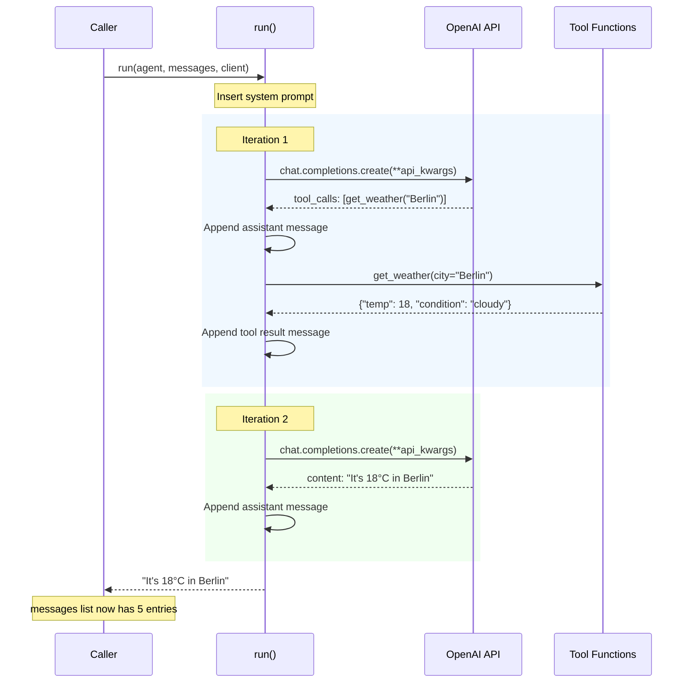

# The Agent Run Loop

In Exercise 02 you built the agent loop **by hand** — calling the API, checking for tool calls, executing them, appending results, and looping back. From Exercise 03 onward, every exercise uses a shared `run()` function that encapsulates exactly that loop.

This page walks through `run()` line by line so there's nothing hidden.

## From Manual Loop to `run()`

Here's the connection. In Exercise 02 you wrote something like this:

```python
while True:
    response = client.chat.completions.create(model=model, messages=messages, tools=tools)
    message = response.choices[0].message
    messages.append(message)

    if not message.tool_calls:
        break  # Final answer

    for tool_call in message.tool_calls:
        result = execute_tool(tool_call)
        messages.append({"role": "tool", "tool_call_id": tool_call.id, "content": result})
```

The shared `run()` function in `exercises/commons/agent.py` does **the same thing** — with logging, error handling, and a safety limit on iterations. No magic.

## The `Agent` Dataclass

Before looking at `run()`, here's what it operates on:

```python
@dataclass
class Agent:
    name: str              # For logging — "Billing Specialist", "Research Agent"
    system_prompt: str     # The system message that defines behavior
    tools: list            # Tool definitions from pydantic_function_tool()
    tool_functions: dict   # {"get_weather": get_weather_fn, ...}
    model: str = ""        # Model name (e.g., "gpt-4o")
    max_iterations: int = 10  # Safety valve
```

An `Agent` is just data — it doesn't **do** anything on its own. The `run()` function brings it to life.

## The `run()` Function — Annotated

Here's the full function, broken into phases with explanations.

### Signature

```python
def run(
    agent: Agent,
    messages: list[dict],
    client: OpenAI | AzureOpenAI,
    model: str | None = None,
) -> str:
```

| Parameter | Purpose |
|-----------|---------|
| `agent` | The agent definition (prompt, tools, identity) |
| `messages` | The conversation so far — **mutated in place** as the loop runs |
| `client` | The OpenAI / Azure OpenAI client for API calls |
| `model` | Optional override — falls back to `agent.model` |

!!! warning "Messages are mutated"
    The `messages` list you pass in **grows** during execution. After `run()` returns, it contains the full conversation including all assistant responses and tool results. This is by design — it lets you inspect the full trace or continue the conversation.

### Phase 1: Setup

```python
effective_model = model or agent.model

if not messages or messages[0].get("role") != "system":
    messages.insert(0, {"role": "system", "content": agent.system_prompt})
```

The system prompt is automatically prepended if it's not already there. This means callers don't need to manually add it — just pass user messages.

### Phase 2: The Loop (Reason → Act → Observe)

```python
iteration = 0

while iteration < agent.max_iterations:
    iteration += 1
```

The loop runs until one of two things happens:

1. The model produces a **final text response** (no tool calls) → return it
2. We hit `max_iterations` → safety exit

### Phase 3: Build API Call with `**kwargs`

```python
api_kwargs: dict[str, Any] = {
    "model": effective_model,
    "messages": messages,
}
if agent.tools:
    api_kwargs["tools"] = agent.tools

response = client.chat.completions.create(**api_kwargs)
```

This pattern uses **`**kwargs` (keyword argument unpacking)** to build the API call dynamically. Let's break this down since it's a Python pattern you'll see everywhere:

??? info "Python `**kwargs` Explained"

    In Python, `**` before a dictionary **unpacks** it into keyword arguments. These two calls are identical:

    ```python
    # Explicit keyword arguments
    client.chat.completions.create(
        model="gpt-4o",
        messages=[...],
        tools=[...],
    )

    # Equivalent using dict unpacking
    api_kwargs = {
        "model": "gpt-4o",
        "messages": [...],
        "tools": [...],
    }
    client.chat.completions.create(**api_kwargs)
    ```

    **Why use this pattern?** It lets you build arguments **conditionally**. In our case, we only include `tools` when the agent actually has tools defined:

    ```python
    api_kwargs = {"model": model, "messages": messages}

    if agent.tools:           # Only add tools if the agent has them
        api_kwargs["tools"] = agent.tools

    client.chat.completions.create(**api_kwargs)
    ```

    Without this pattern, you'd need an `if/else` with two separate API calls — one with `tools` and one without. The dict approach is cleaner and scales to any number of optional parameters.

    The reverse also exists: a function can **receive** arbitrary keyword arguments with `**kwargs` in its signature:

    ```python
    def my_function(**kwargs):
        print(kwargs)  # {'a': 1, 'b': 2}

    my_function(a=1, b=2)
    ```

### Phase 4: Reason — Check the Model's Decision

```python
choice = response.choices[0]
assistant_message = choice.message

messages.append(assistant_message.model_dump())

if not assistant_message.tool_calls:
    return assistant_message.content or ""
```

The model has two possible responses:

- **No tool calls** → it has a final text answer → **return it** (loop ends)
- **Has tool calls** → it wants to use tools → continue to Phase 5

Note `model_dump()` — this converts the Pydantic response object to a plain `dict` so it can be appended to the messages list for the next API call.

### Phase 5: Act — Execute Tool Calls

```python
for tool_call in assistant_message.tool_calls:
    function_name = tool_call.function.name
    arguments = json.loads(tool_call.function.arguments)

    if function_name not in agent.tool_functions:
        result = f"Error: Unknown tool '{function_name}'"
    else:
        result = agent.tool_functions[function_name](**arguments)
```

Here `**arguments` appears again — the model returns arguments as a JSON object like `{"city": "Berlin", "unit": "celsius"}`, and `**arguments` unpacks it into keyword arguments for the Python function: `get_weather(city="Berlin", unit="celsius")`.

### Phase 6: Observe — Return Results to the Model

```python
    messages.append({
        "role": "tool",
        "tool_call_id": tool_call.id,
        "content": json.dumps(result),
    })
```

Each tool result is appended with:

- `role: "tool"` — tells the API this is a tool result (not user or assistant)
- `tool_call_id` — links this result back to the specific tool call that requested it
- `content` — the JSON-serialized return value

Then the `while` loop continues — back to Phase 3, sending the updated messages (now including tool results) to the model again.

### Phase 7: Safety Valve

```python
logger.warning(
    "[%s] Reached maximum iterations (%d)",
    agent.name, agent.max_iterations,
)
return messages[-1].get("content", "")
```

If the model keeps requesting tools beyond `max_iterations` (default: 10), we stop and return whatever we have. This prevents infinite loops if the model gets stuck.

## Full Sequence Diagram

Here's a complete picture of what happens when `run()` processes a query that requires two rounds of tool calls:



## How `messages` Grows

Understanding how the messages list evolves is key. Here's what it looks like across iterations:

| Step | Messages List |
|------|--------------|
| **Start** | `[{user: "What's the weather in Berlin?"}]` |
| **After setup** | `[{system: "You are..."}, {user: "What's the weather?"}]` |
| **Iter 1 — model responds** | `[..., {assistant: tool_calls=[get_weather]}]` |
| **Iter 1 — tool result** | `[..., {tool: {"temp": 18}}]` |
| **Iter 2 — model responds** | `[..., {assistant: "It's 18°C in Berlin"}]` |

The list only grows — nothing is ever removed. This is why context management matters in long conversations (see [Context Management](../production-considerations/context-management.md)).

## Where `run()` Is Used

Every exercise from 03 onward uses this function:

| Exercise | How it uses `run()` |
|----------|-------------------|
| **03 — Single Agent** | One agent, multiple turns, messages list grows across turns |
| **04 — Sequential** | Each agent gets a **fresh** messages list with only the previous output |
| **05 — Concurrent** | Multiple `run()` calls in parallel (via `ThreadPoolExecutor`) |
| **06 — Group Chat** | Multiple agents share **one** messages list |
| **07 — Handoff** | Triage agent → structured output → specialist agent gets a **new** messages list |
| **08 — Magentic** | Manager dispatches tasks → workers run independently → results feed back |

The function is always the same — only the **orchestration** around it changes. That's the whole point of this workshop.

!!! tip "Ready to practice?"
    Continue with the hands-on exercise in the sidebar (✏️) to apply what you've learned.
