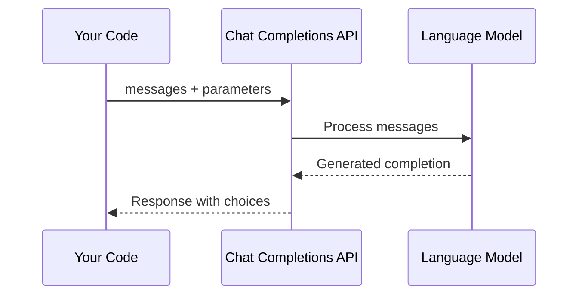

# Chat Completions API

!!! tip "Chapter Slides"
    [:material-file-pdf-box: Download Chapter 1 — LLM Foundations (PDF)](../slides/Chapter1_LLM_Foundations.pdf){:target="_blank"}

Before building agents, you need to understand the foundation: how Large Language Models (LLMs) process conversations through the Chat Completions API.

## The Chat Completions API

The Chat Completions API is a stateless, request-response interface. You send a list of **messages**, and the model returns a **completion** — the next message in the conversation.



Every request includes the full conversation history. The API has no memory between calls — **you** manage the conversation state.

## Messages and Roles

A conversation is a list of messages, each with a **role**:

| Role | Purpose | Example |
|------|---------|---------|
| `system` | Sets the model's behavior, persona, and constraints | "You are a helpful travel assistant." |
| `user` | Human input — questions, instructions, data | "What's the best time to visit Japan?" |
| `assistant` | Model's previous responses (for multi-turn context) | "Spring (March-May) is ideal for cherry blossoms..." |
| `tool` | Results from tool/function calls (covered later) | `{"temperature": 22, "condition": "sunny"}` |

!!! note "The `developer` role"
    The latest OpenAI models also support a `developer` role as a replacement for `system`. They are functionally equivalent for our purposes. This workshop uses `system` because it works universally across all providers.

### Single-Turn vs. Multi-Turn

**Single-turn** — one question, one answer:

```python
messages = [
    {"role": "system", "content": "You are a travel assistant."},
    {"role": "user", "content": "What's the best time to visit Japan?"},
]
```

**Multi-turn** — a conversation with history:

```python
messages = [
    {"role": "system", "content": "You are a travel assistant."},
    {"role": "user", "content": "What's the best time to visit Japan?"},
    {"role": "assistant", "content": "Spring (March-May) is ideal..."},
    {"role": "user", "content": "What about budget tips?"},
]
```

The model sees the *entire* message list on every call. This is how it maintains context — and why context management matters as conversations grow (see [Context Management](../production-considerations/context-management.md)).

## Key Parameters

| Parameter | What It Does | Typical Values |
|-----------|-------------|----------------|
| `model` | Which model to use | `gpt-4o-mini`, `gpt-4o` |
| `temperature` | Randomness (0 = deterministic, 2 = very random) | `0.0` – `1.0` |
| `max_tokens` | Maximum response length | `100` – `4096` |
| `top_p` | Nucleus sampling (alternative to temperature) | `0.1` – `1.0` |

!!! tip "Temperature for agents"
    For agentic tasks, use low temperature (`0.0` – `0.3`) to get consistent, reliable behavior. Save higher temperatures for creative tasks like brainstorming.

## Token Usage

Every API call consumes **tokens** (roughly 4 characters per token in English). The response includes usage information:

```python
response = client.chat.completions.create(
    model="gpt-4o-mini",
    messages=messages,
)

print(response.usage.prompt_tokens)      # Tokens in your input
print(response.usage.completion_tokens)  # Tokens in the response
print(response.usage.total_tokens)       # Total
```

Understanding token usage matters for cost control and for staying within context window limits (see [Context Management](../production-considerations/context-management.md)).

## Key Takeaways

1. The Chat Completions API is **stateless** — you send the full conversation every time
2. **Roles** define who said what: `system`, `user`, `assistant`, `tool`
3. **Temperature** controls randomness — use low values for agents
4. **You** manage conversation state — the API doesn't remember previous calls

## References

- [OpenAI Chat Completions API Guide](https://platform.openai.com/docs/guides/text-generation)
- [OpenAI API Reference](https://platform.openai.com/docs/api-reference/chat)
- [Andrej Karpathy — "Intro to Large Language Models" (YouTube)](https://www.youtube.com/watch?v=zjkBMFhNj_g)
- [Anthropic Prompt Engineering Guide](https://docs.anthropic.com/en/docs/build-with-claude/prompt-engineering)

## Hands-On Exercise

Now try it yourself — head to the [Chat Completion exercise](../exercises/01_chat_completion.md){:target="_blank"} to build a travel assistant with single-turn and multi-turn conversations.

You can run exercises from the terminal or use the [Workshop TUI](../workshop-tui.md).
