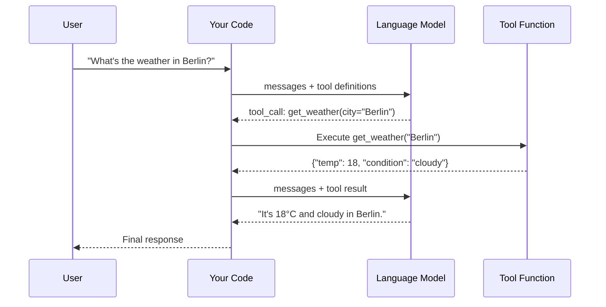

# Function Calling

!!! tip "Chapter Slides"
    [:material-file-pdf-box: Download Chapter 2 — Tools & Function Calling (PDF)](../slides/Chapter2_Tools_Function_Calling.pdf){:target="_blank"}

Tools are what transform an LLM from a text generator into an **agent** — the ability to take actions in the real world by calling functions you define.

## The Concept

The model doesn't execute code directly. Instead, it decides *which* function to call and *with what arguments*, and your code executes it:



## Defining Tools with `pydantic_function_tool()`

The modern way to define tools in the OpenAI SDK uses Pydantic models for parameter schemas with **strict mode**:

```python
import openai
from pydantic import BaseModel, Field

class GetWeatherParams(BaseModel):
    city: str = Field(description="The city to get weather for")
    units: str = Field(default="celsius", description="Temperature units: celsius or fahrenheit")

tools = [
    openai.pydantic_function_tool(
        GetWeatherParams,
        name="get_weather",
        description="Get current weather for a city",
    ),
]
```

This automatically generates a JSON schema with `strict: true`, which means the model is guaranteed to produce valid arguments matching your schema.

!!! warning "Deprecated patterns — don't use these"
    - The old `functions` parameter (use `tools` instead)
    - The old `function_call` parameter (use `tool_choice` instead)
    - The `function` role for results (use `tool` role instead)
    - Raw JSON schema dicts without strict mode

## Making a Tool Call

Send messages with tools to the API. If the model decides a tool is needed, the response contains `tool_calls` instead of text:

```python
response = client.chat.completions.create(
    model=model,
    messages=messages,
    tools=tools,
)

message = response.choices[0].message

if message.tool_calls:
    for tool_call in message.tool_calls:
        name = tool_call.function.name          # "get_weather"
        args = json.loads(tool_call.function.arguments)  # {"city": "Berlin"}
        # Execute the function yourself
        result = get_weather(**args)
```

## Returning Tool Results

After executing a tool, send the result back to the model using the `tool` role:

```python
messages.append(message)  # Append the assistant's tool_call message
messages.append({
    "role": "tool",
    "tool_call_id": tool_call.id,
    "content": json.dumps(result),
})

# Call the API again — the model now has the tool result
response = client.chat.completions.create(
    model=model,
    messages=messages,
    tools=tools,
)
```

## Parallel Tool Calls

The model can request multiple tool calls in a single response. For example, it might call `get_weather("Berlin")` and `get_weather("Paris")` simultaneously. Your code should execute all of them and return all results before calling the API again.

## The Agent Loop

When you combine tool calling with a loop, you get the core **agent loop** — the foundation of every agentic pattern in this workshop. This is covered in depth in the dedicated [Agent Run Loop](agent-run-loop.md) page.

!!! tip "Ready to practice?"
    Continue with the hands-on exercise in the sidebar (✏️) to apply what you've learned.

## Key Takeaways

1. Tools let models **take actions** — but your code executes them, not the model
2. Use `openai.pydantic_function_tool()` for type-safe tool definitions with strict mode
3. The `tools` parameter and `tool` role are the modern patterns (not `functions`/`function` role)
4. The **agent loop** (reason → act → observe) is the core of all agentic patterns
5. The model decides *when* to use tools and *which* ones — you decide *what tools are available*

## References

- [OpenAI Function Calling Guide](https://platform.openai.com/docs/guides/function-calling)
- [OpenAI Tools API Reference](https://platform.openai.com/docs/api-reference/chat/create#chat-create-tools)
- [MS Learn — Tool Use in AI Agents](https://learn.microsoft.com/en-us/azure/architecture/ai-ml/guide/ai-agent-design-patterns)

## Hands-On Exercises

Now try it yourself:

- [Function Calling exercise](../exercises/02_function_calling.md){:target="_blank"} — Define tools with `pydantic_function_tool()`, make a single-pass tool call
- [Tool Loop exercise](../exercises/02_tool_loop.md){:target="_blank"} — Build the full agent loop: reason → call tool → observe → repeat

You can run exercises from the terminal or use the [Workshop TUI](../workshop-tui.md).
