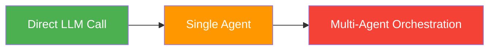
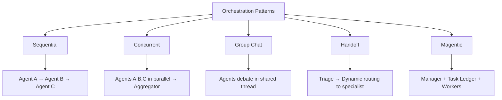

# Orchestration Overview

!!! tip "Chapter Slides"
    [:material-file-pdf-box: Chapter 3 — Single Agent (PDF)](../slides/Chapter3_Single_Agent.pdf){:target="_blank"} · [:material-file-pdf-box: Chapter 4 — Multi-Agent (PDF)](../slides/Chapter4_Multi_Agent.pdf){:target="_blank"} · [:material-file-pdf-box: Chapter 5 — Advanced Patterns (PDF)](../slides/Chapter5_Advanced_Patterns.pdf){:target="_blank"}

When a single agent isn't enough, you need **orchestration** — coordinating multiple agents to solve complex problems. This page introduces the complexity spectrum and the five patterns you'll learn.

## The Complexity Spectrum

Not every problem needs multiple agents. Start simple and add complexity only when needed:

| Level | When to Use | Example |
|-------|------------|---------|
| **Direct LLM Call** | Simple generation, classification, extraction | Summarize an email |
| **Single Agent** | Task requires tools and reasoning loops | Customer support with order lookup |
| **Multi-Agent** | Task requires specialized roles, parallel work, or dynamic routing | Incident response with diagnostics + infrastructure + communication |

!!! tip "Start simple"
    The biggest mistake is jumping to multi-agent orchestration when a single agent would suffice. A single agent with good tools and a well-crafted system prompt handles most tasks. Add agents only when you need **specialization**, **parallelism**, or **dynamic routing**.

## The Five Orchestration Patterns

### 1. Sequential (Pipeline)

Agents work in a chain — each agent's output becomes the next agent's input.

**Use when**: Tasks have clear, ordered stages (research → draft → edit).

→ [Learn more](../patterns/sequential.md)

### 2. Concurrent (Fan-out / Fan-in)

Multiple agents work on the same input simultaneously, and an aggregator combines their results.

**Use when**: Independent analyses can run in parallel (fundamental + technical + sentiment analysis).

→ [Learn more](../patterns/concurrent.md)

### 3. Group Chat

Agents share a conversation thread and take turns contributing, building on each other's messages.

**Use when**: Collaborative problem-solving, brainstorming, iterative refinement (maker-checker).

→ [Learn more](../patterns/group-chat.md)

### 4. Handoff

A triage agent classifies incoming requests and routes them to specialist agents.

**Use when**: Different request types need different expertise (billing vs. technical vs. account support).

→ [Learn more](../patterns/handoff.md)

### 5. Magentic (Adaptive Planning)

A manager agent maintains a task ledger and dynamically delegates work to specialist workers, adapting the plan based on findings.

**Use when**: Complex, multi-step tasks where the plan may change based on intermediate results (incident response).

→ [Learn more](../patterns/magentic.md)

## Pattern Comparison

| Pattern | Agents | Communication | State | Adaptability |
|---------|--------|--------------|-------|-------------|
| Sequential | 2-5 in chain | One-way (output → input) | Fresh per stage | Low — fixed pipeline |
| Concurrent | 2-5 + aggregator | Independent + merge | Independent per agent | Low — fixed fan-out |
| Group Chat | 2-5 + manager | Shared conversation | Shared message thread | Medium — turn-taking |
| Handoff | 1 triage + N specialists | Structured handoff | Handoff context object | Medium — dynamic routing |
| Magentic | 1 manager + N workers | Task delegation | Task ledger (mutable) | High — adaptive planning |

For a deeper comparison and decision framework, see [Choosing a Pattern](../production-considerations/choosing-a-pattern.md).

## Context Passing: The Hidden Challenge

The biggest practical challenge in multi-agent systems is **how conversation context flows between agents**. Each pattern handles this differently:

| Pattern | What Gets Passed | Strategy |
|---------|-----------------|----------|
| Sequential | Previous agent's output only | Fresh context per stage |
| Concurrent | Same initial input to all | Independent (no sharing) |
| Group Chat | Full shared conversation | Accumulating shared memory |
| Handoff | Structured handoff object | Selective, structured |
| Magentic | Task-specific context only | Manager controls what workers see |

This is covered in detail for each pattern and comprehensively in [Context Management](../production-considerations/context-management.md).

## Key Takeaways

1. Start with the simplest approach — don't orchestrate when a single agent suffices
2. Five patterns cover the vast majority of multi-agent use cases
3. Each pattern has different trade-offs for communication, state, and adaptability
4. Context passing strategy is as important as choosing the right pattern
5. Patterns can be combined (e.g., sequential pipeline where one stage uses concurrent agents)

## References

- [MS Learn — AI Agent Design Patterns](https://learn.microsoft.com/en-us/azure/architecture/ai-ml/guide/ai-agent-design-patterns)
- [Andrew Ng — "What's next for AI agentic workflows" (YouTube)](https://www.youtube.com/watch?v=sal78ACtGTc)
- [Anthropic — "Building Effective Agents"](https://www.anthropic.com/engineering/building-effective-agents)
