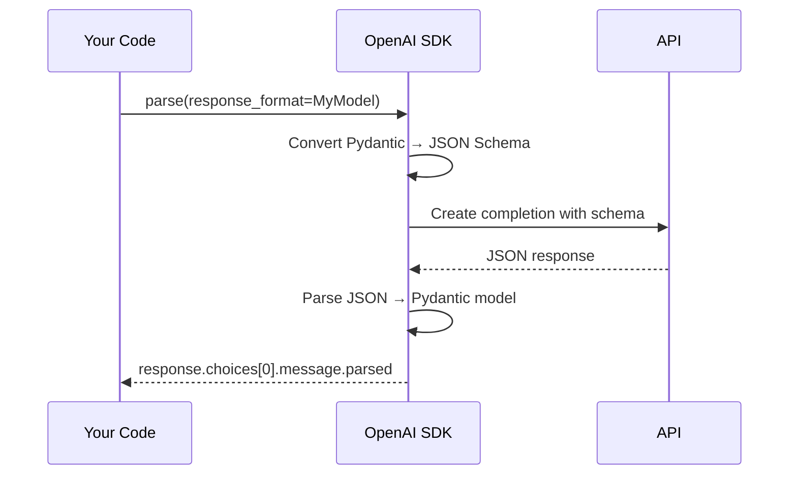

# Structured Outputs

Structured outputs let you guarantee that the model returns data in a specific format — not just free text. This is essential for agents that need to parse model responses programmatically.

## Why Structured Outputs?

When building agents, you often need the model to return data in a specific shape:

- A classification with confidence scores
- An extracted list of entities
- A decision object with reasoning
- A structured handoff context to pass between agents

Free text requires fragile parsing. Structured outputs give you **guaranteed valid JSON** matching your schema.

## The Modern Pattern: `parse()` + Pydantic

The OpenAI SDK provides `client.chat.completions.parse()` which combines a chat completion with automatic Pydantic model parsing:

```python
from pydantic import BaseModel, Field

class ReviewAnalysis(BaseModel):
    sentiment: str = Field(description="positive, negative, or neutral")
    confidence: float = Field(description="Confidence score 0.0-1.0")
    keywords: list[str] = Field(description="Key topics mentioned")
    summary: str = Field(description="One-sentence summary")

response = client.chat.completions.parse(
    model=model,
    messages=[
        {"role": "system", "content": "Analyze this product review."},
        {"role": "user", "content": "The battery life is amazing but the screen is dim."},
    ],
    response_format=ReviewAnalysis,
)

analysis = response.choices[0].message.parsed
# analysis.sentiment  → "mixed" or "neutral"
# analysis.confidence → 0.85
# analysis.keywords   → ["battery life", "screen", "brightness"]
```

The `parsed` attribute gives you a fully typed Pydantic object — no `json.loads()`, no try/except, no schema validation boilerplate.

!!! warning "Stable API only"
    Use `client.chat.completions.parse()` — the stable namespace. Do **not** use `client.beta.chat.completions.parse()`. The stable version is fully supported across providers.

## How It Works



The SDK:

1. Converts your Pydantic model to a JSON Schema
2. Sends it to the API with strict mode enabled
3. The model generates JSON conforming to the schema
4. The SDK parses the JSON back into your Pydantic model

## When to Use Structured Outputs

| Use Case | Example |
|----------|---------|
| **Classification** | Route a message to the right agent |
| **Entity extraction** | Pull names, dates, IDs from text |
| **Decision making** | Agent decides next action with reasoning |
| **Handoff context** | Structured data passed between agents |
| **Data transformation** | Convert unstructured text to structured records |

In the orchestration patterns, structured outputs are used for:

- The **triage decision** in the Handoff pattern (category, priority, extracted info)
- The **task plan** in the Magentic pattern (list of tasks with assignments)
- Any place where one agent's output needs to be reliably consumed by another

## Nested and Complex Schemas

Pydantic models can be nested for complex structures:

```python
class Task(BaseModel):
    description: str
    assigned_to: str
    priority: str = Field(description="low, medium, or high")

class IncidentPlan(BaseModel):
    assessment: str
    tasks: list[Task]
```

!!! tip "Ready to practice?"
    Continue with the hands-on exercise in the sidebar (✏️) to apply what you've learned.

## Key Takeaways

1. Use `client.chat.completions.parse()` with Pydantic `response_format` for guaranteed structured responses
2. The `parsed` attribute gives you a typed Pydantic object — no manual JSON parsing needed
3. Structured outputs are the backbone of reliable inter-agent communication
4. Nested Pydantic models support complex schemas
5. This is the **stable** API — no `beta` namespace needed

## References

- [OpenAI Structured Outputs Guide](https://platform.openai.com/docs/guides/structured-outputs)
- [Pydantic Documentation](https://docs.pydantic.dev/latest/)

## Hands-On Exercise

Head to the [LLM Basics exercises](../exercises/01_llm_basics.md) — specifically **03 Structured Outputs** to extract structured analysis from product reviews.

You can run it from the terminal or use the [Workshop TUI](../workshop-tui.md).
