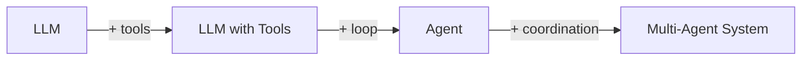
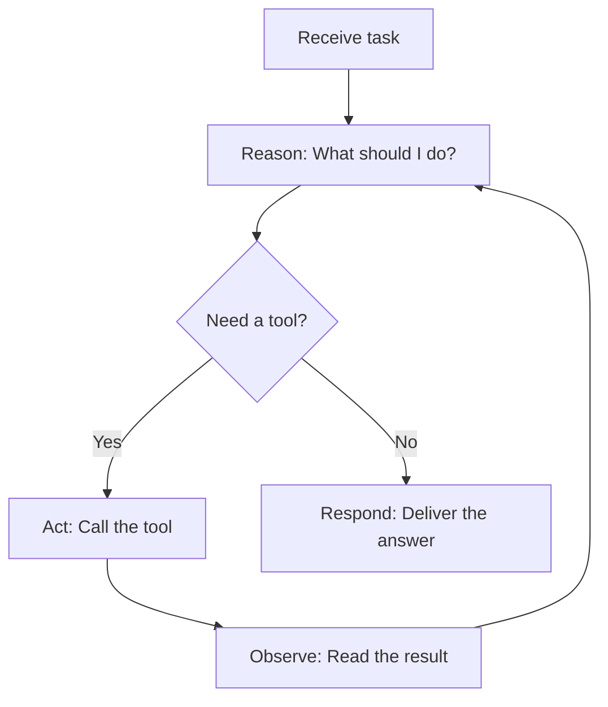

# What Is an Agent?

An agent is an LLM that can **take actions** in a loop — not just generate text, but reason about what to do, use tools, observe results, and decide what to do next.

## From LLM to Agent



| Level | What It Does | Example |
|-------|-------------|---------|
| **LLM** | Generates text from a prompt | "Translate this sentence" |
| **LLM + Tools** | Generates text OR requests tool calls | "What's the weather?" → calls `get_weather()` |
| **Agent** | Loops: reason → act → observe → repeat | Customer support bot that looks up orders, checks FAQs, processes refunds |
| **Multi-Agent System** | Multiple agents coordinating | Triage → specialist handoff, parallel analysis |

## The Agent Loop: Reason → Act → Observe

The core of every agent is a simple loop:



In code (using the OpenAI SDK), this maps directly to:

1. **Reason**: Call the model with messages + tools → model decides what to do
2. **Act**: If `finish_reason == "tool_calls"`, execute the requested tools
3. **Observe**: Append tool results to messages, loop back to step 1
4. **Respond**: If `finish_reason == "stop"`, the model has its final answer

This loop is implemented in `exercises/commons/agent.py` and used throughout the workshop.

## What Makes a Good Agent?

An effective agent has:

- **Clear identity** — A focused system prompt defining its role and constraints
- **Appropriate tools** — Access to the specific functions it needs (and nothing more)
- **Bounded behavior** — A maximum iteration limit to prevent infinite loops
- **Structured reasoning** — The model explains its actions through the conversation flow

!!! note "Agents are not autonomous"
    In this workshop, "agent" means an LLM + tools + loop. The agent operates within boundaries you define: specific tools, a system prompt, and a maximum number of iterations. It makes decisions about *which* tool to call, but you control *what tools are available*.

## The Minimal Agent Abstraction

This workshop uses a deliberately simple agent abstraction — a Python `dataclass`:

```python
@dataclass
class Agent:
    name: str
    system_prompt: str
    tools: list           # Tool definitions (JSON schemas)
    tool_functions: dict  # Mapping of name → callable
    model: str
    max_iterations: int = 10
```

And a `run()` function that implements the loop. No inheritance, no metaclasses, no registration — just a data structure and a function. This makes it easy to understand exactly what happens on every iteration.

## Agent vs. Framework Agent

| This Workshop | LangGraph | Pydantic AI |
|--------------|-----------|-------------|
| `Agent` dataclass | `StateGraph` node | `Agent` class |
| `run()` function | Graph compilation + execution | `agent.run()` |
| `messages` list | `TypedDict` state | Message history |
| Python `dict` handoff | Conditional edges | Tool-based delegation |
| `dataclass` context | State channels | Dependency injection |

By building the agent yourself, you understand what every framework does internally.

## Hands-On Exercise

- **`exercises/03_single_agent/01_customer_support_agent.py`** — A customer support agent with order lookup, FAQ search, and refund processing tools

```bash
python exercises/03_single_agent/01_customer_support_agent.py
```

## Key Takeaways

1. An agent = LLM + tools + loop (Reason → Act → Observe)
2. The agent loop runs until the model produces a final text response (`finish_reason="stop"`)
3. Agents are bounded — maximum iterations prevent infinite loops
4. System prompts define agent identity; tools define agent capability
5. Our minimal `Agent` dataclass + `run()` function is everything you need

## References

- [Lilian Weng — "LLM Powered Autonomous Agents"](https://lilianweng.github.io/posts/2023-06-23-agent/)
- [Andrew Ng — "What's next for AI agentic workflows" (YouTube)](https://www.youtube.com/watch?v=sal78ACtGTc)
- [Anthropic — "Building Effective Agents"](https://www.anthropic.com/engineering/building-effective-agents)
- [MS Learn — AI Agent Design Patterns](https://learn.microsoft.com/en-us/azure/architecture/ai-ml/guide/ai-agent-design-patterns)
- [ReAct: Synergizing Reasoning and Acting in Language Models (Yao et al., 2023)](https://arxiv.org/abs/2210.03629)
