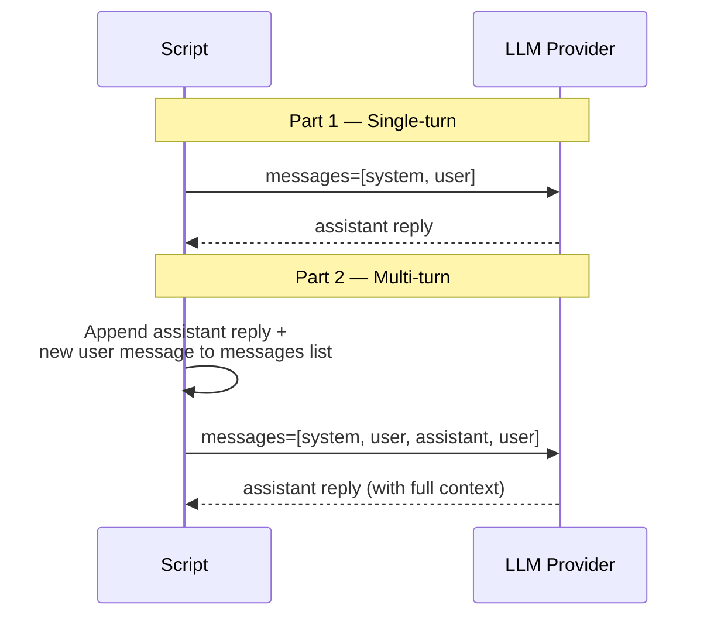

# Exercise: Chat Completion

## Objective

Learn how the Chat Completions API processes single-turn and multi-turn conversations using a growing messages list.

## Concepts Covered

- Messages list and roles (`system`, `user`, `assistant`)
- Single-turn vs. multi-turn conversations
- Temperature and `max_tokens` parameters
- How the model "remembers" via the full message history

## How It Works

The script shows how the messages list works. In **single-turn** mode, you send a system prompt and one user message, and the model replies. In **multi-turn** mode, you append the assistant's reply and a follow-up question back to the same messages list, then re-send the full history — this is how the model "remembers" the conversation.



**Context sharing:** The growing `messages` list IS the context. Each call sends the full conversation history to the model.

## Interactive Message Flow

<div class="message-flow-interactive" markdown="block" data-title="Chat Completion: Multi-Turn Conversation" data-context-type="growing" data-context-label="Messages list grows with each turn — the model sees full history">

<div class="mf-step" data-description="Initial request: system prompt sets the travel assistant identity, user asks a question">
<div class="mf-msg" data-role="system" data-list="messages" data-payload='{"role": "system", "content": "You are a knowledgeable and enthusiastic travel assistant. Help users plan trips with practical advice."}'>You are a knowledgeable and enthusiastic travel assistant. Help users plan trips with practical advice.</div>
<div class="mf-msg" data-role="user" data-list="messages" data-payload='{"role": "user", "content": "What&#39;s the best time of year to visit Japan?"}'>What's the best time of year to visit Japan?</div>
</div>

<div class="mf-step" data-description="Assistant responds with travel advice. This reply is appended to the messages list.">
<div class="mf-msg" data-role="assistant" data-list="messages" data-payload='{"role": "assistant", "content": "Spring (March-May) is ideal for cherry blossoms. Autumn (September-November) offers beautiful foliage and mild weather. Both seasons have comfortable temperatures and fewer typhoons than summer."}'>Spring (March-May) is ideal for cherry blossoms. Autumn (September-November) offers beautiful foliage and mild weather. Both seasons have comfortable temperatures and fewer typhoons than summer.</div>
</div>

<div class="mf-step" data-description="User asks a follow-up. The full conversation history (system + user + assistant + new user) is sent to the model.">
<div class="mf-msg" data-role="user" data-list="messages" data-payload='{"role": "user", "content": "Can you suggest a 3-day itinerary for Tokyo?"}'>Can you suggest a 3-day itinerary for Tokyo?</div>
</div>

<div class="mf-step" data-description="The model sees the full history and builds on prior context to give a relevant itinerary">
<div class="mf-msg" data-role="assistant" data-list="messages" data-payload='{"role": "assistant", "content": "Day 1: Explore Shibuya crossing and Harajuku street fashion. Day 2: Visit Senso-ji temple in Asakusa, then Akihabara for electronics. Day 3: Day trip to Kamakura for the Great Buddha and coastal views."}'>Day 1: Explore Shibuya crossing and Harajuku street fashion. Day 2: Visit Senso-ji temple in Asakusa, then Akihabara for electronics. Day 3: Day trip to Kamakura for the Great Buddha and coastal views.</div>
</div>

</div>

## File

- **`01_chat_completion.py`** — Basic chat completion with a travel assistant

## How to Run

```bash
python exercises/01_llm_basics/01_chat_completion.py
```

## Expected Output

Structured logging showing the LLM interaction, the messages sent, and the response received.

## Next

→ [Exercise: System Prompts](01_system_prompts.md)
