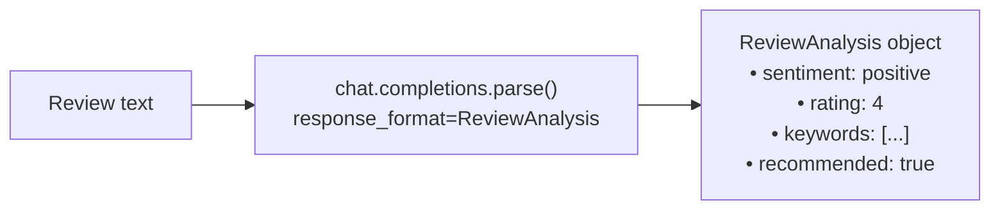

# Exercise: Structured Outputs

## Objective

Get typed, validated responses from the LLM using Pydantic models and `chat.completions.parse()`.

## Concepts Covered

- Structured outputs with Pydantic models
- `client.chat.completions.parse()` with `response_format`
- Guaranteed schema conformance from the model

## How It Works

Instead of `chat.completions.create()`, this script uses `chat.completions.parse()` with a `ReviewAnalysis` Pydantic model. The model returns JSON that is automatically validated and parsed into a typed Python object with fields like `sentiment`, `rating`, `keywords`, and `recommended`.



**Structured output:** Yes — this is the first exercise that uses `client.chat.completions.parse()` with a Pydantic model as `response_format`. The model's output is guaranteed to match the schema.

## Interactive Message Flow

<div class="message-flow-interactive" markdown="block" data-title="Structured Outputs: Typed Responses with Pydantic" data-context-type="isolated" data-context-label="parse() returns a validated Pydantic object — not free text">

<div class="mf-step" data-description="System prompt defines the analyst role, user provides a product review to analyze">
<div class="mf-msg" data-role="system" data-list="messages" data-payload='{"role": "system", "content": "You are a product review analyst. Extract structured data from customer reviews."}'>You are a product review analyst. Extract structured data from customer reviews.</div>
<div class="mf-msg" data-role="user" data-list="messages" data-payload='{"role": "user", "content": "Analyze this review: &#39;Great headphones! Sound quality is amazing, comfortable for long sessions. Battery could be better though.&#39;"}'>Analyze this review: 'Great headphones! Sound quality is amazing, comfortable for long sessions. Battery could be better though.'</div>
</div>

<div class="mf-step" data-description="chat.completions.parse() is called with response_format=ReviewAnalysis — the model MUST conform to the Pydantic schema">
<div class="mf-msg" data-role="assistant" data-list="messages" data-payload='{"role": "assistant", "content": "Generating structured response matching the ReviewAnalysis schema..."}'>Generating structured response matching the ReviewAnalysis schema...</div>
</div>

<div class="mf-step" data-description="The parsed result is a validated ReviewAnalysis object with typed fields — not a raw JSON string">
<div class="mf-msg" data-role="structured" data-list="messages" data-agent="ReviewAnalysis" data-payload='{"role": "assistant", "content": "{\"sentiment\": \"positive\", \"rating\": 4, \"keywords\": [\"sound quality\", \"comfortable\", \"battery\"], \"summary\": \"Positive review praising audio and comfort with minor battery concern\", \"recommended\": true}", "parsed": {"sentiment": "positive", "rating": 4, "keywords": ["sound quality", "comfortable", "battery"], "summary": "Positive review praising audio and comfort with minor battery concern", "recommended": true}}'>sentiment: positive | rating: 4 | keywords: [sound quality, comfortable, battery] | summary: Positive review praising audio and comfort with minor battery concern | recommended: true</div>
</div>

</div>

## File

- **`03_structured_outputs.py`** — Extract structured data using `client.chat.completions.parse()`

## How to Run

```bash
python exercises/01_llm_basics/03_structured_outputs.py
```

## Expected Output

Structured logging showing the parsed `ReviewAnalysis` object with typed fields like `sentiment`, `rating`, `keywords`, and `recommended`.

## Next

→ [Exercise: Function Calling](02_function_calling.md)
