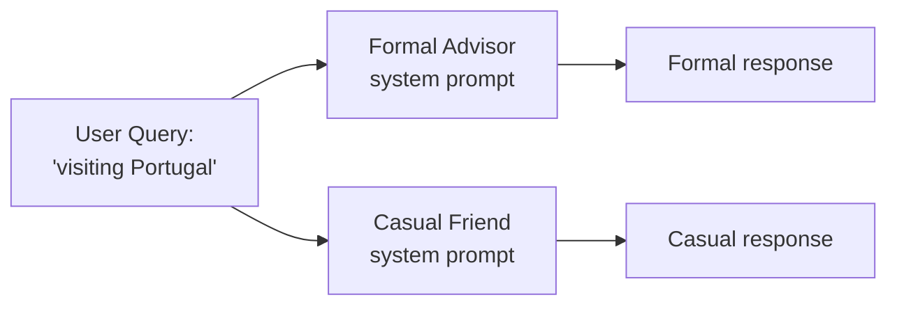

# Exercise: System Prompts

## Objective

See how system prompts shape agent identity — the same user query produces completely different responses with different personas.

## Concepts Covered

- System prompts for shaping agent behavior
- Independent message lists for different personas
- How the same model becomes different "agents" with different prompts

## How It Works

The same user query ("visiting Portugal") is sent with two different system prompts — a formal travel advisor and a casual friend. Each gets an **independent messages list** with no shared context between them.



**Context sharing:** None between the two calls — they are completely independent.

## Interactive Message Flow

<div class="message-flow-interactive" markdown="block" data-title="System Prompts: Same Query, Different Personas" data-context-type="independent" data-context-label="Each persona gets its own isolated messages list — only the system prompt differs">

<div class="mf-step" data-description="Both personas receive the same user query, but with different system prompts shaping their identity">
<div class="mf-msg" data-role="system" data-list="formal" data-payload='{"role": "system", "content": "You are a formal travel consultant. Provide detailed, professional advice with structured recommendations."}'>You are a formal travel consultant. Provide detailed, professional advice with structured recommendations.</div>
<div class="mf-msg" data-role="user" data-list="formal" data-payload='{"role": "user", "content": "I&#39;m thinking about visiting Portugal. Any suggestions?"}'>I'm thinking about visiting Portugal. Any suggestions?</div>
<div class="mf-msg" data-role="system" data-list="casual" data-payload='{"role": "system", "content": "You are a casual, enthusiastic travel buddy. Give fun, relaxed advice like talking to a friend."}'>You are a casual, enthusiastic travel buddy. Give fun, relaxed advice like talking to a friend.</div>
<div class="mf-msg" data-role="user" data-list="casual" data-payload='{"role": "user", "content": "I&#39;m thinking about visiting Portugal. Any suggestions?"}'>I'm thinking about visiting Portugal. Any suggestions?</div>
</div>

<div class="mf-step" data-description="The Formal Advisor responds with structured, professional guidance">
<div class="mf-msg" data-role="assistant" data-list="formal" data-agent="Formal Advisor" data-payload='{"role": "assistant", "content": "I would recommend considering Lisbon and Porto as your primary destinations. The Algarve region offers excellent coastal experiences. For cultural enrichment, Sintra provides remarkable palatial architecture worth a full day excursion."}'>I would recommend considering Lisbon and Porto as your primary destinations. The Algarve region offers excellent coastal experiences. For cultural enrichment, Sintra provides remarkable palatial architecture worth a full day excursion.</div>
</div>

<div class="mf-step" data-description="The Casual Friend responds with an informal, enthusiastic tone — same facts, completely different voice">
<div class="mf-msg" data-role="assistant" data-list="casual" data-agent="Casual Friend" data-payload='{"role": "assistant", "content": "Oh wow, Portugal is AMAZING! You gotta check out Lisbon — the food, the views, the nightlife! And Porto? Best port wine you&#39;ll ever taste. Hit up the Algarve for beaches that&#39;ll blow your mind!"}'>Oh wow, Portugal is AMAZING! You gotta check out Lisbon — the food, the views, the nightlife! And Porto? Best port wine you'll ever taste. Hit up the Algarve for beaches that'll blow your mind!</div>
</div>

</div>

## File

- **`02_system_prompts.py`** — Same query, different personas via system prompts

## How to Run

```bash
python exercises/01_llm_basics/02_system_prompts.py
```

## Expected Output

Structured logging showing the same query producing dramatically different responses based on the system prompt persona.

## Next

→ [Exercise: Structured Outputs](01_structured_outputs.md)
