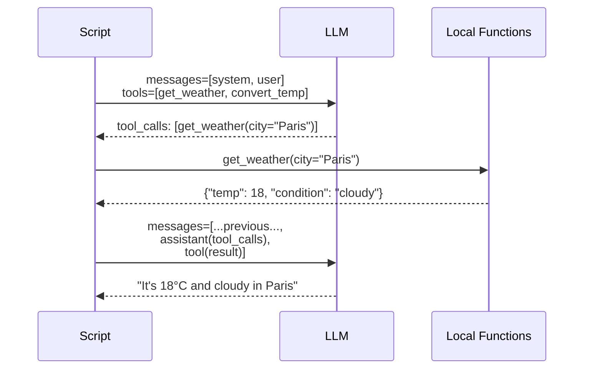

# Exercise: Function Calling

## Objective

Learn how LLMs interact with external tools through function calling — the foundation of agentic behavior.

## Concepts Covered

- Tool definitions with `openai.pydantic_function_tool()`
- The `tools` parameter and strict mode
- Parsing `tool_calls` from model responses
- `tool` role messages for returning results

## How It Works

This script introduces the mechanics of function calling. You define tools as Pydantic models and register them with `openai.pydantic_function_tool()`. When the model decides it needs a tool, it returns a `tool_calls` array instead of a text reply. You execute the function locally and send the result back with `role: "tool"`.



**Context sharing:** A single `messages` list grows across the exchange: system → user → assistant (with tool_calls) → tool result → assistant (final answer).

## Interactive Message Flow

<div class="message-flow-interactive" markdown="block" data-title="Function Calling: Single Round Trip" data-context-type="growing" data-context-label="Messages list grows as tools are called and results returned">

<div class="mf-step" data-description="System prompt establishes the weather assistant, user asks about Berlin weather and a temperature conversion">
<div class="mf-msg" data-role="system" data-list="messages" data-payload='{"role": "system", "content": "You are a helpful weather assistant. Use the provided tools to answer questions."}'>You are a helpful weather assistant. Use the provided tools to answer questions.</div>
<div class="mf-msg" data-role="user" data-list="messages" data-payload='{"role": "user", "content": "What&#39;s the weather in Berlin? Also convert 18C to Fahrenheit."}'>What's the weather in Berlin? Also convert 18C to Fahrenheit.</div>
</div>

<div class="mf-step" data-description="The model decides it needs two tools and returns tool_calls instead of a text response">
<div class="mf-msg" data-role="tool_calls" data-list="messages" data-agent="Assistant" data-payload='{"role": "assistant", "content": null, "tool_calls": [{"id": "call_fw92", "type": "function", "function": {"name": "get_weather", "arguments": "{\"city\":\"Berlin\",\"unit\":\"celsius\"}"}}, {"id": "call_ht73", "type": "function", "function": {"name": "convert_temperature", "arguments": "{\"value\":18,\"from_unit\":\"celsius\",\"to_unit\":\"fahrenheit\"}"}}]}'>get_weather(location='Berlin') + convert_temperature(celsius=18)</div>
</div>

<div class="mf-step" data-description="Your code executes both tool functions locally and appends results with role='tool'">
<div class="mf-msg" data-role="tool" data-list="messages" data-agent="get_weather" data-payload='{"role": "tool", "tool_call_id": "call_fw92", "content": "{\"location\": \"Berlin\", \"temperature\": 18, \"condition\": \"Partly cloudy\"}"}'>{"location": "Berlin", "temperature": 18, "condition": "Partly cloudy"}</div>
<div class="mf-msg" data-role="tool" data-list="messages" data-agent="convert_temperature" data-payload='{"role": "tool", "tool_call_id": "call_ht73", "content": "{\"celsius\": 18, \"fahrenheit\": 64.4}"}'>{"celsius": 18, "fahrenheit": 64.4}</div>
</div>

<div class="mf-step" data-description="The model sees the tool results and produces a natural language summary for the user">
<div class="mf-msg" data-role="assistant" data-list="messages" data-payload='{"role": "assistant", "content": "Berlin is currently 18C (64.4F) and partly cloudy. Great weather for a walk!"}'>Berlin is currently 18C (64.4F) and partly cloudy. Great weather for a walk!</div>
</div>

</div>

## File

- **`01_function_calling.py`** — Define and invoke tools with Pydantic schemas

## How to Run

```bash
python exercises/02_tool_use/01_function_calling.py
```

## Expected Output

Structured logging showing the tool call request, local function execution, tool result returned, and the final model response.

## Next

→ [Exercise: Tool Loop](02_tool_loop.md)
