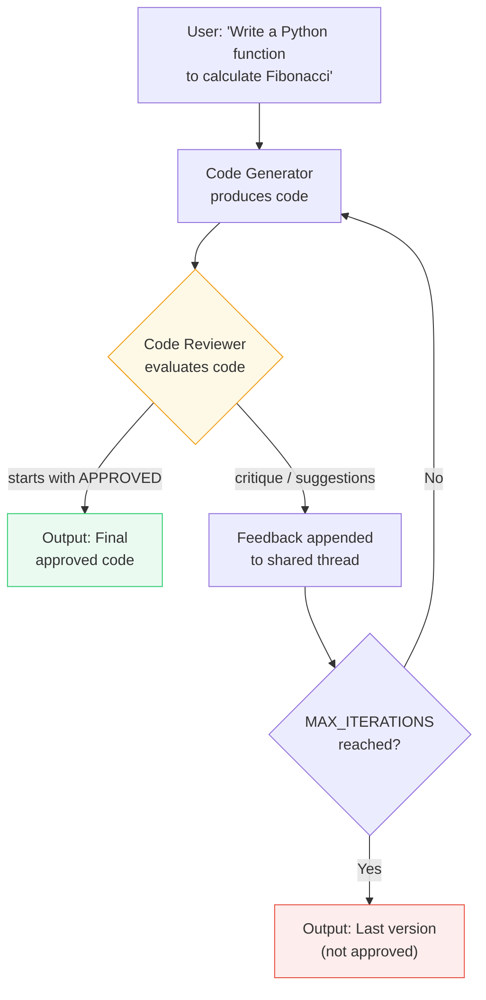
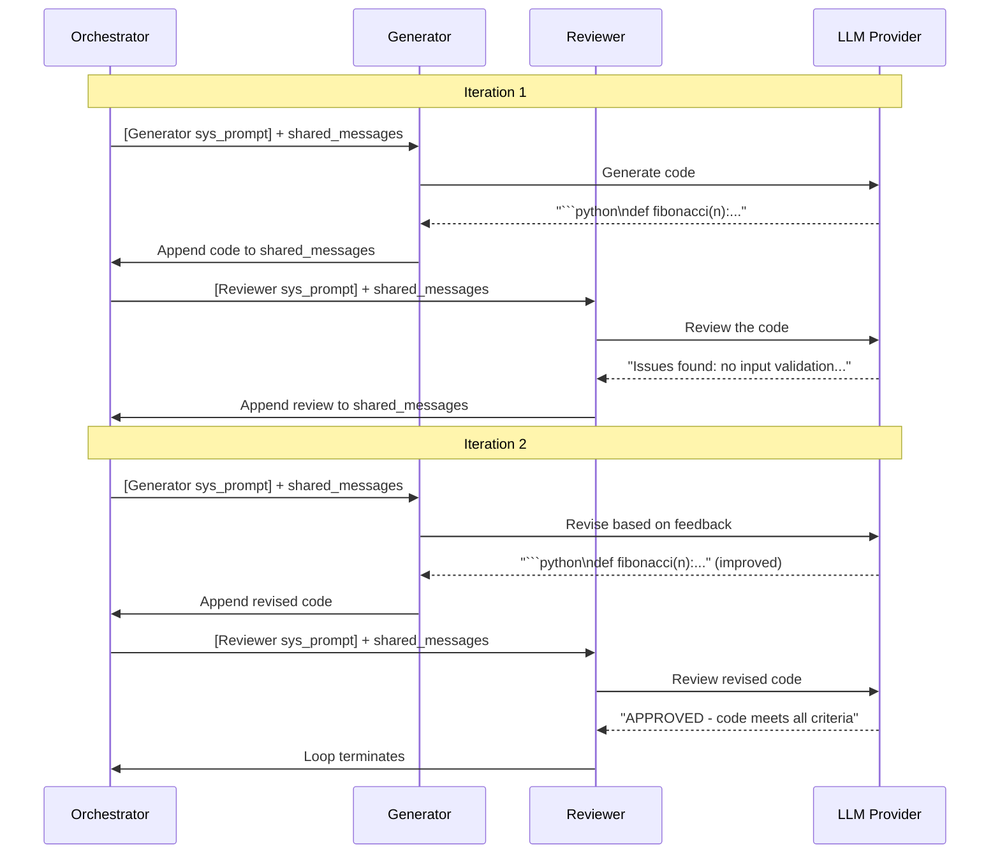

# Exercise: Maker-Checker (Reflection Loop)

## Objective

Implement the **maker-checker** pattern (also called the **evaluator-optimizer** or **reflection** pattern) — two agents alternate on a shared conversation thread until quality criteria are met.

## Concepts Covered

- Maker-checker / evaluator-optimizer loop (reflection pattern)
- Shared conversation thread between two agents
- String-based termination condition (`APPROVED`)
- `MAX_ITERATIONS` safety valve
- Iterative refinement via accumulated feedback

## How It Works

Two agents — a Code Generator and a Code Reviewer — alternate on a shared conversation thread. The Generator produces code, the Reviewer critiques it, and the loop continues until the Reviewer responds with `APPROVED` or `MAX_ITERATIONS` (4) is reached.





**Context sharing:** **Fully shared.** Both agents operate on the same thread. The Reviewer sees the Generator's code and all prior iterations. The Generator sees the Reviewer's feedback and improves accordingly. This accumulating shared context is what enables iterative refinement.

**Structured output:** Not used. Agent replies are plain text strings. Termination is detected by checking if the review `strip().upper().startswith("APPROVED")`.

!!! warning "Context window growth"
    In the maker-checker variant, the shared messages list grows with every iteration. With up to 8 turns (4 iterations × 2 agents), the context can become substantial. For production systems, consider summarizing or truncating older messages.

## Interactive Message Flow

<div class="message-flow-interactive" markdown="block" data-title="Maker-Checker: Iterative Code Review" data-context-type="shared" data-context-label="Generator and Reviewer alternate on the same shared messages list until APPROVED">

<div class="mf-step" data-description="Two agents are created: a Generator and a Reviewer, each with a specialized system prompt. These are prepended per-agent before each API call.">
<div class="mf-msg" data-role="system" data-list="agent_system_prompts" data-agent="Generator" data-payload='{"role": "system", "content": "You are an expert Python developer. Write clean, well-documented Python code that follows best practices. When you receive feedback from a reviewer, carefully address each point and provide an improved version. Output ONLY the Python code (in a code block) — no extra commentary."}'>You are an expert Python developer. Write clean, well-documented Python code that follows best practices. When you receive feedback from a reviewer, carefully address each point and provide an improved version. Output ONLY the Python code (in a code block) — no extra commentary.</div>
<div class="mf-msg" data-role="system" data-list="agent_system_prompts" data-agent="Reviewer" data-payload='{"role": "system", "content": "You are a meticulous code reviewer. Review the provided Python code for:\n1. Correctness — does it handle edge cases?\n2. Readability — clear naming, good structure?\n3. Best practices — type hints, docstrings, error handling?\n4. Performance — any obvious inefficiencies?\n\nIf the code is good enough, respond with exactly &#39;APPROVED&#39; as the first word.\nIf it needs improvement, provide specific, actionable feedback points.\nBe constructive but rigorous."}'>You are a meticulous code reviewer. Review the provided Python code for: 1. Correctness — does it handle edge cases? 2. Readability — clear naming, good structure? 3. Best practices — type hints, docstrings, error handling? 4. Performance — any obvious inefficiencies? If the code is good enough, respond with exactly 'APPROVED' as the first word. If it needs improvement, provide specific, actionable feedback points. Be constructive but rigorous.</div>
</div>

<div class="mf-step" data-description="The coding task is placed in the shared messages list. Both Generator and Reviewer will see this.">
<div class="mf-msg" data-role="user" data-list="shared_messages" data-payload='{"role": "user", "content": "Write a Python function merge_sorted_lists(list1, list2) that merges two sorted lists into one sorted list. Do NOT use sorted() — implement the merge algorithm manually."}'>Write a Python function merge_sorted_lists(list1, list2) that merges two sorted lists into one sorted list. Do NOT use sorted() — implement the merge algorithm manually.</div>
</div>

<div class="mf-step" data-description="Iteration 1 — Generator produces initial code. It sees only the task description.">
<div class="mf-msg" data-role="assistant" data-list="shared_messages" data-agent="Generator" data-payload='{"role": "assistant", "content": "def merge_sorted_lists(list1, list2): Two-pointer merge — initialize result=[], i=j=0. Compare elements, append smaller, advance pointer. After loop, extend with remaining elements. Includes docstring and edge case handling for empty lists."}'>def merge_sorted_lists(list1, list2): Two-pointer merge — initialize result=[], i=j=0. Compare elements, append smaller, advance pointer. After loop, extend with remaining elements. Includes docstring and edge case handling for empty lists.</div>
</div>

<div class="mf-step" data-description="Iteration 1 — Reviewer evaluates. In the actual run, the code was clean enough to pass on first try.">
<div class="mf-msg" data-role="assistant" data-list="shared_messages" data-agent="Reviewer" data-payload='{"role": "assistant", "content": "APPROVED. The implementation correctly uses two-pointer merge with O(n) time complexity. Edge cases (empty lists, remaining elements) are handled properly. Type hints and docstring included. Code is clean and efficient."}'>APPROVED. The implementation correctly uses two-pointer merge with O(n) time complexity. Edge cases (empty lists, remaining elements) are handled properly. Type hints and docstring included. Code is clean and efficient.</div>
</div>

</div>

## Message Flow: Practical Example

This shows how the **shared messages list** grows during the maker-checker loop.

### Shared messages with a termination condition

**Start — the coding task:**

```python
# Initial state
shared_messages = [
    {"role": "user", "content": "Write a Python function `merge_sorted_lists`..."}
]
```

**Generator produces initial code → appended to shared list:**

```python
shared_messages = [
    {"role": "user",      "content": "Write a Python function `merge_sorted_lists`..."},
    {"role": "assistant", "content": "[Generator]: ```python\ndef merge_sorted_lists(...):\n    ...```"}
]
```

**Reviewer evaluates:** The Reviewer sees the shared list plus an extra instruction. If the code has issues:

```python
# Reviewer adds its critique to the shared list:
shared_messages = [
    {"role": "user",      "content": "Write a Python function `merge_sorted_lists`..."},
    {"role": "assistant", "content": "[Generator]: ```python\ndef merge_sorted_lists(...):\n    ...```"},
    {"role": "assistant", "content": "[Reviewer]: Missing type hints and no edge case handling for empty lists..."}
]
```

**Generator revises** — it sees the original task, its first attempt, AND the feedback:

```python
shared_messages = [
    {"role": "user",      "content": "Write a Python function `merge_sorted_lists`..."},
    {"role": "assistant", "content": "[Generator]: ```python\ndef merge_sorted_lists(...):\n    ...```"},
    {"role": "assistant", "content": "[Reviewer]: Missing type hints and no edge case handling..."},
    {"role": "assistant", "content": "[Generator]: ```python\ndef merge_sorted_lists(list1: list[int], ...):\n    ...```"}
]
```

**Reviewer approves** — the loop terminates:

```python
shared_messages = [
    {"role": "user",      "content": "Write a Python function `merge_sorted_lists`..."},
    {"role": "assistant", "content": "[Generator]: ```python\ndef merge_sorted_lists(...):\n    ...```"},
    {"role": "assistant", "content": "[Reviewer]: Missing type hints and no edge case handling..."},
    {"role": "assistant", "content": "[Generator]: ```python\ndef merge_sorted_lists(list1: list[int], ...):\n    ...```"},
    {"role": "assistant", "content": "[Reviewer]: APPROVED - code meets all criteria"}
]
# ↑ Loop ends because review.strip().upper().startswith("APPROVED")
```

**Termination:** The loop checks `review.strip().upper().startswith("APPROVED")`. If not approved after `MAX_ITERATIONS=4`, the loop ends with the last generated code (not approved).

## File

- **`02_maker_checker.py`** — Code generator + reviewer in a reflection loop

## How to Run

```bash
python exercises/06_group_chat/02_maker_checker.py
```

## Expected Output

Turn-by-turn logging showing the Generator producing code, the Reviewer providing feedback (or approving), and the iterative refinement loop progressing.

## References

- **Andrew Ng — Agentic Design Patterns (2024):** Ng identifies *Multi-Agent Collaboration* and *Reflection* as two of four foundational agentic AI patterns. The brainstorm exercise implements multi-agent collaboration; maker-checker implements reflection (an agent critiques and iterates on another's output). See [Agentic Design Patterns Part 2: Reflection](https://www.deeplearning.ai/the-batch/agentic-design-patterns-part-2-reflection/) and the full [Agentic AI course by DeepLearning.AI](https://www.deeplearning.ai/courses/).
- **Microsoft Agent Framework SDK — `RoundRobinGroupChat`:** The production-grade implementation of this pattern. Agents take turns via `select_speaker()` cycling through `participant_names` with modular termination conditions. See [Agent Framework documentation](https://learn.microsoft.com/en-us/agent-framework/) and the [`RoundRobinGroupChat` source](https://github.com/microsoft/autogen/blob/main/python/packages/autogen-agentchat/src/autogen_agentchat/teams/_group_chat/_round_robin_group_chat.py).
- **Microsoft Agent Framework — Group Chat Orchestration:** Describes round-robin, selector-based, and swarm group chat strategies with shared message threads and configurable termination. See [Group Chat Orchestration on Microsoft Learn](https://learn.microsoft.com/en-us/agent-framework/workflows/orchestrations/group-chat).
- **LangGraph — Multi-Agent Group Chat:** Graph-based orchestration where agents are nodes and edges define speaking order. Round-robin is modeled as a cyclic graph. See [LangGraph documentation](https://www.langchain.com/langgraph).

## Next

→ [Exercise: Handoff Pattern](07_handoff.md)
