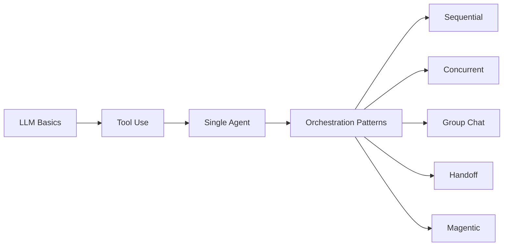

# Agentic AI Design Patterns Workshop

!!! warning "Disclaimer"
    This is **not** an official Microsoft product, does not represent official Microsoft learning materials, product documentation, or official statements by Microsoft Corporation. The content, opinions, and recommendations presented herein are the authors' own, provided solely for educational purposes, and should not be construed as official Microsoft guidance or endorsement.

Welcome to the **Agentic AI Design Patterns Workshop** — a hands-on, multi-part workshop that teaches you how to build AI agents and multi-agent systems using **pure Python and the OpenAI SDK**. No AI frameworks required.

:material-share-variant: **Spread the word** — if you find this workshop useful, share it with your network!

<a class="share-cta__btn share-cta__btn--linkedin" href="https://www.linkedin.com/sharing/share-offsite/?url=https%3A%2F%2Fgithub.com%2Fjeffreygroneberg%2FAI_Workshop_Agentic_Patterns" target="_blank" rel="noopener" title="Share on LinkedIn"><svg viewBox="0 0 24 24"><path d="M20.447 20.452h-3.554v-5.569c0-1.328-.027-3.037-1.852-3.037-1.853 0-2.136 1.445-2.136 2.939v5.667H9.351V9h3.414v1.561h.046c.477-.9 1.637-1.85 3.37-1.85 3.601 0 4.267 2.37 4.267 5.455v6.286zM5.337 7.433a2.062 2.062 0 01-2.063-2.065 2.064 2.064 0 112.063 2.065zm1.782 13.019H3.555V9h3.564v11.452zM22.225 0H1.771C.792 0 0 .774 0 1.729v20.542C0 23.227.792 24 1.771 24h20.451C23.2 24 24 23.227 24 22.271V1.729C24 .774 23.2 0 22.222 0h.003z"/></svg> LinkedIn</a>
<a class="share-cta__btn share-cta__btn--x" href="https://x.com/intent/tweet?text=Check%20out%20this%20hands-on%20workshop%20on%20Agentic%20AI%20Design%20Patterns%20%E2%80%94%20pure%20Python%2C%20no%20frameworks!&url=https%3A%2F%2Fgithub.com%2Fjeffreygroneberg%2FAI_Workshop_Agentic_Patterns" target="_blank" rel="noopener" title="Share on X"><svg viewBox="0 0 24 24"><path d="M18.901 1.153h3.68l-8.04 9.19L24 22.846h-7.406l-5.8-7.584-6.638 7.584H.474l8.6-9.83L0 1.154h7.594l5.243 6.932ZM17.61 20.644h2.039L6.486 3.24H4.298Z"/></svg> X</a>
<a class="share-cta__btn share-cta__btn--substack" href="https://substack.com/share?url=https%3A%2F%2Fgithub.com%2Fjeffreygroneberg%2FAI_Workshop_Agentic_Patterns&title=Agentic%20AI%20Design%20Patterns%20Workshop" target="_blank" rel="noopener" title="Share on Substack"><svg viewBox="0 0 24 24"><path d="M22.539 8.242H1.46V5.406h21.08v2.836zM1.46 10.812V24l9.6-5.244 9.6 5.244V10.812H1.46zM22.54 0H1.46v2.836h21.08V0z"/></svg> Substack</a>
<a class="share-cta__btn share-cta__btn--reddit" href="https://www.reddit.com/submit?url=https%3A%2F%2Fgithub.com%2Fjeffreygroneberg%2FAI_Workshop_Agentic_Patterns&title=Agentic%20AI%20Design%20Patterns%20Workshop" target="_blank" rel="noopener" title="Share on Reddit"><svg viewBox="0 0 24 24"><path d="M12 0A12 12 0 000 12a12 12 0 0012 12 12 12 0 0012-12A12 12 0 0012 0zm5.01 4.744c.688 0 1.25.561 1.25 1.249a1.25 1.25 0 01-2.498.056l-2.597-.547-.8 3.747c1.824.07 3.48.632 4.674 1.488.308-.309.73-.491 1.207-.491.968 0 1.754.786 1.754 1.754 0 .716-.435 1.333-1.01 1.614a3.111 3.111 0 01.042.52c0 2.694-3.13 4.87-7.004 4.87-3.874 0-7.004-2.176-7.004-4.87 0-.183.015-.366.043-.534A1.748 1.748 0 014.028 12c0-.968.786-1.754 1.754-1.754.463 0 .898.196 1.207.49 1.207-.883 2.878-1.43 4.744-1.487l.885-4.182a.342.342 0 01.14-.197.35.35 0 01.238-.042l2.906.617a1.214 1.214 0 011.108-.701zM9.25 12C8.561 12 8 12.562 8 13.25c0 .687.561 1.248 1.25 1.248.687 0 1.248-.561 1.248-1.249 0-.688-.561-1.249-1.249-1.249zm5.5 0c-.687 0-1.248.561-1.248 1.25 0 .687.561 1.248 1.249 1.248.688 0 1.249-.561 1.249-1.249 0-.687-.562-1.249-1.25-1.249zm-5.466 3.99a.327.327 0 00-.231.094.33.33 0 000 .463c.842.842 2.484.913 2.961.913.477 0 2.105-.056 2.961-.913a.361.361 0 000-.463.327.327 0 00-.462 0c-.547.533-1.684.73-2.512.73-.828 0-1.979-.196-2.512-.73a.326.326 0 00-.205-.094z"/></svg> Reddit</a>
<a class="share-cta__btn share-cta__btn--hn" href="https://news.ycombinator.com/submitlink?u=https%3A%2F%2Fgithub.com%2Fjeffreygroneberg%2FAI_Workshop_Agentic_Patterns&t=Agentic%20AI%20Design%20Patterns%20Workshop" target="_blank" rel="noopener" title="Share on Hacker News"><svg viewBox="0 0 24 24"><path d="M0 24V0h24v24H0zM6.951 5.896l4.112 7.708v5.064h1.583v-4.972l4.148-7.799h-1.749l-2.457 4.875c-.372.745-.688 1.434-.688 1.434s-.297-.708-.651-1.434L8.831 5.896H6.951z"/></svg> Hacker News</a>
<a class="share-cta__btn share-cta__btn--github" href="https://github.com/jeffreygroneberg/AI_Workshop_Agentic_Patterns" target="_blank" rel="noopener" title="Star on GitHub"><svg viewBox="0 0 24 24"><path d="M12 .297c-6.63 0-12 5.373-12 12 0 5.303 3.438 9.8 8.205 11.385.6.113.82-.258.82-.577 0-.285-.01-1.04-.015-2.04-3.338.724-4.042-1.61-4.042-1.61C4.422 18.07 3.633 17.7 3.633 17.7c-1.087-.744.084-.729.084-.729 1.205.084 1.838 1.236 1.838 1.236 1.07 1.835 2.809 1.305 3.495.998.108-.776.417-1.305.76-1.605-2.665-.3-5.466-1.332-5.466-5.93 0-1.31.465-2.38 1.235-3.22-.135-.303-.54-1.523.105-3.176 0 0 1.005-.322 3.3 1.23.96-.267 1.98-.399 3-.405 1.02.006 2.04.138 3 .405 2.28-1.552 3.285-1.23 3.285-1.23.645 1.653.24 2.873.12 3.176.765.84 1.23 1.91 1.23 3.22 0 4.61-2.805 5.625-5.475 5.92.42.36.81 1.096.81 2.22 0 1.606-.015 2.896-.015 3.286 0 .315.21.69.825.57C20.565 22.092 24 17.592 24 12.297c0-6.627-5.373-12-12-12"/></svg> Star on GitHub</a>

## What You'll Learn

By the end of this workshop you will understand:

1. How LLMs work as building blocks (chat completions, system prompts, structured outputs)
2. How to give LLMs tools and build the core agent loop (Reason → Act → Observe)
3. Five multi-agent orchestration patterns and when to use each one
4. How context flows between agents in each pattern
5. Practical considerations: reliability, human-in-the-loop, and choosing the right pattern

## Learning Path

## Workshop Structure

| Part | Topics | Exercises |
|------|--------|-----------|
| **Part 1** | LLM fundamentals, tool use, single agents | `00_setup` → `03_single_agent` |
| **Part 2** | Sequential, concurrent, group chat patterns | `04_sequential` → `06_group_chat` |
| **Part 3** | Handoff, magentic, implementation topics | `07_handoff` → `08_magentic` |

## Philosophy

This workshop deliberately avoids AI agent frameworks. Instead, you build everything from scratch using:

- **[OpenAI Python SDK](https://github.com/openai/openai-python){:target="_blank"}** — the `openai` package for LLM calls
- **[Pydantic](https://docs.pydantic.dev/latest/){:target="_blank"}** — for structured outputs and tool parameter schemas
- **Python standard library** — `logging`, `dataclasses`, `concurrent.futures`, `pathlib`

By building each pattern yourself, you understand *exactly* what frameworks like the **[Microsoft Agent Framework](https://learn.microsoft.com/en-us/agent-framework/){:target="_blank"}** do under the hood. This makes you a better user of any framework you choose later.

## Provider Flexibility

Every exercise works with any of these providers — just set `LLM_PROVIDER` in your `.env`:

| Provider | `LLM_PROVIDER` | What You Need |
|----------|----------------|---------------|
| GitHub Models | `github` | GitHub token (free tier available) |
| OpenAI | `openai` | OpenAI API key |
| Azure AI Foundry | `azure` | Azure OpenAI endpoint + key |

## Getting Started

1. Read the [Setup Guide](setup.md) to configure your environment
2. Work through the [Concepts](concepts/chat-completions-api.md) section to build foundations
3. Tackle each [Pattern](patterns/single-agent.md) with its corresponding exercise
4. Review [Production Considerations](production-considerations/index.md) for real-world engineering challenges

!!! tip "Read first, then code"
    Each pattern has a **documentation page** (you're reading the docs now) and a **hands-on exercise** in the `exercises/` folder. Always read the docs page first to understand *what* and *why*, then open the exercise to see *how* and practice.
