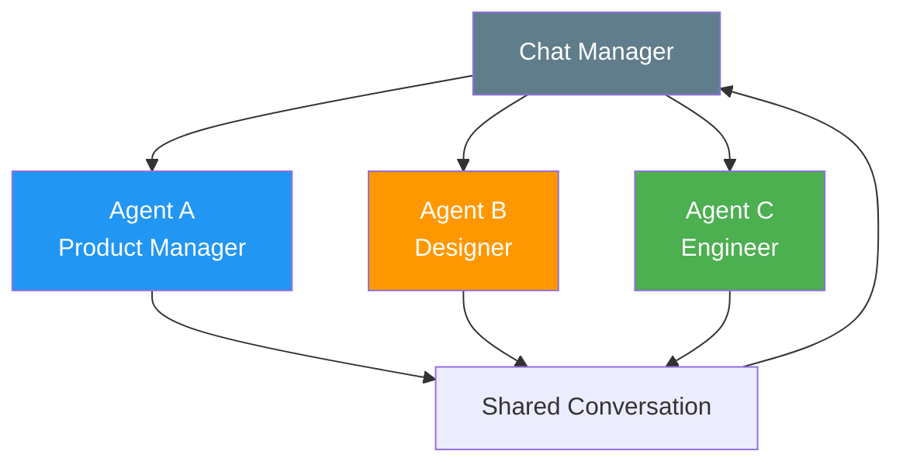
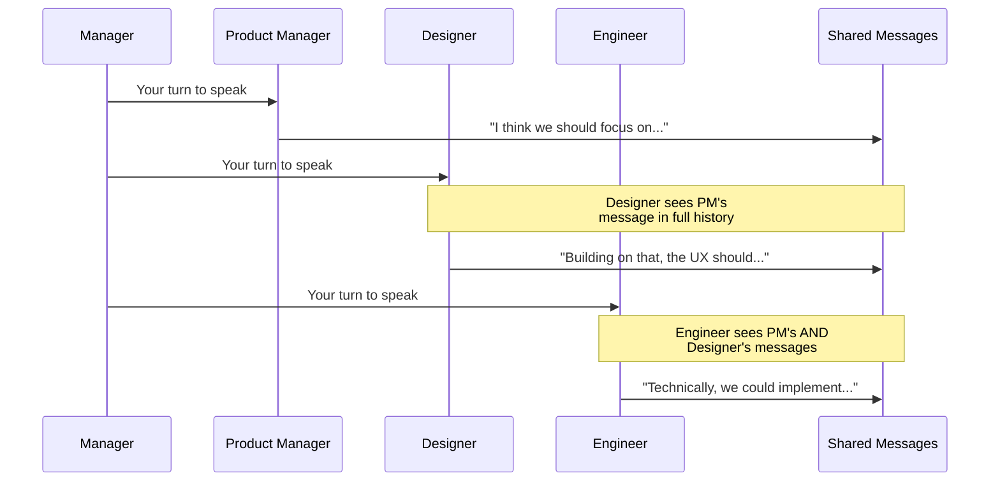
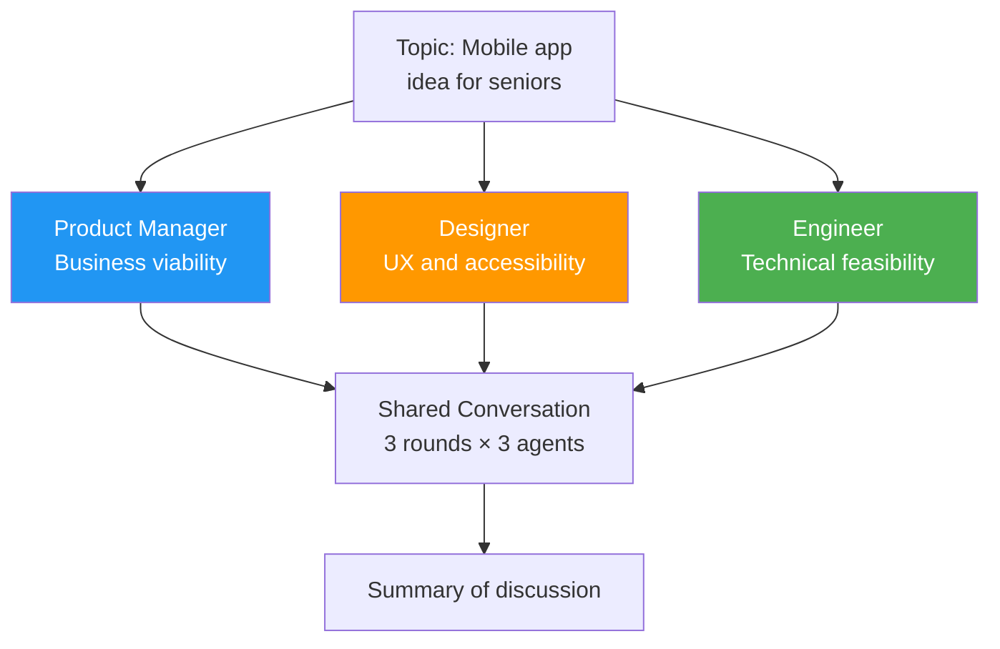

# Brainstorm (Round-Robin) Pattern

The brainstorm pattern puts multiple agents in a shared conversation where they take turns in a **fixed, repeating order** (round-robin), building on each other's messages.

## Pattern Architecture



## When to Use

- The task benefits from **multiple perspectives debating** the same problem
- Agents need to **build on each other's ideas**
- You want **predictable, democratic** conversations where every voice is heard equally
- Examples: brainstorming, collaborative planning, requirements gathering

## When to Avoid

- Agents don't need to see each other's output (use [Concurrent](concurrent.md))
- Tasks have a clear linear flow (use [Sequential](sequential.md))
- You need dynamic routing (use [Handoff](handoff.md))
- You need iterative quality refinement (use [Maker-Checker](maker-checker.md))

## Context Passing Strategy

All agents share the **same conversation thread** — a single `messages` list that grows with every turn. This is the "shared memory" approach.



**Why shared conversation?**

- Agents naturally build on each other's ideas
- Context accumulates — later agents have richer information
- Simulates a real team discussion

**Trade-off**: The message list grows with every turn, which can hit token limits in long discussions. For production systems, consider summarization between rounds.

## What We're Building

### [Brainstorm Exercise](../exercises/06_brainstorm.md){:target="_blank"}



## Expected Console Output

```
══════════════════════════════════════════════════════════════════
  Group Chat: Brainstorm
══════════════════════════════════════════════════════════════════
[INFO] Topic: Design a mobile app for seniors

══════════════════════════════════════════════════════════════════
  Round 1 of 3
══════════════════════════════════════════════════════════════════
[INFO] [Product Manager] From a business perspective, the senior
       demographic is growing rapidly...
[INFO] [Designer] Accessibility is paramount. Large fonts, high
       contrast, simple navigation...
[INFO] [Engineer] We should consider offline capabilities and
       low bandwidth support...

══════════════════════════════════════════════════════════════════
  Round 2 of 3
══════════════════════════════════════════════════════════════════
[INFO] [Product Manager] Building on the accessibility points...
```

!!! tip "Ready to practice?"
    Continue with the hands-on exercise in the sidebar (✏️) to apply what you've learned.

## Key Takeaways

1. Round-robin = **fixed, repeating turn order** — predictable and democratic
2. All agents share the **same conversation thread** — each sees the full history
3. A **chat manager** controls turn order and termination
4. Shared context enables agents to build on each other's ideas
5. Watch token usage — shared conversations grow with every turn

## References

- [MS Learn — Group Chat Pattern](https://learn.microsoft.com/en-us/azure/architecture/ai-ml/guide/ai-agent-design-patterns)
- [Andrew Ng — Multi-Agent Collaboration (YouTube)](https://www.youtube.com/watch?v=sal78ACtGTc)
- [Microsoft Agent Framework — Group Chat Orchestration](https://learn.microsoft.com/en-us/agent-framework/workflows/orchestrations/group-chat)

## Hands-On Exercise

Head to the [Brainstorm exercise](../exercises/06_brainstorm.md){:target="_blank"} — PM, Designer, and Engineer debate a product idea in rounds.

You can run exercises from the terminal or use the [Workshop TUI](../workshop-tui.md).
