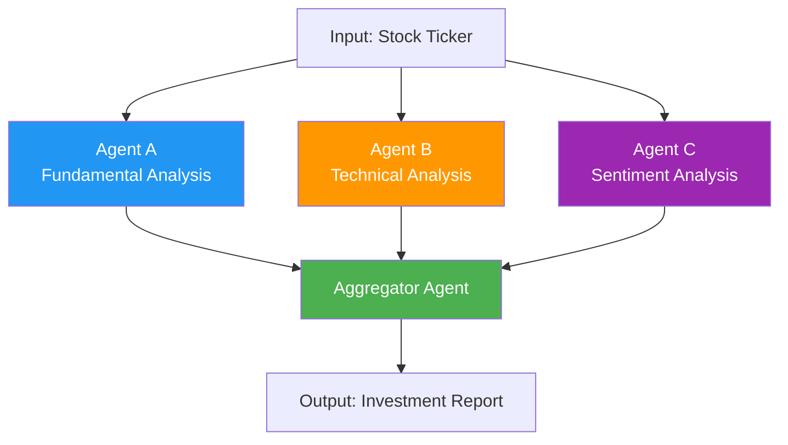
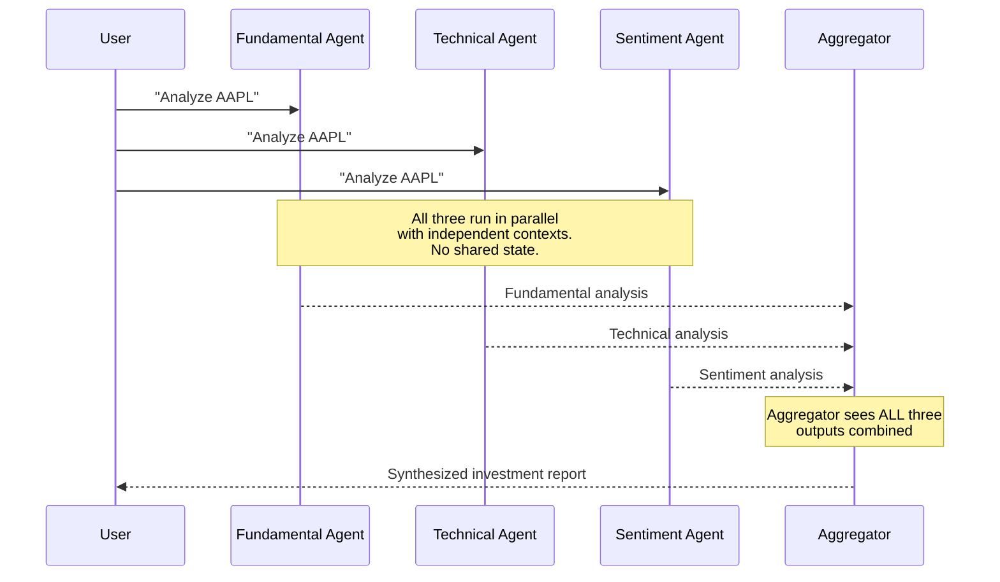
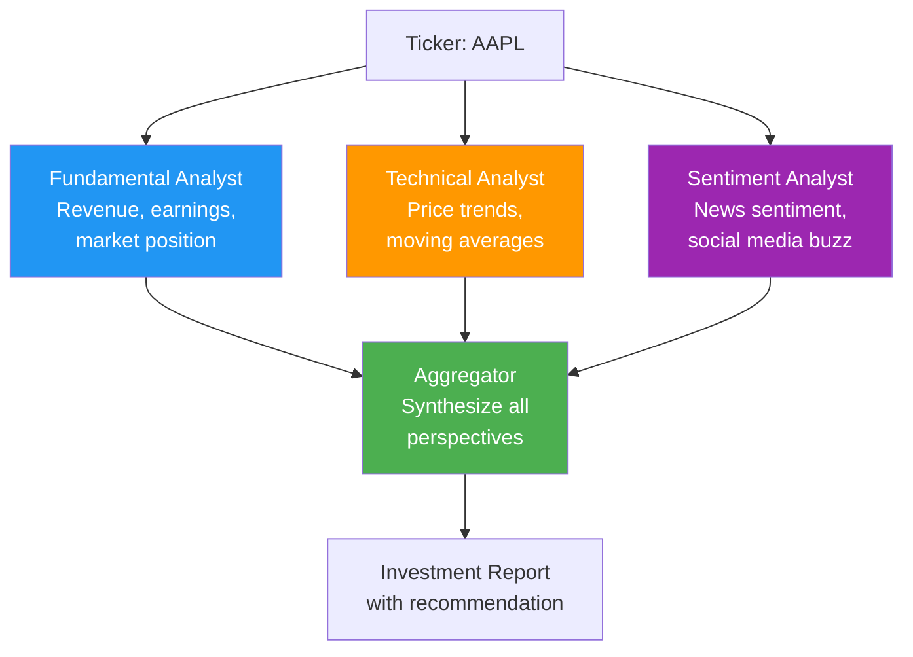

# Concurrent Pattern

The concurrent pattern runs multiple agents in parallel on the same input, then combines their results. Think of it as getting multiple expert opinions simultaneously.

## Pattern Architecture




*Source: [MS Learn — AI Agent Design Patterns](https://learn.microsoft.com/en-us/azure/architecture/ai-ml/guide/ai-agent-design-patterns)*

## When to Use

- Multiple **independent analyses** of the same data
- Each analysis benefits from a **different perspective or expertise**
- Analyses can run **without depending on each other**
- Examples: multi-perspective analysis, parallel data processing, ensemble reasoning

## When to Avoid

- Agents need to **see each other's output** (use [Group Chat](group-chat.md))
- One agent's output determines **what other agents do** (use [Sequential](sequential.md) or [Handoff](handoff.md))
- The task is inherently serial

## Context Passing Strategy

Each parallel agent gets the **same initial input independently** — no shared state between them. The aggregator gets **all agent outputs** as a combined input.



**Why independent contexts?**

- Prevents one agent's reasoning from biasing another
- Each agent is free to form its own conclusions
- Enables true parallelism (no data dependencies)
- The aggregator can weigh conflicting opinions

**How it works in Python**: `concurrent.futures.ThreadPoolExecutor` runs each agent in its own thread. Each thread creates its own `get_client()` instance to avoid connection sharing issues.

## What We're Building



## Expected Console Output

```
══════════════════════════════════════════════════════════════════
  Concurrent Pattern: Stock Analysis
══════════════════════════════════════════════════════════════════
[INFO] Analyzing ticker: AAPL

══════════════════════════════════════════════════════════════════
  Fan-Out: Starting 3 parallel analysts
══════════════════════════════════════════════════════════════════
[INFO] [Fundamental Analyst] Starting analysis of AAPL...
[INFO] [Technical Analyst] Starting analysis of AAPL...
[INFO] [Sentiment Analyst] Starting analysis of AAPL...

[INFO] [Fundamental Analyst] Completed analysis
[INFO] [Technical Analyst] Completed analysis
[INFO] [Sentiment Analyst] Completed analysis

══════════════════════════════════════════════════════════════════
  Fan-In: Aggregating results
══════════════════════════════════════════════════════════════════
[INFO] [Aggregator] Synthesizing 3 analyst reports...
[INFO] [Aggregator] Investment Report: ...
```

!!! tip "Ready to practice?"
    Continue with the hands-on exercise in the sidebar (✏️) to apply what you've learned.

## Key Takeaways

1. Concurrent = fan-out/fan-in — same input, parallel processing, merged results
2. Each agent works **independently** with no shared state
3. The **aggregator** synthesizes potentially conflicting opinions
4. Use `ThreadPoolExecutor` for real parallelism in Python
5. Each thread needs its own client instance (don't share connections)

## References

- [MS Learn — Concurrent Pattern](https://learn.microsoft.com/en-us/azure/architecture/ai-ml/guide/ai-agent-design-patterns)
- [Python `concurrent.futures` Documentation](https://docs.python.org/3/library/concurrent.futures.html)

## Hands-On Exercise

Head to the [Concurrent exercise](../exercises/05_concurrent.md) — build a fan-out/fan-in stock analysis system with 3 parallel analysts and an aggregator.

You can run it from the terminal or use the [Workshop TUI](../workshop-tui.md).
