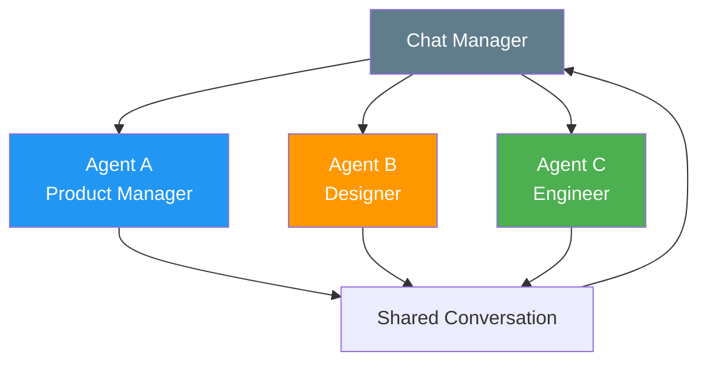
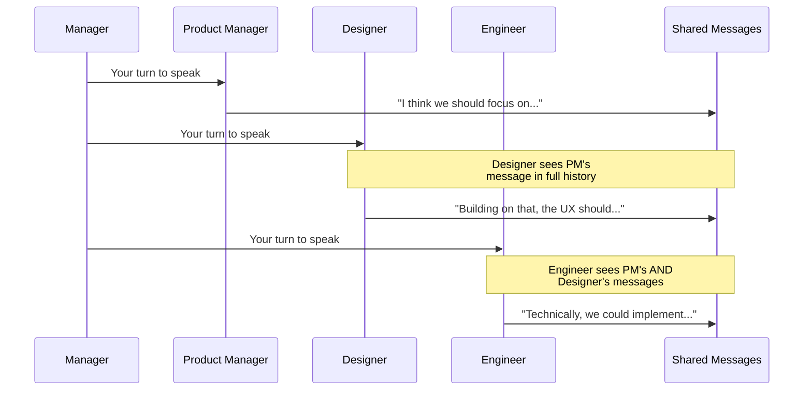
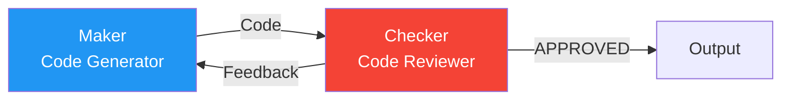
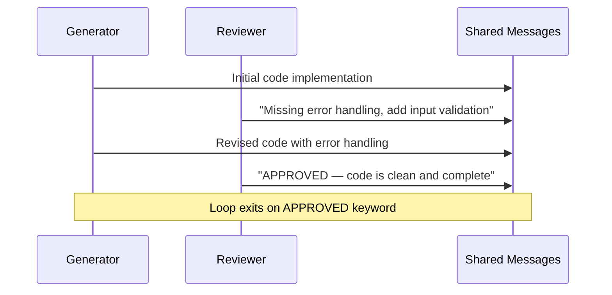
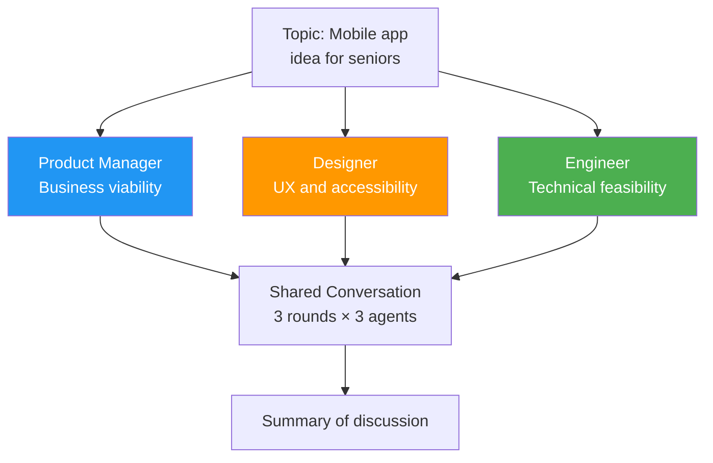
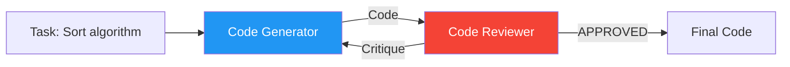

# Group Chat Pattern

The group chat pattern puts multiple agents in a shared conversation where they take turns, building on each other's messages. This includes the **maker-checker** (reflection) sub-pattern.

## Pattern Architecture



## When to Use

- The task benefits from **multiple perspectives debating** the same problem
- Agents need to **build on each other's ideas**
- **Iterative refinement** — one agent creates, another critiques, repeat
- Examples: brainstorming, code review, collaborative writing

## When to Avoid

- Agents don't need to see each other's output (use [Concurrent](concurrent.md))
- Tasks have a clear linear flow (use [Sequential](sequential.md))
- You need dynamic routing (use [Handoff](handoff.md))

## Context Passing Strategy

All agents share the **same conversation thread** — a single `messages` list that grows with every turn. This is the "shared memory" approach.



**Why shared conversation?**

- Agents naturally build on each other's ideas
- Context accumulates — later agents have richer information
- Simulates a real team discussion

**Trade-off**: The message list grows with every turn, which can hit token limits in long discussions. For production systems, consider summarization between rounds.

## Variant: Maker-Checker (Reflection)

The maker-checker is a two-agent group chat with a specific structure:



1. **Maker** produces output (code, text, plan)
2. **Checker** reviews and provides feedback
3. **Maker** revises based on feedback
4. Loop until **Checker** approves or max iterations reached

This maps to the **Evaluator-Optimizer** pattern from Anthropic's "Building Effective Agents" and the **Reflection** pattern from Andrew Ng's agentic patterns talk.



## What We're Building

### Exercise 1: Brainstorm



### Exercise 2: Maker-Checker



## Expected Console Output

### Brainstorm

```
══════════════════════════════════════════════════════════════════
  Group Chat: Brainstorm
══════════════════════════════════════════════════════════════════
[INFO] Topic: Design a mobile app for seniors

══════════════════════════════════════════════════════════════════
  Round 1 of 3
══════════════════════════════════════════════════════════════════
[INFO] [Product Manager] From a business perspective, the senior
       demographic is growing rapidly...
[INFO] [Designer] Accessibility is paramount. Large fonts, high
       contrast, simple navigation...
[INFO] [Engineer] We should consider offline capabilities and
       low bandwidth support...

══════════════════════════════════════════════════════════════════
  Round 2 of 3
══════════════════════════════════════════════════════════════════
[INFO] [Product Manager] Building on the accessibility points...
```

### Maker-Checker

```
══════════════════════════════════════════════════════════════════
  Group Chat: Maker-Checker
══════════════════════════════════════════════════════════════════

[INFO] [Code Generator] Iteration 1:
       def sort_list(lst): ...

[INFO] [Code Reviewer] Iteration 1:
       Issues found: No type hints, missing docstring...

[INFO] [Code Generator] Iteration 2:
       def sort_list(lst: list[int]) -> list[int]: ...

[INFO] [Code Reviewer] Iteration 2:
       APPROVED — Clean, well-documented implementation.
```

!!! tip "Ready to practice?"
    Continue with the hands-on exercise in the sidebar (✏️) to apply what you've learned.

## Key Takeaways

1. Group chat = **shared conversation** — all agents see the full history
2. A **chat manager** controls turn order and termination
3. **Maker-checker** is a specialized 2-agent group chat for iterative refinement
4. Shared context enables agents to build on each other's ideas
5. Watch token usage — shared conversations grow with every turn

## References

- [MS Learn — Group Chat Pattern](https://learn.microsoft.com/en-us/azure/architecture/ai-ml/guide/ai-agent-design-patterns)
- [Anthropic — Evaluator-Optimizer Pattern](https://www.anthropic.com/engineering/building-effective-agents)
- [Andrew Ng — Reflection Pattern (YouTube)](https://www.youtube.com/watch?v=sal78ACtGTc)
- [Reflexion: Language Agents with Verbal Reinforcement Learning (Shinn et al., 2023)](https://arxiv.org/abs/2303.11366)

## Hands-On Exercises

Head to the [Group Chat exercises](../exercises/06_group_chat.md):

- **Brainstorm** — PM, Designer, and Engineer debate a product idea in rounds
- **Maker-Checker** — Code generator + reviewer in a reflection loop

You can run them from the terminal or use the [Workshop TUI](../workshop-tui.md).
