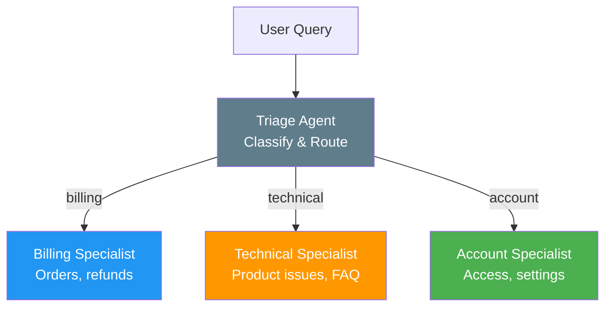
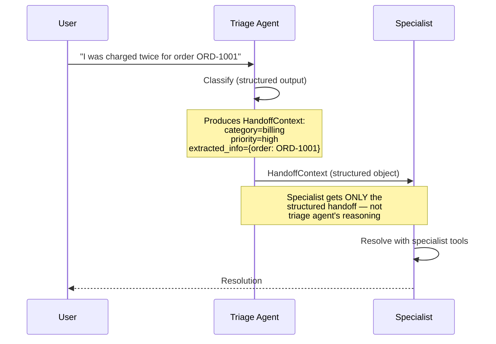
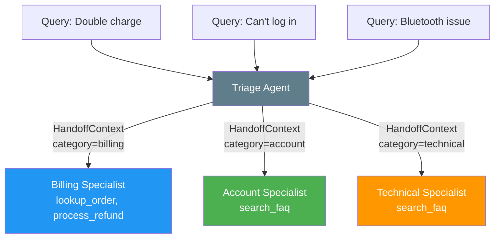

# Handoff Pattern

The handoff pattern uses a triage agent to classify incoming requests and route them to specialist agents. Each specialist has focused expertise and tools.

## Pattern Architecture




*Source: [MS Learn — AI Agent Design Patterns](https://learn.microsoft.com/en-us/azure/architecture/ai-ml/guide/ai-agent-design-patterns)*

## When to Use

- Different input types require **different expertise and tools**
- You want to keep specialist agents **focused** with lean system prompts
- The routing logic can be expressed as classification
- Examples: customer support triage, document routing, task categorization

## When to Avoid

- All queries need the **same set of tools** (use [Single Agent](single-agent.md))
- Tasks need multiple specialists to **collaborate** (use [Group Chat](group-chat.md))
- The plan needs to **adapt based on findings** (use [Magentic](magentic.md))

## Context Passing Strategy

The handoff pattern uses a **structured handoff object** — a dataclass — to pass context from triage to specialist. The specialist does NOT see the triage agent's internal reasoning.



### Three Context Passing Options

The exercise implements **Option 2** (structured handoff) and includes comments showing the alternatives:

| Option | What Gets Passed | Pros | Cons |
|--------|-----------------|------|------|
| **1. Full history** | Triage conversation + all messages | Simple | Noisy — specialist sees triage reasoning |
| **2. Structured handoff** (used) | `HandoffContext` dataclass | Clean, focused | Must explicitly extract relevant info |
| **3. Selective history** | Filtered messages (user/assistant only) | Balance | May miss relevant context |

**Why structured handoff?**

- Specialists stay focused — they don't see triage "thinking"
- Explicit about what information is passed
- Easy to extend (add fields to the dataclass)
- Works across process boundaries (serializable)

## What We're Building



## Expected Console Output

```
══════════════════════════════════════════════════════════════════
  Handoff Pattern: Support Triage
══════════════════════════════════════════════════════════════════

══════════════════════════════════════════════════════════════════
  Customer Query 1/3
══════════════════════════════════════════════════════════════════
[INFO] Customer: I was charged twice for order ORD-1001...

══════════════════════════════════════════════════════════════════
  Triage
══════════════════════════════════════════════════════════════════
[INFO] [Triage Agent] Category: billing | Priority: high
[INFO] [Triage Agent] Reasoning: Customer reports duplicate charge...

[INFO] Handoff: Triage Agent → Billing Specialist (category=billing)
[INFO] Context: structured HandoffContext (query + category + priority + extracted_info)

[INFO] [Billing Specialist] I've looked up order ORD-1001 and
       can see the duplicate charge. Processing your refund now...
```

## Hands-On Exercise

**`exercises/07_handoff/01_support_triage.py`** — Build a support triage system that classifies queries and routes to billing, technical, or account specialists.

```bash
python exercises/07_handoff/01_support_triage.py
```

## Key Takeaways

1. Handoff = **classify → route → resolve** with specialist agents
2. Use **structured outputs** (Pydantic) for reliable triage classification
3. Pass a **structured handoff object** — not raw conversation history
4. Specialists get **focused context** — they don't see triage reasoning
5. Each specialist has its own **tools and system prompt**

## References

- [MS Learn — Handoff Pattern](https://learn.microsoft.com/en-us/azure/architecture/ai-ml/guide/ai-agent-design-patterns)
- [Anthropic — "Building Effective Agents"](https://www.anthropic.com/engineering/building-effective-agents)
