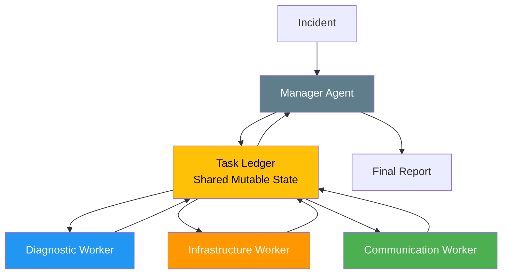
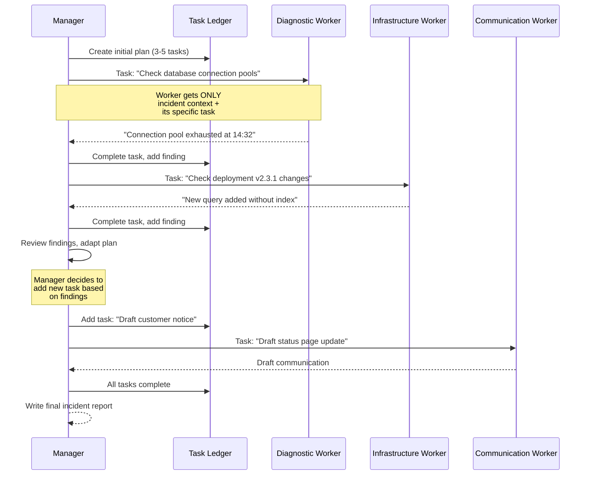
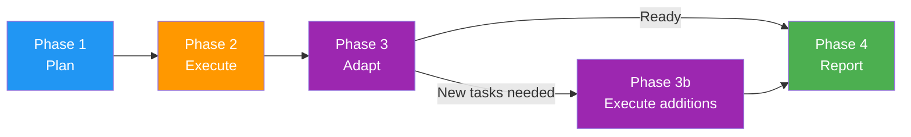
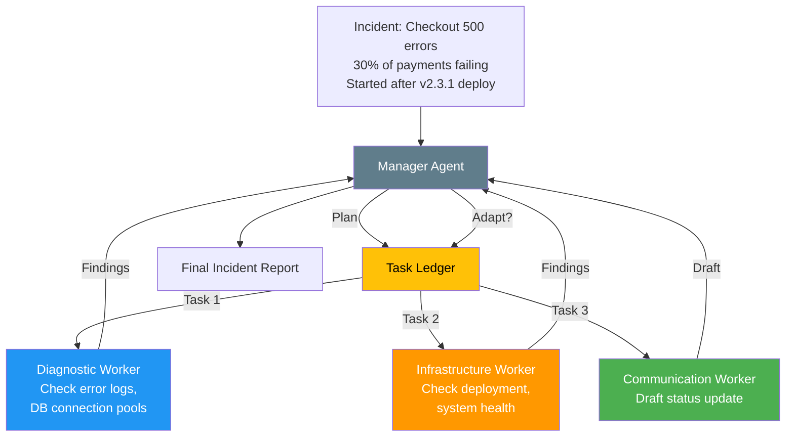

# Magentic Pattern

The magentic pattern (adaptive planning) uses a manager agent that maintains a **task ledger** and dynamically coordinates specialist workers. The plan adapts based on findings.

## Pattern Architecture




*Source: [MS Learn — AI Agent Design Patterns](https://learn.microsoft.com/en-us/azure/architecture/ai-ml/guide/ai-agent-design-patterns)*

## When to Use

- The task is **complex and multi-step** with potential for plan changes
- Intermediate findings may require **adding or modifying tasks**
- A central coordinator needs to **track progress and synthesize results**
- Examples: incident response, project management, complex research

## When to Avoid

- The plan is **fixed and known upfront** (use [Sequential](sequential.md))
- Agents can work **completely independently** (use [Concurrent](concurrent.md))
- Simple classification-based routing suffices (use [Handoff](handoff.md))

## The Task Ledger

The task ledger is the central artifact of this pattern — a **shared mutable dataclass** that the manager uses to coordinate work:

```python
@dataclass
class TaskLedger:
    incident_description: str
    tasks: list[Task]       # All tasks (pending, in-progress, completed)
    findings: list[str]     # Accumulated findings from workers
    next_task_id: int = 1

    def add_task(self, description, assigned_to): ...
    def complete_task(self, task_id, result): ...
    def add_finding(self, finding): ...
```

The ledger is:

- **Maintained by the manager** — workers don't modify it directly
- **Mutable** — new tasks can be added based on findings
- **The single source of truth** for coordination state

## Context Passing Strategy

Workers get **task-specific context only** — not the full ledger, not other workers' outputs. The manager decides what each worker needs to know.



**Why task-specific context?**

- Workers stay **focused** on their specific task
- Prevents **information overload** — diagnostic details would confuse the communication agent
- The **manager controls information flow** — deciding what each worker needs to know
- Enables the manager to **synthesize** across all workers' findings

**Trade-off**: The manager is a bottleneck — all information flows through it. For very complex tasks, consider hierarchical managers.

## Phases of Execution



1. **Plan**: Manager analyzes the incident and creates initial tasks using structured outputs
2. **Execute**: Workers complete their assigned tasks, findings flow back to the ledger
3. **Adapt**: Manager reviews all findings and decides if more tasks are needed
4. **Report**: Manager synthesizes all findings into a final report

## What We're Building



## Expected Console Output

```
══════════════════════════════════════════════════════════════════
  Magentic Pattern: Incident Response
══════════════════════════════════════════════════════════════════
[INFO] Incident: The checkout service is returning 500 errors...

══════════════════════════════════════════════════════════════════
  Phase 1: Initial Planning
══════════════════════════════════════════════════════════════════
[INFO] [Manager] Assessment: Critical incident affecting payment processing...
[INFO] [Task Ledger] Added task #1: 'Investigate database connection pool metrics'
[INFO] [Task Ledger] Added task #2: 'Review v2.3.1 deployment changes'
[INFO] [Task Ledger] Added task #3: 'Draft initial customer communication'

══════════════════════════════════════════════════════════════════
  Phase 2: Executing Tasks
══════════════════════════════════════════════════════════════════
[INFO] Context: task-specific context only (not full ledger)
[INFO] [Diagnostic Worker] Connection pool exhausted at 14:32...
[INFO] [Infrastructure Worker] Deployment v2.3.1 added new query...
[INFO] [Communication Worker] Status update draft: ...

══════════════════════════════════════════════════════════════════
  Phase 3: Plan Adaptation
══════════════════════════════════════════════════════════════════
[INFO] [Manager] Analysis: Root cause identified — missing index...
[INFO] [Task Ledger] Added task #4: 'Verify index fix resolves issue'

══════════════════════════════════════════════════════════════════
  Phase 4: Final Incident Report
══════════════════════════════════════════════════════════════════
[INFO] Incident Summary: ...
       Root Cause: ...
       Resolution: ...
       Prevention: ...
```

## Hands-On Exercise

**`exercises/08_magentic/01_incident_response.py`** — Build a manager that coordinates diagnostic, infrastructure, and communication workers to respond to a production incident.

```bash
python exercises/08_magentic/01_incident_response.py
```

## Key Takeaways

1. Magentic = **adaptive planning with a task ledger**
2. The **task ledger** is shared mutable state maintained by the manager
3. Workers get **task-specific context only** — the manager controls information flow
4. The plan can **adapt** — new tasks added based on intermediate findings
5. The manager **synthesizes** all results into a final output

## References

- [MS Learn — Magentic Pattern](https://learn.microsoft.com/en-us/azure/architecture/ai-ml/guide/ai-agent-design-patterns)
- [CAMEL: Communicative Agents for "Mind" Exploration (Li et al., 2023)](https://arxiv.org/abs/2303.17760)
