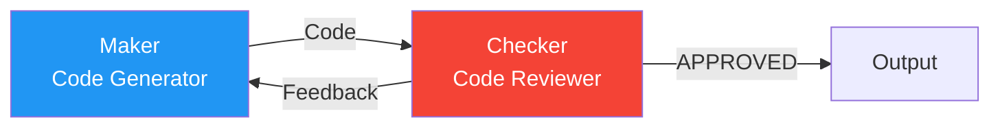
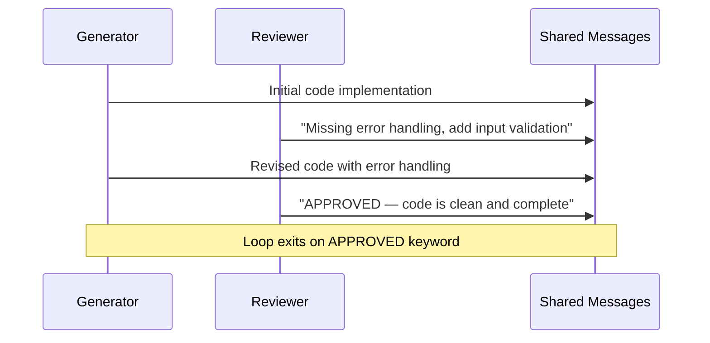
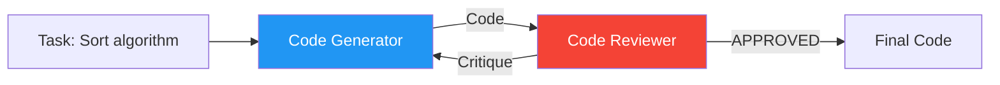

# Maker-Checker (Reflection) Pattern

The maker-checker is a two-agent pattern where one agent produces output and another evaluates it, looping until quality criteria are met. This maps to the **Evaluator-Optimizer** pattern from Anthropic's "Building Effective Agents" and the **Reflection** pattern from Andrew Ng's agentic design patterns.

## Pattern Architecture



## When to Use

- **Iterative refinement** — one agent creates, another critiques, repeat
- Quality needs to be verified before output is accepted
- The task has clear acceptance criteria (code passes tests, text meets guidelines)
- Examples: code review, content editing, compliance checking

## When to Avoid

- Single-pass output is sufficient (no need for quality gating)
- The task benefits from multiple perspectives debating (use [Brainstorm](brainstorm.md))
- Tasks have a clear linear flow with no iteration (use [Sequential](sequential.md))

## How It Works

1. **Maker** produces output (code, text, plan)
2. **Checker** reviews and provides feedback
3. **Maker** revises based on feedback
4. Loop until **Checker** approves or max iterations reached



## Context Passing Strategy

Both agents share the **same conversation thread**. The Reviewer sees the Generator's code and all prior iterations. The Generator sees the Reviewer's feedback. This accumulating shared context is what enables iterative refinement.

**Termination:** The orchestrator checks the Reviewer's response for a keyword (e.g., `APPROVED`). A `MAX_ITERATIONS` safety valve prevents infinite loops.

## What We're Building

### [Maker-Checker Exercise](../exercises/06_maker_checker.md){:target="_blank"}



## Expected Console Output

```
══════════════════════════════════════════════════════════════════
  Group Chat: Maker-Checker
══════════════════════════════════════════════════════════════════

[INFO] [Code Generator] Iteration 1:
       def sort_list(lst): ...

[INFO] [Code Reviewer] Iteration 1:
       Issues found: No type hints, missing docstring...

[INFO] [Code Generator] Iteration 2:
       def sort_list(lst: list[int]) -> list[int]: ...

[INFO] [Code Reviewer] Iteration 2:
       APPROVED — Clean, well-documented implementation.
```

!!! tip "Ready to practice?"
    Continue with the hands-on exercise in the sidebar (✏️) to apply what you've learned.

## Key Takeaways

1. Maker-checker is a specialized **two-agent loop** for iterative quality refinement
2. Both agents share the **same conversation thread** — feedback accumulates
3. Termination is keyword-based (`APPROVED`) with a `MAX_ITERATIONS` safety valve
4. Maps to **Reflection** (Andrew Ng) and **Evaluator-Optimizer** (Anthropic)
5. The pattern can be applied to any domain: code, writing, planning, compliance

## References

- [Anthropic — Evaluator-Optimizer Pattern](https://www.anthropic.com/engineering/building-effective-agents)
- [Andrew Ng — Reflection Pattern (YouTube)](https://www.youtube.com/watch?v=sal78ACtGTc)
- [MS Learn — Group Chat Pattern](https://learn.microsoft.com/en-us/azure/architecture/ai-ml/guide/ai-agent-design-patterns)
- [Reflexion: Language Agents with Verbal Reinforcement Learning (Shinn et al., 2023)](https://arxiv.org/abs/2303.11366)

## Hands-On Exercise

Head to the [Maker-Checker exercise](../exercises/06_maker_checker.md){:target="_blank"} — Code generator + reviewer in a reflection loop.

You can run exercises from the terminal or use the [Workshop TUI](../workshop-tui.md).
