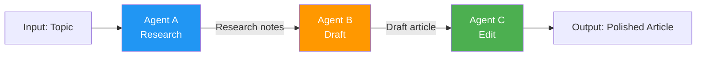
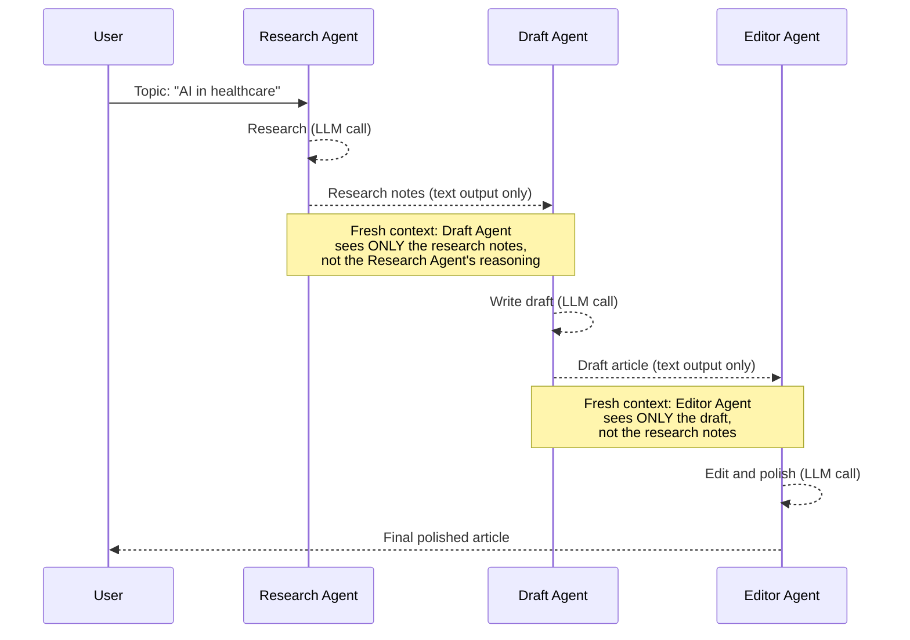
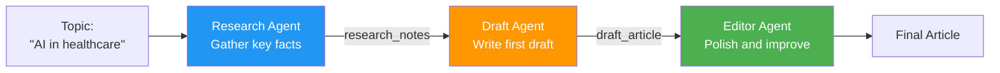

# Sequential Pattern

The sequential pattern chains agents in a pipeline — each agent's output becomes the next agent's input. Think of it as an assembly line for content.

## Pattern Architecture




*Source: [MS Learn — AI Agent Design Patterns](https://learn.microsoft.com/en-us/azure/architecture/ai-ml/guide/ai-agent-design-patterns)*

## When to Use

- Tasks have **clear, ordered stages** — each stage refines or transforms the previous output
- Each stage benefits from a **different persona or expertise**
- Examples: content pipeline, data processing, review workflows

## When to Avoid

- Stages could run **independently** (use [Concurrent](concurrent.md) instead)
- The task requires **back-and-forth** between agents (use [Group Chat](group-chat.md))
- One stage's output determines **which** agent runs next (use [Handoff](handoff.md))

## Context Passing Strategy

The sequential pattern uses **fresh context per stage** — each agent gets a clean conversation with only the previous agent's output, not the full history of all prior stages.



**Why fresh context?**

- Each agent stays focused on its specific task
- No "context pollution" from earlier stages' internal reasoning
- Token usage stays efficient (each call is small)
- Agents can't be confused by irrelevant prior conversation

**Trade-off**: If a later agent needs info from an earlier stage, you must explicitly pass it. The [exercise](../exercises/04_sequential.md){:target="_blank"} uses `log_context_pass()` to make this visible.

## What We're Building



A 3-stage content pipeline where:

1. **Research Agent** gathers key facts and talking points
2. **Draft Agent** writes a first draft from the research notes
3. **Editor Agent** polishes the draft for clarity and flow

## Expected Console Output

```
══════════════════════════════════════════════════════════════════
  Sequential Pattern: Content Pipeline
══════════════════════════════════════════════════════════════════

══════════════════════════════════════════════════════════════════
  Stage 1/3: Research
══════════════════════════════════════════════════════════════════
[INFO] [Research Agent] Researching: AI in healthcare
[INFO] [Research Agent] AI in healthcare encompasses diagnostic imaging,
       drug discovery, clinical decision support...

══════════════════════════════════════════════════════════════════
  Context Pass: Research Agent → Draft Agent
══════════════════════════════════════════════════════════════════
[INFO] Passing: research notes (text output only)

══════════════════════════════════════════════════════════════════
  Stage 2/3: Drafting
══════════════════════════════════════════════════════════════════
[INFO] [Draft Agent] Writing draft from research notes...
[INFO] [Draft Agent] Artificial intelligence is transforming healthcare...

══════════════════════════════════════════════════════════════════
  Context Pass: Draft Agent → Editor Agent
══════════════════════════════════════════════════════════════════
[INFO] Passing: draft article (text output only)

══════════════════════════════════════════════════════════════════
  Stage 3/3: Editing
══════════════════════════════════════════════════════════════════
[INFO] [Editor Agent] Polishing draft...
[INFO] [Editor Agent] [Final polished article...]
```

!!! tip "Ready to practice?"
    Continue with the hands-on exercise in the sidebar (✏️) to apply what you've learned.

## Key Takeaways

1. Sequential = pipeline — each agent's output feeds the next agent's input
2. **Fresh context per stage** keeps agents focused and efficient
3. Use `log_context_pass()` to make inter-agent data flow visible
4. Each agent has a specialized system prompt for its role
5. The pipeline is linear — no branching or feedback loops

## References

- [MS Learn — Sequential Pattern](https://learn.microsoft.com/en-us/azure/architecture/ai-ml/guide/ai-agent-design-patterns)
- [Andrew Ng — Agentic Design Patterns (YouTube)](https://www.youtube.com/watch?v=sal78ACtGTc)

## Hands-On Exercise

Head to the [Sequential exercise](../exercises/04_sequential.md){:target="_blank"} — build a research → draft → edit pipeline with explicit context passing between stages.

You can run it from the terminal or use the [Workshop TUI](../workshop-tui.md).
