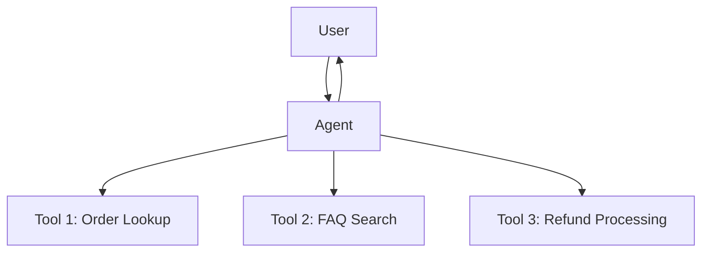
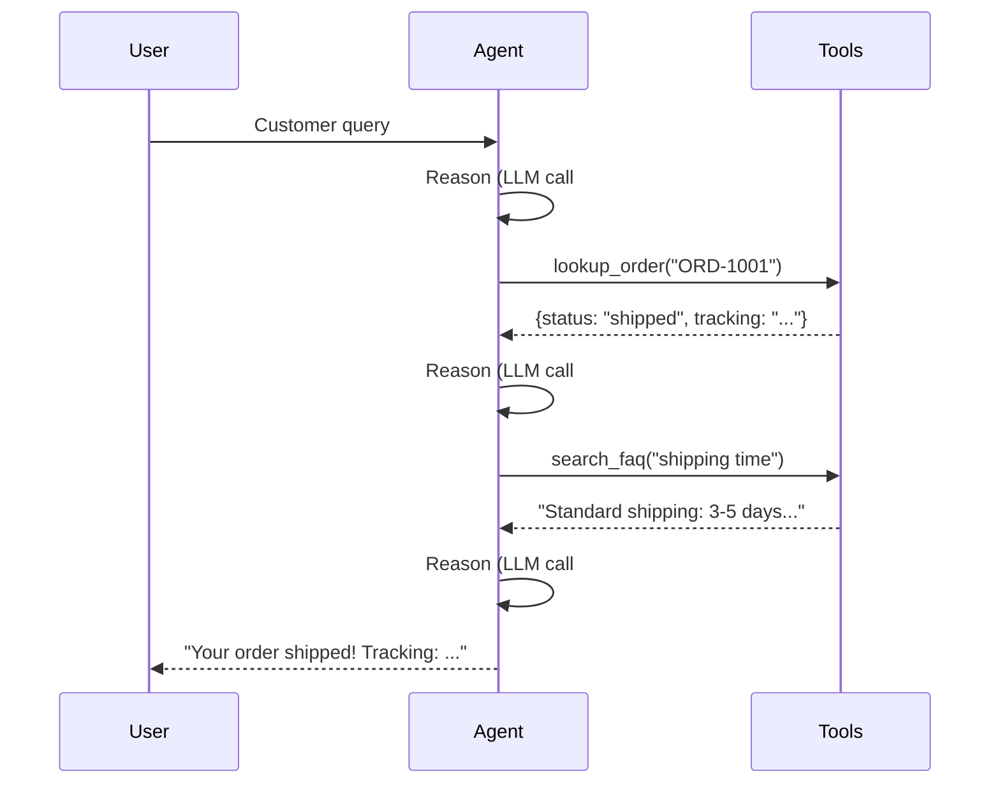
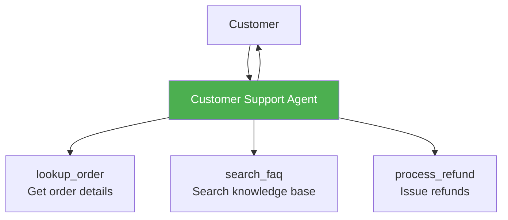

# Single Agent Pattern

The single agent is the foundation — one agent with tools and a reasoning loop. Most tasks should start here before considering multi-agent orchestration.

## Pattern Architecture



A single agent receives a user query, reasons about which tools to use, executes them in a loop, and produces a final response.

## When to Use

- The task requires **reasoning + tool use** but not specialized roles
- A well-crafted system prompt can cover all needed expertise
- Examples: customer support, research assistant, data retrieval

## When to Move Beyond

- Different parts of the task need **fundamentally different expertise**
- The system prompt becomes too long and unfocused
- You need **parallel processing** for performance
- The task requires **dynamic routing** based on input classification

## Context Management

The single agent pattern has the simplest context strategy:

- **One conversation thread** — all messages (system, user, assistant, tool) live in a single list
- **Accumulating history** — each tool call and result is appended to the messages
- **Trade-off**: Simple but can hit token limits on long conversations



## What We're Building



A customer support agent that handles queries about orders, returns, and general questions — using three tools to access "backend systems."

## Expected Console Output

```
══════════════════════════════════════════════════════════════════
  Single Agent: Customer Support
══════════════════════════════════════════════════════════════════
[INFO] Customer: I ordered a laptop (order ORD-1001) and it hasn't arrived.

[INFO] [Customer Support] Loop iteration 1/10
[INFO] [Tool Call] lookup_order({"order_id": "ORD-1001"})
[INFO] [Tool Result] {"order_id": "ORD-1001", "status": "shipped", ...}

[INFO] [Customer Support] Loop iteration 2/10
[INFO] [Tool Call] search_faq({"question": "shipping delays"})
[INFO] [Tool Result] "Standard shipping takes 3-5 business days..."

[INFO] [Customer Support] Loop iteration 3/10
[INFO] [Customer Support] Final response:
       Your order ORD-1001 has been shipped! ...
```

Notice the loop iterations — the agent reasons about what to do, calls tools, observes results, and decides whether it has enough information to respond.

!!! tip "Ready to practice?"
    Continue with the hands-on exercise in the sidebar (✏️) to apply what you've learned.

## Key Takeaways

1. The single agent pattern is often **sufficient** — don't over-engineer with multiple agents
2. The agent loop (reason → act → observe) handles multiple tool calls automatically
3. System prompts define agent personality and constraints
4. Tool selection determines agent capability
5. Set `max_iterations` to prevent runaway loops

## References

- [MS Learn — Single Agent Pattern](https://learn.microsoft.com/en-us/azure/architecture/ai-ml/guide/ai-agent-design-patterns)
- [Anthropic — "Building Effective Agents"](https://www.anthropic.com/engineering/building-effective-agents)

## Hands-On Exercise

Head to the [Single Agent exercise](../exercises/03_single_agent.md){:target="_blank"} — build a customer support agent with order lookup, FAQ search, and refund processing.

You can run it from the terminal or use the [Workshop TUI](../workshop-tui.md).
