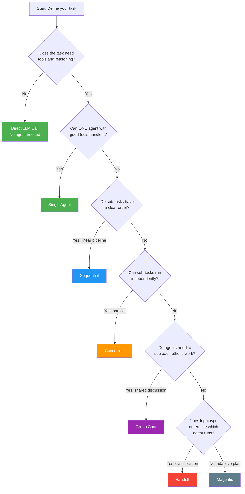
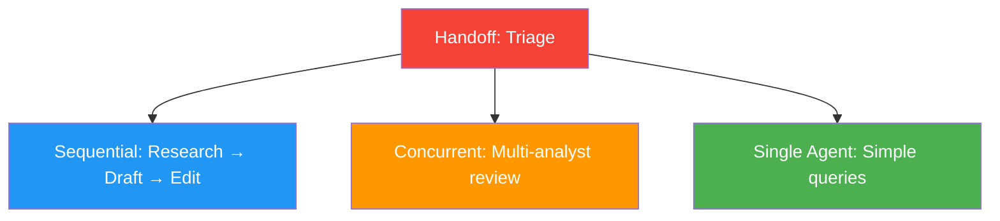

# Choosing a Pattern

With five orchestration patterns available, how do you pick the right one? Start with the simplest approach that solves your problem — don't over-engineer.

## Decision Flowchart

## Comparison Table

| Factor | Single Agent | Sequential | Concurrent | Group Chat | Handoff | Magentic |
|--------|-------------|-----------|------------|-----------|---------|----------|
| **Complexity** | Low | Low-Medium | Medium | Medium | Medium | High |
| **# Agents** | 1 | 2-5 chain | 2-5 + aggregator | 2-5 + manager | 1 + N specialists | 1 + N workers |
| **Parallelism** | No | No | Yes | No | No | Possible |
| **Adaptability** | N/A | Low (fixed) | Low (fixed) | Medium | Medium | High |
| **Context cost** | Low-Medium | Low per stage | Medium (N × input) | High (growing) | Low per specialist | Low per worker |
| **Best for** | Most tasks | Refinement pipelines | Multi-perspective analysis | Collaborative work | Classification + routing | Complex, dynamic tasks |

## Pattern Selection Guide

### Start with Single Agent

Most tasks are best served by a single agent with well-chosen tools and a focused system prompt. Only add complexity when you have a clear reason:

!!! tip "The Single Agent Test"
    Before choosing a multi-agent pattern, ask: **Can I solve this with a single agent that has good tools and a well-crafted system prompt?** If yes, stop there.

### When to Add Agents

| Signal | Pattern |
|--------|---------|
| "This task has distinct, ordered phases" | Sequential |
| "I need multiple independent analyses" | Concurrent |
| "The agents should debate/critique each other" | Group Chat |
| "Different input types need different expertise" | Handoff |
| "The plan may change based on what we discover" | Magentic |

## Combining Patterns

Patterns aren't mutually exclusive. Common combinations:

- **Handoff + Sequential**: Triage routes to a multi-stage pipeline
- **Handoff + Single Agent**: Triage routes to specialized single agents
- **Magentic + Concurrent**: Manager dispatches parallel worker tasks
- **Sequential + Group Chat**: Pipeline where one stage uses maker-checker

## Common Mistakes

| Mistake | Why It's Wrong | Fix |
|---------|---------------|-----|
| Using multi-agent for everything | Adds complexity without benefit | Start with single agent |
| Too many agents | Coordination overhead dominates | Combine roles where possible |
| Shared state everywhere | Hard to debug, race conditions | Prefer structured handoffs |
| No max iterations | Runaway loops | Always set `max_iterations` |
| Passing full history everywhere | Token waste, context pollution | Use fresh context or structured objects |

## Real-World Mappings

| Real Problem | Recommended Pattern | Why |
|-------------|-------------------|-----|
| Customer support chatbot | Single Agent or Handoff | Most queries are simple; handoff for specialized teams |
| Content creation pipeline | Sequential | Clear stages: research → write → edit |
| Investment analysis | Concurrent | Independent perspectives combine for better decisions |
| Code review workflow | Group Chat (Maker-Checker) | Iterative refinement between generator and reviewer |
| Incident response | Magentic | Dynamic plan with multiple specialist workers |
| Document processing | Sequential or Concurrent | Depending on whether stages are ordered or independent |

## Key Takeaways

1. **Start simple** — single agent first, add complexity only when needed
2. **Match the pattern to the task structure**, not the other way around
3. **Patterns can be combined** for complex workflows
4. **Context strategy matters as much as pattern choice** — see [Context Management](context-management.md)
5. **Max iterations and error handling** are non-negotiable regardless of pattern — see [Reliability](reliability.md)

## References

- [MS Learn — AI Agent Design Patterns](https://learn.microsoft.com/en-us/azure/architecture/ai-ml/guide/ai-agent-design-patterns)
- [Anthropic — "Building Effective Agents"](https://www.anthropic.com/engineering/building-effective-agents)
- [Andrew Ng — "Agentic Design Patterns"](https://www.youtube.com/watch?v=sal78ACtGTc)
