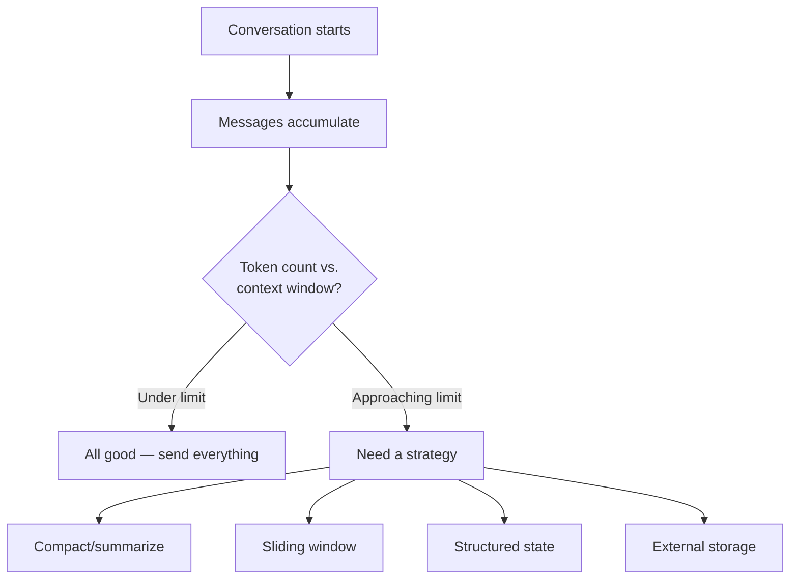

# Context Management

Context management is one of the most important practical challenges in building agentic systems. Every LLM call has a **context window** — a maximum number of tokens it can process — and managing what goes into that window directly affects agent quality, cost, and reliability.

## The Core Problem



The Chat Completions API is **stateless** — you send the full conversation on every call. As conversations grow, you hit limits:

- **GPT-4o-mini**: 128K tokens context window
- **GPT-4o**: 128K tokens context window
- **Cost**: You pay for all input tokens on every call

## Four Context Strategies

### 1. Full Message History

Pass the entire conversation. Simple and lossless.

```python
messages = [system_prompt, user_msg_1, assistant_msg_1, user_msg_2, ...]
```

**Used in**: Single Agent, Group Chat (brainstorm)

**Trade-offs**: Simple but expensive and can hit token limits on long conversations.

### 2. Fresh Context Per Stage

Each agent gets a clean conversation with only the previous agent's output.

```python
# Agent B gets only Agent A's output, not Agent A's full conversation
messages = [
    {"role": "system", "content": agent_b_prompt},
    {"role": "user", "content": agent_a_output},  # Just the output text
]
```

**Used in**: Sequential pattern

**Trade-offs**: Token-efficient but earlier context is lost. Must explicitly pass anything a later agent needs.

### 3. Structured State Objects

Pass a dataclass or Pydantic model between agents instead of raw text.

```python
@dataclass
class HandoffContext:
    customer_query: str
    category: str
    priority: str
    extracted_info: dict
```

**Used in**: Handoff pattern, Magentic pattern (TaskLedger)

**Trade-offs**: Explicit and type-safe. Requires upfront design of the state schema. Most robust for complex workflows.

### 4. Task-Specific Context

The manager curates what each worker sees — only their specific task, not the full state.

```python
# Worker sees only incident description + their specific task
worker_messages = [
    {"role": "system", "content": worker_prompt},
    {"role": "user", "content": f"Incident: {description}\nYour task: {task.description}"},
]
```

**Used in**: Magentic pattern

**Trade-offs**: Prevents information overload but requires the manager to be a good information curator.

## Strategy by Pattern

| Pattern | Strategy | What Each Agent Sees |
|---------|----------|---------------------|
| Single Agent | Full history | Everything (one conversation thread) |
| Sequential | Fresh per stage | Only previous agent's output |
| Concurrent | Independent | Same initial input (no sharing) |
| Group Chat | Shared accumulating | Full conversation (all agents' messages) |
| Handoff | Structured object | `HandoffContext` dataclass |
| Magentic | Task-specific | Incident context + specific task only |

## Compaction: When History Gets Too Long

When a conversation exceeds a comfortable token budget, you can **compact** the history:

```python
def compact_history(messages: list[dict], client, model: str) -> list[dict]:
    """Summarize older messages to save tokens."""
    # Keep system prompt and recent messages
    system = messages[0]
    recent = messages[-6:]  # Last 3 exchanges

    # Summarize everything in between
    middle = messages[1:-6]
    if not middle:
        return messages

    summary_text = "".join(m["content"] for m in middle if m.get("content"))

    response = client.chat.completions.create(
        model=model,
        messages=[
            {"role": "system", "content": "Summarize this conversation concisely."},
            {"role": "user", "content": summary_text},
        ],
        max_tokens=200,
    )

    summary = response.choices[0].message.content
    return [system, {"role": "assistant", "content": f"[Summary of earlier conversation]: {summary}"}] + recent
```

!!! note "Compaction is a trade-off"
    Summarization loses detail. Use it when you're approaching token limits, not proactively. For short exercises in this workshop, you won't need it.

## Token Budgeting

A practical approach to token management:

1. **Reserve tokens** for the system prompt (~500-1000 tokens)
2. **Reserve tokens** for the model's response (`max_tokens` parameter)
3. **Budget remaining tokens** for conversation history
4. **Monitor usage** via `response.usage.prompt_tokens`
5. **Compact** when approaching 75% of context window

## Key Takeaways

1. Context management determines agent quality — too little context and agents forget, too much and they get confused
2. Choose the strategy that matches your pattern (fresh per stage, shared, structured, task-specific)
3. Structured state objects (dataclasses) are the most robust inter-agent communication mechanism
4. Compaction (summarization) is available when history gets too long
5. Monitor token usage — it affects both cost and reliability

## References

- [OpenAI Tokenizer Tool](https://platform.openai.com/tokenizer)
- [OpenAI Context Window Documentation](https://platform.openai.com/docs/models)
- [Anthropic — "Building Effective Agents" — Managing Context](https://www.anthropic.com/engineering/building-effective-agents)
