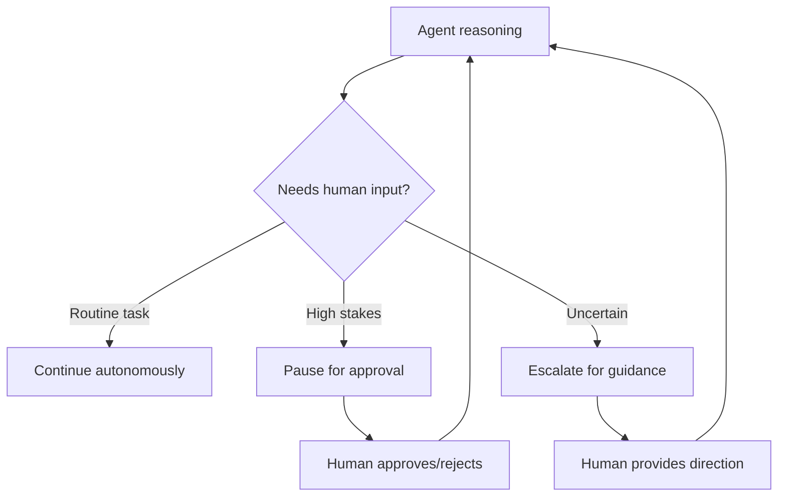
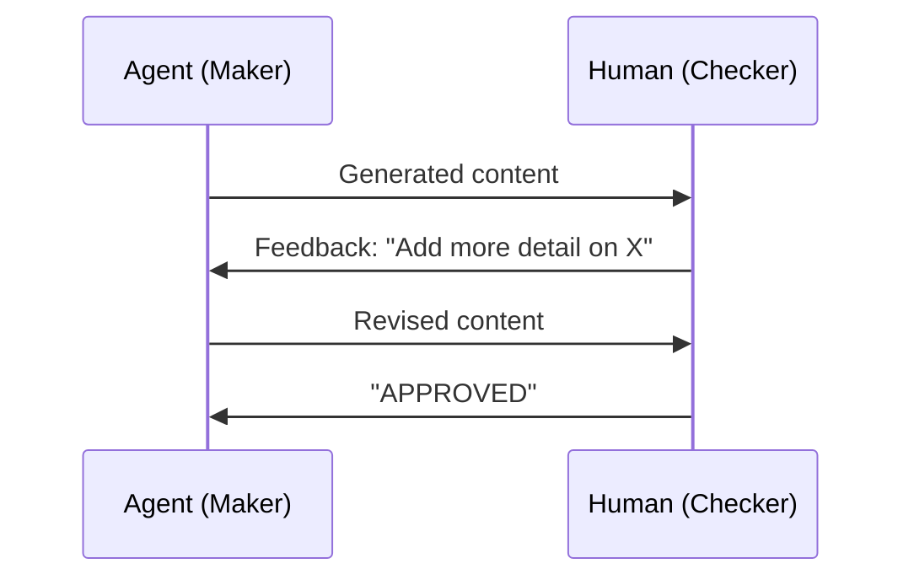

# Human in the Loop

Not every decision should be automated. Human-in-the-loop (HITL) patterns let agents operate autonomously for routine tasks while escalating to humans for high-stakes decisions.

## When to Involve Humans



| Scenario | Strategy | Example |
|----------|---------|---------|
| **Approval gate** | Pause before irreversible actions | Refund > $100, production deployment |
| **Escalation** | Agent can't resolve, needs expert | Complex complaint, edge case |
| **Feedback loop** | Human reviews and corrects | Content moderation, quality review |
| **Confirmation** | Verify understanding before proceeding | "I'll process a refund for $50. Confirm?" |

## Approval Gates

The simplest HITL pattern — pause execution and ask for confirmation:

```python
def approval_gate(action: str, details: dict) -> bool:
    """Pause for human approval before a high-stakes action."""
    print(f"\n{'='*60}")
    print(f"  APPROVAL REQUIRED: {action}")
    print(f"  Details: {details}")
    print(f"{'='*60}")

    while True:
        response = input("Approve? (yes/no): ").strip().lower()
        if response in ("yes", "y"):
            return True
        if response in ("no", "n"):
            return False
        print("Please enter 'yes' or 'no'.")
```

Used in the tool execution flow:

```python
def process_refund(order_id: str, reason: str) -> dict:
    """Process a refund — requires human approval."""
    if not approval_gate("Process Refund", {"order_id": order_id, "reason": reason}):
        return {"status": "rejected", "message": "Human operator rejected the refund."}

    # Proceed with refund processing
    return {"status": "approved", "refund_id": "RF-001"}
```

## Escalation Pattern

When an agent encounters something outside its scope, it escalates:

```python
class EscalationNeeded(BaseModel):
    reason: str
    context: str
    suggested_action: str

# In the agent's system prompt:
PROMPT = """
You are a customer support agent. If you encounter any of these situations,
respond with an escalation request instead of trying to resolve:
- Customer threatens legal action
- Refund amount exceeds $500
- Technical issue you cannot diagnose
- Customer requests manager/supervisor
"""
```

The agent produces a structured escalation object that can be routed to a human queue.

## Feedback Loops

In the maker-checker pattern, a human can serve as the checker:



```python
def human_review_loop(agent, client, task, max_rounds=3):
    """Agent generates, human reviews, agent revises."""
    messages = [
        {"role": "system", "content": agent.system_prompt},
        {"role": "user", "content": task},
    ]

    for round_num in range(max_rounds):
        response = client.chat.completions.create(
            model=agent.model,
            messages=messages,
        )
        output = response.choices[0].message.content

        print(f"\n--- Agent Output (Round {round_num + 1}) ---")
        print(output)
        feedback = input("\nYour feedback (or 'approve' to accept): ")

        if feedback.lower() in ("approve", "approved", "ok", "lgtm"):
            return output

        messages.append({"role": "assistant", "content": output})
        messages.append({"role": "user", "content": f"Feedback: {feedback}"})

    return output  # Return last version after max rounds
```

## Where HITL Fits in Each Pattern

| Pattern | HITL Opportunity | Example |
|---------|-----------------|---------|
| **Single Agent** | Approval before tool execution | Confirm refund processing |
| **Sequential** | Review between pipeline stages | Human reviews draft before editing |
| **Concurrent** | Review aggregated results | Human validates analysis before reporting |
| **Group Chat** | Human joins as a participant | Human provides direction mid-debate |
| **Handoff** | Override triage decisions | Human re-routes misclassified queries |
| **Magentic** | Approve task plan, review findings | Human approves incident response plan |

## Key Takeaways

1. Not every decision should be automated — **high-stakes actions need human gates**
2. **Approval gates** are simple `input()` calls that pause execution
3. **Escalation** lets agents recognize their limits and route to humans
4. **Feedback loops** combine agent generation with human refinement
5. In production, replace `input()` with async queues, webhooks, or UI approvals

## References

- [Anthropic — Human-in-the-Loop Patterns](https://www.anthropic.com/engineering/building-effective-agents)
- [MS Learn — AI Agent Design Patterns](https://learn.microsoft.com/en-us/azure/architecture/ai-ml/guide/ai-agent-design-patterns)
