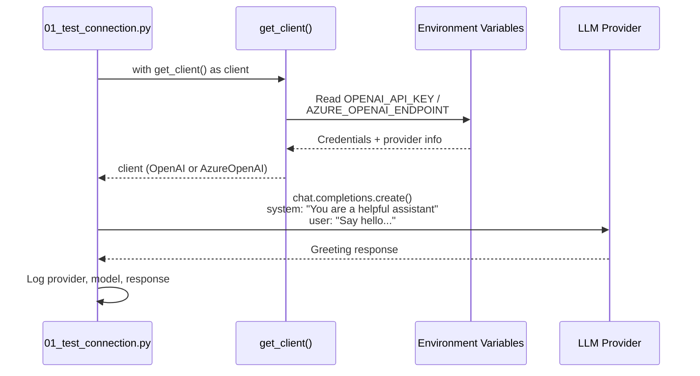

# Exercise 00: Setup & Connection Test

## Objective

Verify your environment is configured correctly and can communicate with your chosen LLM provider.

## Concepts Covered

- Virtual environment setup
- Environment variable configuration
- Provider-agnostic client initialization
- Context managers for HTTP client lifecycle

## How It Works

This exercise validates the full connection path from your local machine to the LLM provider. The script uses the shared `get_client()` context manager from `commons/llm_client.py`, which reads environment variables and returns an `OpenAI` or `AzureOpenAI` client depending on your configuration.



**Context sharing:** None — this is a single request/response. No messages are accumulated or reused.

**Structured output:** Not used. The response is plain text.

## Interactive Message Flow

<div class="message-flow-interactive" markdown="block" data-title="Setup: Test Connection" data-context-type="isolated" data-context-label="Single request/response — no messages are accumulated or reused">

<div class="mf-step" data-description="The system prompt establishes the assistant's identity">
<div class="mf-msg" data-role="system" data-list="messages" data-payload='{"role": "system", "content": "You are a helpful assistant."}'>You are a helpful assistant.</div>
</div>

<div class="mf-step" data-description="The user sends a simple test message to verify the LLM connection works">
<div class="mf-msg" data-role="user" data-list="messages" data-payload='{"role": "user", "content": "Say hello and confirm you are working. Keep it brief."}'>Say hello and confirm you are working. Keep it brief.</div>
</div>

<div class="mf-step" data-description="The assistant responds — connection confirmed. This is the simplest possible LLM interaction.">
<div class="mf-msg" data-role="assistant" data-list="messages" data-payload='{"role": "assistant", "content": "Hello! I&#39;m working and ready to help. What can I do for you?"}'>Hello! I'm working and ready to help. What can I do for you?</div>
</div>

</div>

## Files

1. **`01_test_connection.py`** — Tests your API connection and prints provider info

## How to Run

```bash
python exercises/00_setup/01_test_connection.py
```

## Expected Output

A greeting from the model confirming connectivity, along with provider and model details.

## Next

→ [Exercise 01: LLM Basics](01_llm_basics.md)
