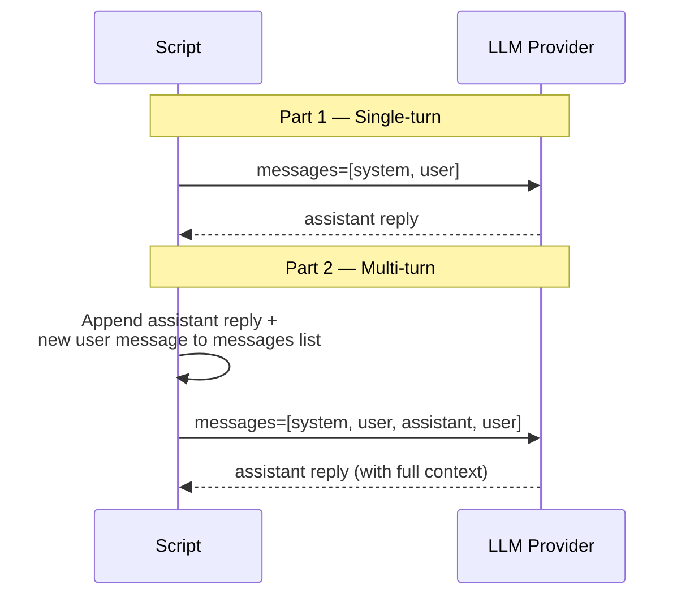
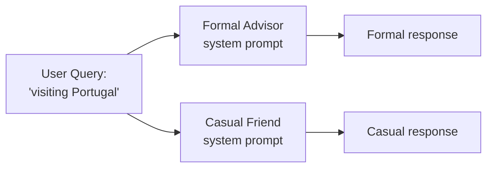
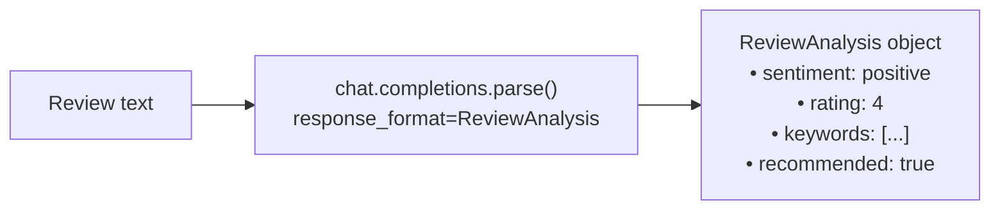

# Exercise 01: LLM Basics

## Objective

Learn the fundamentals of interacting with Large Language Models through the Chat Completions API.

## Concepts Covered

- Messages list and roles (system, user, assistant)
- Temperature and max_tokens parameters
- System prompts for shaping agent behavior
- Structured outputs with Pydantic models

## How It Works

This exercise contains three scripts that progressively introduce core LLM concepts.

### 01 — Chat Completion (Single-Turn & Multi-Turn)

The first script shows how the messages list works. In **single-turn** mode, you send a system prompt and one user message, and the model replies. In **multi-turn** mode, you append the assistant's reply and a follow-up question back to the same messages list, then re-send the full history — this is how the model "remembers" the conversation.



**Context sharing:** The growing `messages` list IS the context. Each call sends the full conversation history to the model.

### 02 — System Prompts

The same user query ("visiting Portugal") is sent with two different system prompts — a formal travel advisor and a casual friend. Each gets an **independent messages list** with no shared context between them.



**Context sharing:** None between the two calls — they are completely independent.

### 03 — Structured Outputs

Instead of `chat.completions.create()`, this script uses `chat.completions.parse()` with a `ReviewAnalysis` Pydantic model. The model returns JSON that is automatically validated and parsed into a typed Python object with fields like `sentiment`, `rating`, `keywords`, and `recommended`.



**Structured output:** Yes — this is the first exercise that uses `client.chat.completions.parse()` with a Pydantic model as `response_format`. The model's output is guaranteed to match the schema.

## Interactive Message Flows

<div class="message-flow-interactive" markdown="block" data-title="Chat Completion: Multi-Turn Conversation" data-context-type="growing" data-context-label="Messages list grows with each turn — the model sees full history">

<div class="mf-step" data-description="Initial request: system prompt sets the travel assistant identity, user asks a question">
<div class="mf-msg" data-role="system" data-list="messages" data-payload='{"role": "system", "content": "You are a knowledgeable and enthusiastic travel assistant. Help users plan trips with practical advice."}'>You are a knowledgeable and enthusiastic travel assistant. Help users plan trips with practical advice.</div>
<div class="mf-msg" data-role="user" data-list="messages" data-payload='{"role": "user", "content": "What&#39;s the best time of year to visit Japan?"}'>What's the best time of year to visit Japan?</div>
</div>

<div class="mf-step" data-description="Assistant responds with travel advice. This reply is appended to the messages list.">
<div class="mf-msg" data-role="assistant" data-list="messages" data-payload='{"role": "assistant", "content": "Spring (March-May) is ideal for cherry blossoms. Autumn (September-November) offers beautiful foliage and mild weather. Both seasons have comfortable temperatures and fewer typhoons than summer."}'>Spring (March-May) is ideal for cherry blossoms. Autumn (September-November) offers beautiful foliage and mild weather. Both seasons have comfortable temperatures and fewer typhoons than summer.</div>
</div>

<div class="mf-step" data-description="User asks a follow-up. The full conversation history (system + user + assistant + new user) is sent to the model.">
<div class="mf-msg" data-role="user" data-list="messages" data-payload='{"role": "user", "content": "Can you suggest a 3-day itinerary for Tokyo?"}'>Can you suggest a 3-day itinerary for Tokyo?</div>
</div>

<div class="mf-step" data-description="The model sees the full history and builds on prior context to give a relevant itinerary">
<div class="mf-msg" data-role="assistant" data-list="messages" data-payload='{"role": "assistant", "content": "Day 1: Explore Shibuya crossing and Harajuku street fashion. Day 2: Visit Senso-ji temple in Asakusa, then Akihabara for electronics. Day 3: Day trip to Kamakura for the Great Buddha and coastal views."}'>Day 1: Explore Shibuya crossing and Harajuku street fashion. Day 2: Visit Senso-ji temple in Asakusa, then Akihabara for electronics. Day 3: Day trip to Kamakura for the Great Buddha and coastal views.</div>
</div>

</div>

<div class="message-flow-interactive" markdown="block" data-title="System Prompts: Same Query, Different Personas" data-context-type="independent" data-context-label="Each persona gets its own isolated messages list — only the system prompt differs">

<div class="mf-step" data-description="Both personas receive the same user query, but with different system prompts shaping their identity">
<div class="mf-msg" data-role="system" data-list="formal" data-payload='{"role": "system", "content": "You are a formal travel consultant. Provide detailed, professional advice with structured recommendations."}'>You are a formal travel consultant. Provide detailed, professional advice with structured recommendations.</div>
<div class="mf-msg" data-role="user" data-list="formal" data-payload='{"role": "user", "content": "I&#39;m thinking about visiting Portugal. Any suggestions?"}'>I'm thinking about visiting Portugal. Any suggestions?</div>
<div class="mf-msg" data-role="system" data-list="casual" data-payload='{"role": "system", "content": "You are a casual, enthusiastic travel buddy. Give fun, relaxed advice like talking to a friend."}'>You are a casual, enthusiastic travel buddy. Give fun, relaxed advice like talking to a friend.</div>
<div class="mf-msg" data-role="user" data-list="casual" data-payload='{"role": "user", "content": "I&#39;m thinking about visiting Portugal. Any suggestions?"}'>I'm thinking about visiting Portugal. Any suggestions?</div>
</div>

<div class="mf-step" data-description="The Formal Advisor responds with structured, professional guidance">
<div class="mf-msg" data-role="assistant" data-list="formal" data-agent="Formal Advisor" data-payload='{"role": "assistant", "content": "I would recommend considering Lisbon and Porto as your primary destinations. The Algarve region offers excellent coastal experiences. For cultural enrichment, Sintra provides remarkable palatial architecture worth a full day excursion."}'>I would recommend considering Lisbon and Porto as your primary destinations. The Algarve region offers excellent coastal experiences. For cultural enrichment, Sintra provides remarkable palatial architecture worth a full day excursion.</div>
</div>

<div class="mf-step" data-description="The Casual Friend responds with an informal, enthusiastic tone — same facts, completely different voice">
<div class="mf-msg" data-role="assistant" data-list="casual" data-agent="Casual Friend" data-payload='{"role": "assistant", "content": "Oh wow, Portugal is AMAZING! You gotta check out Lisbon — the food, the views, the nightlife! And Porto? Best port wine you&#39;ll ever taste. Hit up the Algarve for beaches that&#39;ll blow your mind!"}'>Oh wow, Portugal is AMAZING! You gotta check out Lisbon — the food, the views, the nightlife! And Porto? Best port wine you'll ever taste. Hit up the Algarve for beaches that'll blow your mind!</div>
</div>

</div>

<div class="message-flow-interactive" markdown="block" data-title="Structured Outputs: Typed Responses with Pydantic" data-context-type="isolated" data-context-label="parse() returns a validated Pydantic object — not free text">

<div class="mf-step" data-description="System prompt defines the analyst role, user provides a product review to analyze">
<div class="mf-msg" data-role="system" data-list="messages" data-payload='{"role": "system", "content": "You are a product review analyst. Extract structured data from customer reviews."}'>You are a product review analyst. Extract structured data from customer reviews.</div>
<div class="mf-msg" data-role="user" data-list="messages" data-payload='{"role": "user", "content": "Analyze this review: &#39;Great headphones! Sound quality is amazing, comfortable for long sessions. Battery could be better though.&#39;"}'>Analyze this review: 'Great headphones! Sound quality is amazing, comfortable for long sessions. Battery could be better though.'</div>
</div>

<div class="mf-step" data-description="chat.completions.parse() is called with response_format=ReviewAnalysis — the model MUST conform to the Pydantic schema">
<div class="mf-msg" data-role="assistant" data-list="messages" data-payload='{"role": "assistant", "content": "Generating structured response matching the ReviewAnalysis schema..."}'>Generating structured response matching the ReviewAnalysis schema...</div>
</div>

<div class="mf-step" data-description="The parsed result is a validated ReviewAnalysis object with typed fields — not a raw JSON string">
<div class="mf-msg" data-role="structured" data-list="messages" data-agent="ReviewAnalysis" data-payload='{"role": "assistant", "content": "{\"sentiment\": \"positive\", \"rating\": 4, \"keywords\": [\"sound quality\", \"comfortable\", \"battery\"], \"summary\": \"Positive review praising audio and comfort with minor battery concern\", \"recommended\": true}", "parsed": {"sentiment": "positive", "rating": 4, "keywords": ["sound quality", "comfortable", "battery"], "summary": "Positive review praising audio and comfort with minor battery concern", "recommended": true}}'>sentiment: positive | rating: 4 | keywords: [sound quality, comfortable, battery] | summary: Positive review praising audio and comfort with minor battery concern | recommended: true</div>
</div>

</div>

## Files (in order)

1. **`01_chat_completion.py`** — Basic chat completion with a travel assistant
2. **`02_system_prompts.py`** — Same query, different personas via system prompts
3. **`03_structured_outputs.py`** — Extract structured data using `client.chat.completions.parse()`

## How to Run

```bash
python exercises/01_llm_basics/01_chat_completion.py
python exercises/01_llm_basics/02_system_prompts.py
python exercises/01_llm_basics/03_structured_outputs.py
```

## Expected Output

Each script produces structured logging showing the LLM interaction, the messages sent, and the response received.

## Next

→ [Exercise 02: Tool Use](02_tool_use.md)
