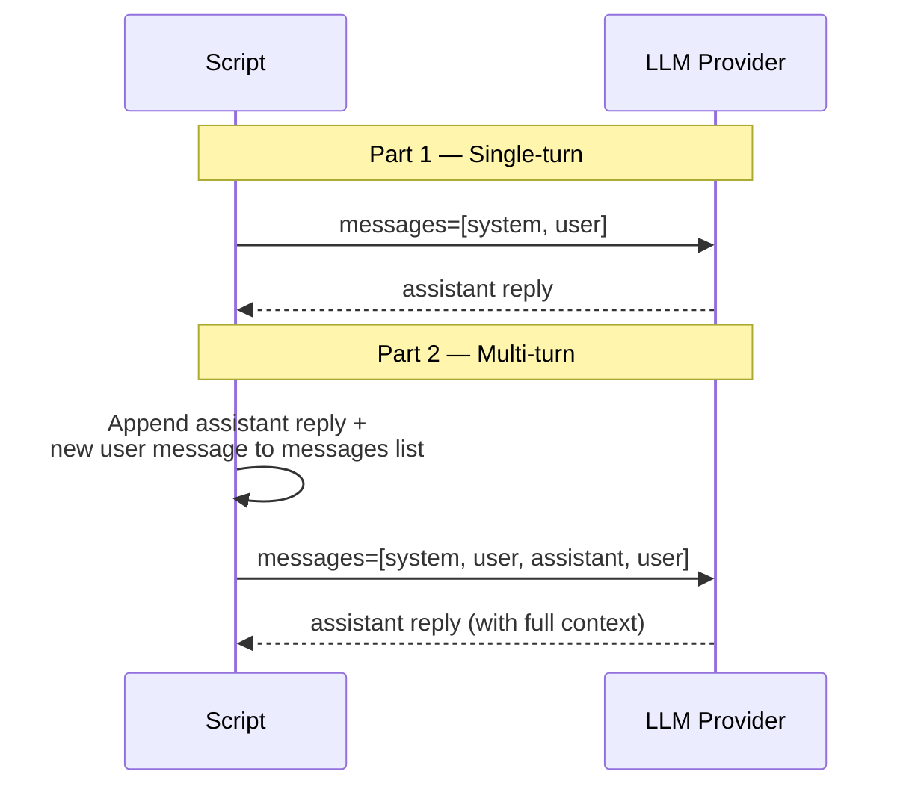
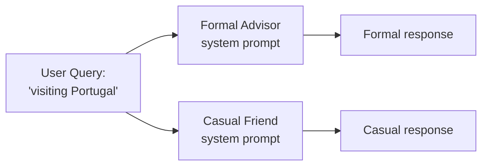
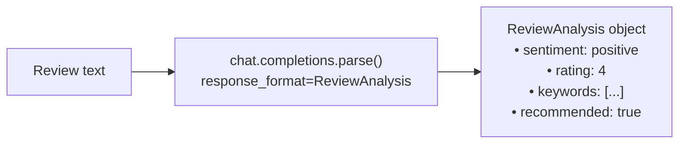

# Exercise 01: LLM Basics

## Objective

Learn the fundamentals of interacting with Large Language Models through the Chat Completions API.

## Concepts Covered

- Messages list and roles (system, user, assistant)
- Temperature and max_tokens parameters
- System prompts for shaping agent behavior
- Structured outputs with Pydantic models

## How It Works

This exercise contains three scripts that progressively introduce core LLM concepts.

### 01 — Chat Completion (Single-Turn & Multi-Turn)

The first script shows how the messages list works. In **single-turn** mode, you send a system prompt and one user message, and the model replies. In **multi-turn** mode, you append the assistant's reply and a follow-up question back to the same messages list, then re-send the full history — this is how the model "remembers" the conversation.



**Context sharing:** The growing `messages` list IS the context. Each call sends the full conversation history to the model.

### 02 — System Prompts

The same user query ("visiting Portugal") is sent with two different system prompts — a formal travel advisor and a casual friend. Each gets an **independent messages list** with no shared context between them.



**Context sharing:** None between the two calls — they are completely independent.

### 03 — Structured Outputs

Instead of `chat.completions.create()`, this script uses `chat.completions.parse()` with a `ReviewAnalysis` Pydantic model. The model returns JSON that is automatically validated and parsed into a typed Python object with fields like `sentiment`, `rating`, `keywords`, and `recommended`.



**Structured output:** Yes — this is the first exercise that uses `client.chat.completions.parse()` with a Pydantic model as `response_format`. The model's output is guaranteed to match the schema.

## Files (in order)

1. **`01_chat_completion.py`** — Basic chat completion with a travel assistant
2. **`02_system_prompts.py`** — Same query, different personas via system prompts
3. **`03_structured_outputs.py`** — Extract structured data using `client.chat.completions.parse()`

## How to Run

```bash
python exercises/01_llm_basics/01_chat_completion.py
python exercises/01_llm_basics/02_system_prompts.py
python exercises/01_llm_basics/03_structured_outputs.py
```

## Expected Output

Each script produces structured logging showing the LLM interaction, the messages sent, and the response received.

## Next

→ [Exercise 02: Tool Use](02_tool_use.md)
