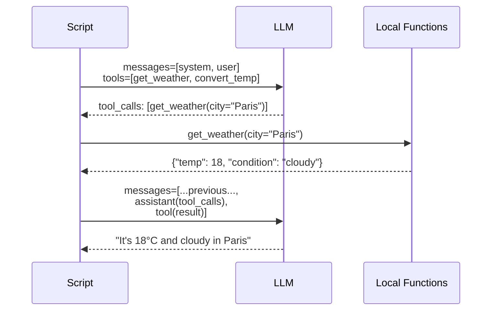
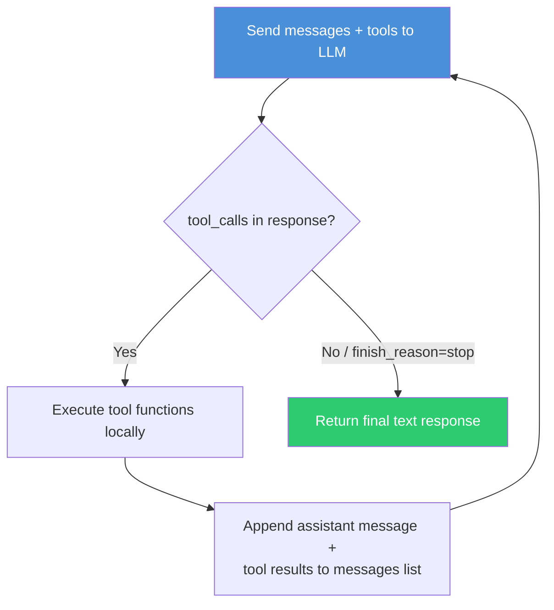

# Exercise 02: Tool Use & Function Calling

## Objective

Learn how LLMs interact with external tools through function calling — the foundation of agentic behavior.

## Concepts Covered

- Tool definitions with `openai.pydantic_function_tool()`
- The `tools` parameter and strict mode
- Parsing `tool_calls` from model responses
- The agent loop: Reason → Act → Observe → Repeat
- `tool` role messages for returning results

## How It Works

### 01 — Single-Pass Function Calling

The first script introduces the mechanics of function calling. You define tools as Pydantic models and register them with `openai.pydantic_function_tool()`. When the model decides it needs a tool, it returns a `tool_calls` array instead of a text reply. You execute the function locally and send the result back with `role: "tool"`.



**Context sharing:** A single `messages` list grows across the exchange: system → user → assistant (with tool_calls) → tool result → assistant (final answer).

### 02 — The Agent Loop (Reason → Act → Observe → Repeat)

The second script introduces the **core agent loop** that all later exercises build on. Instead of a single pass, it runs in a `while` loop: send messages → check for `tool_calls` → execute → append results → re-send — repeating until the model's `finish_reason` is `"stop"` (meaning it has all the information it needs).



The loop is capped by `MAX_ITERATIONS = 10` to prevent infinite cycles. The model might call multiple tools in a single turn (e.g., `search_database` + `get_stock_price`) before combining the results.

**Context sharing:** The `messages` list accumulates every iteration — the model sees its own prior tool calls and results, building up context until it can produce a final answer.

**Structured output:** Not used for inter-agent communication. Tool definitions use Pydantic schemas for input validation (strict mode), but responses are plain text.

## Interactive Message Flows

<div class="message-flow-interactive" markdown="block" data-title="Function Calling: Single Round Trip" data-context-type="growing" data-context-label="Messages list grows as tools are called and results returned">

<div class="mf-step" data-description="System prompt establishes the weather assistant, user asks about Berlin weather and a temperature conversion">
<div class="mf-msg" data-role="system" data-list="messages" data-payload='{"role": "system", "content": "You are a helpful weather assistant. Use the provided tools to answer questions."}'>You are a helpful weather assistant. Use the provided tools to answer questions.</div>
<div class="mf-msg" data-role="user" data-list="messages" data-payload='{"role": "user", "content": "What&#39;s the weather in Berlin? Also convert 18C to Fahrenheit."}'>What's the weather in Berlin? Also convert 18C to Fahrenheit.</div>
</div>

<div class="mf-step" data-description="The model decides it needs two tools and returns tool_calls instead of a text response">
<div class="mf-msg" data-role="tool_calls" data-list="messages" data-agent="Assistant" data-payload='{"role": "assistant", "content": null, "tool_calls": [{"id": "call_fw92", "type": "function", "function": {"name": "get_weather", "arguments": "{\"city\":\"Berlin\",\"unit\":\"celsius\"}"}}, {"id": "call_ht73", "type": "function", "function": {"name": "convert_temperature", "arguments": "{\"value\":18,\"from_unit\":\"celsius\",\"to_unit\":\"fahrenheit\"}"}}]}'>get_weather(location='Berlin') + convert_temperature(celsius=18)</div>
</div>

<div class="mf-step" data-description="Your code executes both tool functions locally and appends results with role='tool'">
<div class="mf-msg" data-role="tool" data-list="messages" data-agent="get_weather" data-payload='{"role": "tool", "tool_call_id": "call_fw92", "content": "{\"location\": \"Berlin\", \"temperature\": 18, \"condition\": \"Partly cloudy\"}"}'>{"location": "Berlin", "temperature": 18, "condition": "Partly cloudy"}</div>
<div class="mf-msg" data-role="tool" data-list="messages" data-agent="convert_temperature" data-payload='{"role": "tool", "tool_call_id": "call_ht73", "content": "{\"celsius\": 18, \"fahrenheit\": 64.4}"}'>{"celsius": 18, "fahrenheit": 64.4}</div>
</div>

<div class="mf-step" data-description="The model sees the tool results and produces a natural language summary for the user">
<div class="mf-msg" data-role="assistant" data-list="messages" data-payload='{"role": "assistant", "content": "Berlin is currently 18C (64.4F) and partly cloudy. Great weather for a walk!"}'>Berlin is currently 18C (64.4F) and partly cloudy. Great weather for a walk!</div>
</div>

</div>

<div class="message-flow-interactive" markdown="block" data-title="Tool Loop: Multi-Iteration Agent" data-context-type="growing" data-context-label="The agent loops (reason-act-observe) until it has enough information to answer">

<div class="mf-step" data-description="System prompt and user query set up a complex question requiring multiple tool calls across iterations">
<div class="mf-msg" data-role="system" data-list="messages" data-payload='{"role": "system", "content": "You are a financial research assistant with access to database, stock price, and calculator tools."}'>You are a financial research assistant with access to database, stock price, and calculator tools.</div>
<div class="mf-msg" data-role="user" data-list="messages" data-payload='{"role": "user", "content": "What is the total market value of our top tech holdings?"}'>What is the total market value of our top tech holdings?</div>
</div>

<div class="mf-step" data-description="Iteration 1 — Reason and Act: The model first needs to discover which companies are held">
<div class="mf-msg" data-role="tool_calls" data-list="messages" data-agent="Assistant" data-payload='{"role": "assistant", "content": null, "tool_calls": [{"id": "call_sd01", "type": "function", "function": {"name": "search_database", "arguments": "{\"query\":\"top tech holdings\",\"category\":\"all\"}"}}]}'>search_database(query='top tech holdings')</div>
</div>

<div class="mf-step" data-description="Iteration 1 — Observe: Database returns the holdings. The model now knows which stocks to look up.">
<div class="mf-msg" data-role="tool" data-list="messages" data-agent="search_database" data-payload='{"role": "tool", "tool_call_id": "call_sd01", "content": "{\"results\": [{\"company\": \"NVDA\", \"shares\": 1000}, {\"company\": \"AAPL\", \"shares\": 500}]}"}'>{"results": [{"company": "NVDA", "shares": 1000}, {"company": "AAPL", "shares": 500}]}</div>
</div>

<div class="mf-step" data-description="Iteration 2 — Act: The model requests stock prices for both companies in a single call">
<div class="mf-msg" data-role="tool_calls" data-list="messages" data-agent="Assistant" data-payload='{"role": "assistant", "content": null, "tool_calls": [{"id": "call_sp01", "type": "function", "function": {"name": "get_stock_price", "arguments": "{\"ticker\":\"NVDA\"}"}}, {"id": "call_sp02", "type": "function", "function": {"name": "get_stock_price", "arguments": "{\"ticker\":\"AAPL\"}"}}]}'>get_stock_price(symbol='NVDA') + get_stock_price(symbol='AAPL')</div>
</div>

<div class="mf-step" data-description="Iteration 2 — Observe: Stock prices returned. The model now has all data needed for calculation.">
<div class="mf-msg" data-role="tool" data-list="messages" data-agent="get_stock_price (NVDA)" data-payload='{"role": "tool", "tool_call_id": "call_sp01", "content": "{\"symbol\": \"NVDA\", \"price\": 875.5}"}'>{"symbol": "NVDA", "price": 875.50}</div>
<div class="mf-msg" data-role="tool" data-list="messages" data-agent="get_stock_price (AAPL)" data-payload='{"role": "tool", "tool_call_id": "call_sp02", "content": "{\"symbol\": \"AAPL\", \"price\": 178.25}"}'>{"symbol": "AAPL", "price": 178.25}</div>
</div>

<div class="mf-step" data-description="Iteration 3 — Act: The model uses the calculator tool to compute the total value">
<div class="mf-msg" data-role="tool_calls" data-list="messages" data-agent="Assistant" data-payload='{"role": "assistant", "content": null, "tool_calls": [{"id": "call_ca01", "type": "function", "function": {"name": "calculate", "arguments": "{\"expression\":\"1000 * 875.50 + 500 * 178.25\"}"}}]}'>calculate(expression='1000 * 875.50 + 500 * 178.25')</div>
</div>

<div class="mf-step" data-description="Loop terminates: After seeing the calculation result, the model has no more tool_calls — it produces a final text answer">
<div class="mf-msg" data-role="tool" data-list="messages" data-agent="calculate" data-payload='{"role": "tool", "tool_call_id": "call_ca01", "content": "{\"result\": 964625.0}"}'>{"result": 964625.0}</div>
<div class="mf-msg" data-role="assistant" data-list="messages" data-payload='{"role": "assistant", "content": "Your top tech holdings have a total market value of $964,625. NVDA: 1,000 shares at $875.50 = $875,500. AAPL: 500 shares at $178.25 = $89,125."}'>Your top tech holdings have a total market value of $964,625. NVDA: 1,000 shares at $875.50 = $875,500. AAPL: 500 shares at $178.25 = $89,125.</div>
</div>

</div>

## Files (in order)

1. **`01_function_calling.py`** — Define and invoke tools with Pydantic schemas
2. **`02_tool_loop.py`** — Full agent loop that runs until the model is done
3. **`tools/`** — Reusable mock tool implementations

## How to Run

```bash
python exercises/02_tool_use/01_function_calling.py
python exercises/02_tool_use/02_tool_loop.py
```

## Expected Output

Structured logging showing each loop iteration, tool calls with arguments, tool return values, and the final model response.

## Next

→ [Exercise 03: Single Agent](03_single_agent.md)
