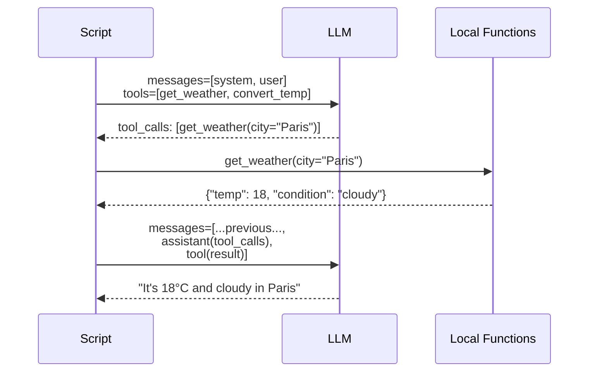
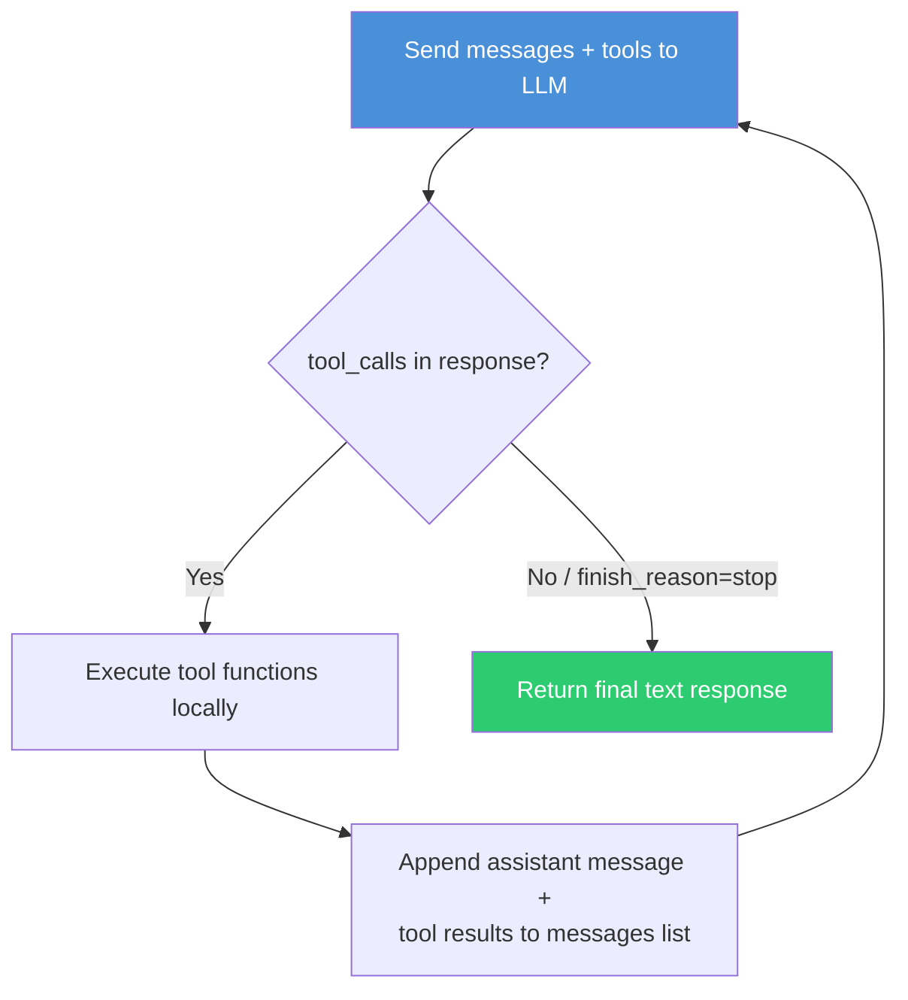

# Exercise 02: Tool Use & Function Calling

## Objective

Learn how LLMs interact with external tools through function calling — the foundation of agentic behavior.

## Concepts Covered

- Tool definitions with `openai.pydantic_function_tool()`
- The `tools` parameter and strict mode
- Parsing `tool_calls` from model responses
- The agent loop: Reason → Act → Observe → Repeat
- `tool` role messages for returning results

## How It Works

### 01 — Single-Pass Function Calling

The first script introduces the mechanics of function calling. You define tools as Pydantic models and register them with `openai.pydantic_function_tool()`. When the model decides it needs a tool, it returns a `tool_calls` array instead of a text reply. You execute the function locally and send the result back with `role: "tool"`.



**Context sharing:** A single `messages` list grows across the exchange: system → user → assistant (with tool_calls) → tool result → assistant (final answer).

### 02 — The Agent Loop (Reason → Act → Observe → Repeat)

The second script introduces the **core agent loop** that all later exercises build on. Instead of a single pass, it runs in a `while` loop: send messages → check for `tool_calls` → execute → append results → re-send — repeating until the model's `finish_reason` is `"stop"` (meaning it has all the information it needs).



The loop is capped by `MAX_ITERATIONS = 10` to prevent infinite cycles. The model might call multiple tools in a single turn (e.g., `search_database` + `get_stock_price`) before combining the results.

**Context sharing:** The `messages` list accumulates every iteration — the model sees its own prior tool calls and results, building up context until it can produce a final answer.

**Structured output:** Not used for inter-agent communication. Tool definitions use Pydantic schemas for input validation (strict mode), but responses are plain text.

## Files (in order)

1. **`01_function_calling.py`** — Define and invoke tools with Pydantic schemas
2. **`02_tool_loop.py`** — Full agent loop that runs until the model is done
3. **`tools/`** — Reusable mock tool implementations

## How to Run

```bash
python exercises/02_tool_use/01_function_calling.py
python exercises/02_tool_use/02_tool_loop.py
```

## Expected Output

Structured logging showing each loop iteration, tool calls with arguments, tool return values, and the final model response.

## Next

→ [Exercise 03: Single Agent](03_single_agent.md)
