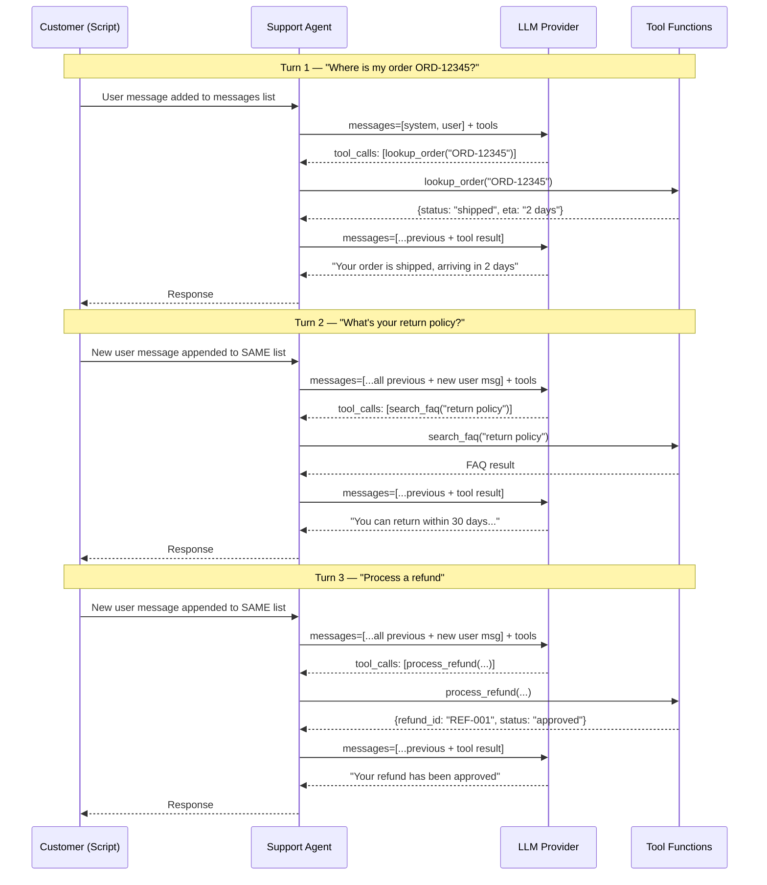

# Exercise 03: Single Agent

## Objective

Build a complete single agent with multiple tools — the building block for all orchestration patterns.

## Concepts Covered

- Agent with multiple tools (order lookup, FAQ search, refund processing)
- Conversation loop handling multi-turn interactions
- When a single agent is sufficient
- Context window growth in long conversations

## How It Works

This exercise uses the shared `Agent` dataclass and `run()` function from `commons/agent.py`. The agent is configured with a system prompt, three tools (`lookup_order`, `search_faq`, `process_refund`), and a tool function mapping. Three separate customer messages are sent sequentially, simulating a multi-turn support conversation.



**Context sharing:** A **single `messages` list persists across all three turns**. This list IS the agent's memory — the model sees the full conversation history on every call, including previous tool calls and results. This means by Turn 3, the model knows about the order lookup from Turn 1 and the FAQ search from Turn 2.

**Structured output:** Not used. Tool inputs use Pydantic schemas for validation, but responses are plain text. Inter-turn context is carried entirely in the growing messages list.

!!! warning "Context window growth"
    In a real application, this messages list grows without bound. Long conversations will eventually exceed the model's context window. Production systems need strategies like summarization or sliding windows — covered in the [Context Management](../production-considerations/context-management.md) section.

## Files

1. **`01_customer_support_agent.py`** — Customer support agent with order, FAQ, and refund tools

## How to Run

```bash
python exercises/03_single_agent/01_customer_support_agent.py
```

## Expected Output

A multi-turn support conversation showing the agent selecting appropriate tools, executing them, and composing responses.

## Next

→ [Exercise 04: Sequential Pattern](04_sequential.md)
