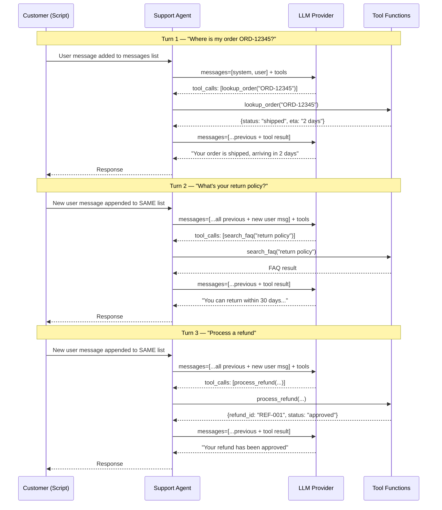

# Exercise 03: Single Agent

## Objective

Build a complete single agent with multiple tools — the building block for all orchestration patterns.

## Concepts Covered

- Agent with multiple tools (order lookup, FAQ search, refund processing)
- Conversation loop handling multi-turn interactions
- When a single agent is sufficient
- Context window growth in long conversations

## How It Works

This exercise uses the shared `Agent` dataclass and `run()` function from `commons/agent.py`. The agent is configured with a system prompt, three tools (`lookup_order`, `search_faq`, `process_refund`), and a tool function mapping. Three separate customer messages are sent sequentially, simulating a multi-turn support conversation.



**Context sharing:** A **single `messages` list persists across all three turns**. This list IS the agent's memory — the model sees the full conversation history on every call, including previous tool calls and results. This means by Turn 3, the model knows about the order lookup from Turn 1 and the FAQ search from Turn 2.

**Structured output:** Not used. Tool inputs use Pydantic schemas for validation, but responses are plain text. Inter-turn context is carried entirely in the growing messages list.

!!! warning "Context window growth"
    In a real application, this messages list grows without bound. Long conversations will eventually exceed the model's context window. Production systems need strategies like summarization or sliding windows — covered in the [Context Management](../production-considerations/context-management.md) section.

## Interactive Message Flow

<div class="message-flow-interactive" markdown="block" data-title="Customer Support Agent: Multi-Turn Conversation" data-context-type="growing" data-context-label="Messages list persists across turns — this IS the agent's memory">

<div class="mf-step" data-description="The system prompt defines the support agent's personality, role, and available tools">
<div class="mf-msg" data-role="system" data-list="messages" data-payload='{"role": "system", "content": "You are a friendly customer support agent for an electronics store. Use your tools to look up orders, search FAQs, and process refunds."}'>You are a friendly customer support agent for an electronics store. Use your tools to look up orders, search FAQs, and process refunds.</div>
</div>

<div class="mf-step" data-description="Turn 1: Customer asks about their order. The agent needs to look it up.">
<div class="mf-msg" data-role="user" data-list="messages" data-payload='{"role": "user", "content": "Hi, I need help with my order ORD-1001. Can you tell me the status?"}'>Hi, I need help with my order ORD-1001. Can you tell me the status?</div>
</div>

<div class="mf-step" data-description="The agent decides to call lookup_order to find the order details">
<div class="mf-msg" data-role="tool_calls" data-list="messages" data-agent="Support Agent" data-payload='{"role": "assistant", "content": null, "tool_calls": [{"id": "call_lo01", "type": "function", "function": {"name": "lookup_order", "arguments": "{\"order_id\":\"ORD-1001\"}"}}]}'>lookup_order(order_id='ORD-1001')</div>
</div>

<div class="mf-step" data-description="Tool returns order details. The agent loop calls the API again with this result in context.">
<div class="mf-msg" data-role="tool" data-list="messages" data-agent="lookup_order" data-payload='{"role": "tool", "tool_call_id": "call_lo01", "content": "{\"order_id\": \"ORD-1001\", \"product\": \"Wireless Headphones\", \"status\": \"delivered\", \"date\": \"2024-01-15\"}"}'>{"order_id": "ORD-1001", "product": "Wireless Headphones", "status": "delivered", "date": "2024-01-15"}</div>
</div>

<div class="mf-step" data-description="No more tool_calls needed — the agent responds with the order information">
<div class="mf-msg" data-role="assistant" data-list="messages" data-payload='{"role": "assistant", "content": "Your order ORD-1001 for Wireless Headphones was delivered on January 15th. Is there anything else I can help you with?"}'>Your order ORD-1001 for Wireless Headphones was delivered on January 15th. Is there anything else I can help you with?</div>
</div>

<div class="mf-step" data-description="Turn 2: Customer follows up with a new issue. The agent sees the FULL conversation history from Turn 1.">
<div class="mf-msg" data-role="user" data-list="messages" data-payload='{"role": "user", "content": "I&#39;m not happy with the headphones. The sound quality is poor. Can I get a refund?"}'>I'm not happy with the headphones. The sound quality is poor. Can I get a refund?</div>
</div>

<div class="mf-step" data-description="The agent searches the FAQ for refund policy before processing">
<div class="mf-msg" data-role="tool_calls" data-list="messages" data-agent="Support Agent" data-payload='{"role": "assistant", "content": null, "tool_calls": [{"id": "call_sf01", "type": "function", "function": {"name": "search_faq", "arguments": "{\"question\":\"refund policy\"}"}}]}'>search_faq(query='refund policy')</div>
</div>

<div class="mf-step" data-description="FAQ confirms policy. Agent now calls process_refund with the order details it remembers from Turn 1.">
<div class="mf-msg" data-role="tool" data-list="messages" data-agent="search_faq" data-payload='{"role": "tool", "tool_call_id": "call_sf01", "content": "{\"answer\": \"Refunds available within 30 days of delivery for defective or unsatisfactory products.\"}"}'>{"answer": "Refunds available within 30 days of delivery for defective or unsatisfactory products."}</div>
<div class="mf-msg" data-role="tool_calls" data-list="messages" data-agent="Support Agent" data-payload='{"role": "assistant", "content": null, "tool_calls": [{"id": "call_pr01", "type": "function", "function": {"name": "process_refund", "arguments": "{\"order_id\":\"ORD-1001\",\"reason\":\"poor sound quality\"}"}}]}'>process_refund(order_id='ORD-1001', reason='poor sound quality')</div>
</div>

<div class="mf-step" data-description="Refund processed. The agent uses full conversation context to provide a complete resolution.">
<div class="mf-msg" data-role="tool" data-list="messages" data-agent="process_refund" data-payload='{"role": "tool", "tool_call_id": "call_pr01", "content": "{\"status\": \"approved\", \"refund_amount\": 79.99, \"message\": \"Refund initiated\"}"}'>{"status": "approved", "refund_amount": 79.99, "message": "Refund initiated"}</div>
<div class="mf-msg" data-role="assistant" data-list="messages" data-payload='{"role": "assistant", "content": "I&#39;ve processed a refund of $79.99 for your Wireless Headphones. You should see it in your account within 5-7 business days. I&#39;m sorry about the sound quality issue!"}'>I've processed a refund of $79.99 for your Wireless Headphones. You should see it in your account within 5-7 business days. I'm sorry about the sound quality issue!</div>
</div>

</div>

## Files

1. **`01_customer_support_agent.py`** — Customer support agent with order, FAQ, and refund tools

## How to Run

```bash
python exercises/03_single_agent/01_customer_support_agent.py
```

## Expected Output

A multi-turn support conversation showing the agent selecting appropriate tools, executing them, and composing responses.

## Next

→ [Exercise 04: Sequential Pattern](04_sequential.md)
