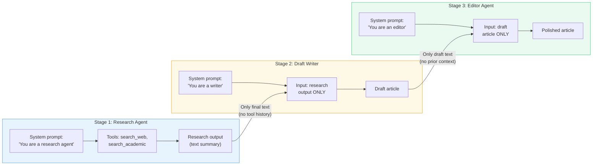
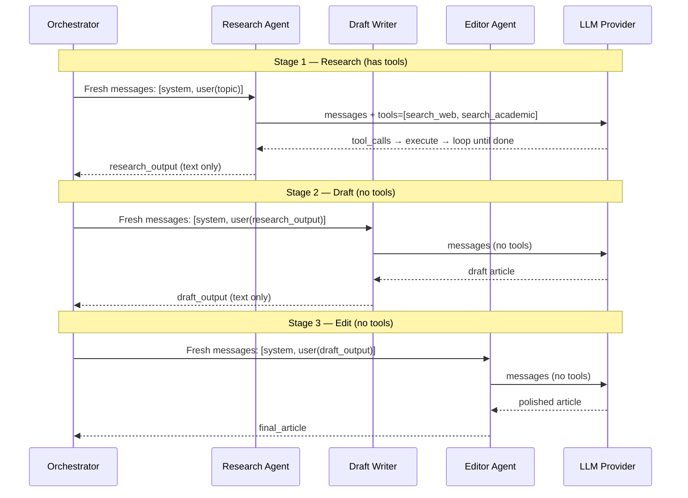

# Exercise 04: Sequential Pattern

## Objective

Implement a multi-agent pipeline where each agent's output feeds into the next — the sequential orchestration pattern.

## Concepts Covered

- Linear agent pipeline (Research → Draft → Edit)
- Fresh context per stage (only passing the previous agent's output)
- Progressive refinement of content
- Context compaction between stages

## How It Works

Three agents process content in a pipeline. The critical design decision: **each agent gets a fresh messages list** containing only the previous agent's final output — not its internal tool calls, reasoning, or full conversation history. This prevents context pollution and keeps each stage focused.



Each stage in detail:



**Context sharing:** **Fresh context per stage.** Each agent gets a new `messages` list containing only `[system_prompt, user_message_with_previous_output]`. The Research Agent's tool calls, intermediate reasoning, and raw search results are never seen by the Draft Writer. Only the final text output crosses the boundary. The code uses `log_context_pass()` to make these handoff points visible in the logs.

**Structured output:** Not used. Plain text strings are passed between stages.

!!! info "Why fresh context?"
    Passing full history would waste tokens and risk confusing downstream agents with irrelevant details (like raw search API responses). Fresh context keeps each stage focused on its specific task while still receiving the essential information it needs.

## Interactive Message Flow

<div class="message-flow-interactive" markdown="block" data-title="Content Pipeline: Research, Draft, Edit" data-context-type="structured" data-context-label="Each agent gets fresh context — only the final output text is passed forward">

<div class="mf-step" data-description="Stage 1: Research agent receives the topic in a fresh messages list">
<div class="mf-msg" data-role="system" data-list="research" data-agent="Research Agent" data-payload='{"role": "system", "content": "You are a research specialist. Gather key facts, statistics, and insights on the given topic."}'>You are a research specialist. Gather key facts, statistics, and insights on the given topic.</div>
<div class="mf-msg" data-role="user" data-list="research" data-payload='{"role": "user", "content": "Research the topic: The impact of remote work on software engineering productivity"}'>Research the topic: The impact of remote work on software engineering productivity</div>
</div>

<div class="mf-step" data-description="Research agent produces findings. Only this output text moves to the next stage — not the system prompt or internal reasoning.">
<div class="mf-msg" data-role="assistant" data-list="research" data-agent="Research Agent" data-payload='{"role": "assistant", "content": "Key findings: 1) Studies show 13% productivity increase for remote workers. 2) Communication overhead increases by 20%. 3) Code quality metrics remain stable. 4) Developer satisfaction up 45%. 5) Onboarding new team members is the biggest challenge."}'>Key findings: 1) Studies show 13% productivity increase for remote workers. 2) Communication overhead increases by 20%. 3) Code quality metrics remain stable. 4) Developer satisfaction up 45%. 5) Onboarding new team members is the biggest challenge.</div>
</div>

<div class="mf-step" data-description="Stage 2: Draft agent gets a NEW messages list. It receives the research output as user input but never sees the research agent's system prompt.">
<div class="mf-msg" data-role="system" data-list="draft" data-agent="Draft Agent" data-payload='{"role": "system", "content": "You are a skilled technical writer. Write a clear, engaging article based on the provided research."}'>You are a skilled technical writer. Write a clear, engaging article based on the provided research.</div>
<div class="mf-msg" data-role="user" data-list="draft" data-payload='{"role": "user", "content": "Write an article based on this research: Key findings: 1) Studies show 13% productivity increase... 2) Communication overhead increases by 20%... 3) Code quality metrics remain stable..."}'>Write an article based on this research: Key findings: 1) Studies show 13% productivity increase... 2) Communication overhead increases by 20%... 3) Code quality metrics remain stable...</div>
</div>

<div class="mf-step" data-description="Draft agent produces a full article. Only this text is forwarded to the editor.">
<div class="mf-msg" data-role="assistant" data-list="draft" data-agent="Draft Agent" data-payload='{"role": "assistant", "content": "The Remote Revolution: How Working From Home Changes Code. Remote work has transformed software engineering. Studies reveal a 13% boost in individual productivity, though teams face new communication challenges with a 20% increase in coordination overhead..."}'>The Remote Revolution: How Working From Home Changes Code. Remote work has transformed software engineering. Studies reveal a 13% boost in individual productivity, though teams face new communication challenges with a 20% increase in coordination overhead...</div>
</div>

<div class="mf-step" data-description="Stage 3: Editor gets a NEW messages list with only the draft — no access to research notes or draft agent's system prompt">
<div class="mf-msg" data-role="system" data-list="edit" data-agent="Editor Agent" data-payload='{"role": "system", "content": "You are an expert editor. Polish the article for clarity, flow, grammar, and professional style."}'>You are an expert editor. Polish the article for clarity, flow, grammar, and professional style.</div>
<div class="mf-msg" data-role="user" data-list="edit" data-payload='{"role": "user", "content": "Polish this draft: The Remote Revolution: How Working From Home Changes Code. Remote work has transformed software engineering..."}'>Polish this draft: The Remote Revolution: How Working From Home Changes Code. Remote work has transformed software engineering...</div>
</div>

<div class="mf-step" data-description="Editor produces the final polished article. The three-stage pipeline is complete.">
<div class="mf-msg" data-role="assistant" data-list="edit" data-agent="Editor Agent" data-payload='{"role": "assistant", "content": "The Remote Revolution: Rethinking Productivity in Software Engineering. The shift to remote work has fundamentally reshaped how software teams operate — and the data tells a compelling story. Individual productivity has risen by 13%, yet this gain comes with a nuanced trade-off..."}'>The Remote Revolution: Rethinking Productivity in Software Engineering. The shift to remote work has fundamentally reshaped how software teams operate — and the data tells a compelling story. Individual productivity has risen by 13%, yet this gain comes with a nuanced trade-off...</div>
</div>

</div>

## Files

1. **`01_content_pipeline.py`** — Three-agent content pipeline that produces a polished article

## How to Run

```bash
python exercises/04_sequential/01_content_pipeline.py
```

## Expected Output

Structured logging showing each pipeline stage, what context is passed between agents, and the progressive refinement of the article.

## Next

→ [Exercise 05: Concurrent Pattern](05_concurrent.md)
