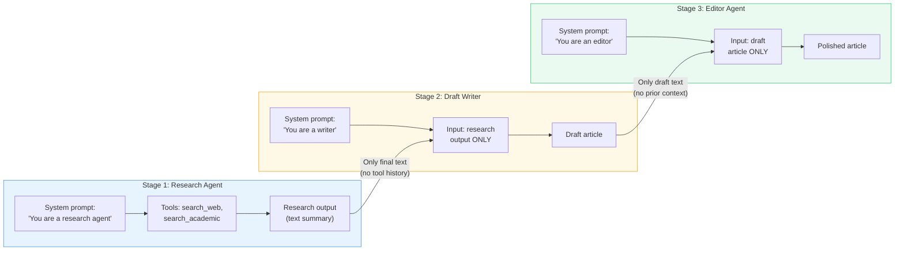
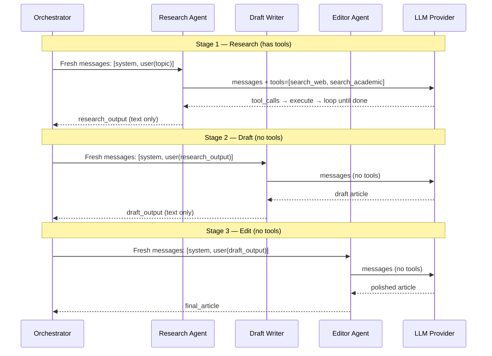

# Exercise 04: Sequential Pattern

## Objective

Implement a multi-agent pipeline where each agent's output feeds into the next — the sequential orchestration pattern.

## Concepts Covered

- Linear agent pipeline (Research → Draft → Edit)
- Fresh context per stage (only passing the previous agent's output)
- Progressive refinement of content
- Context compaction between stages

## How It Works

Three agents process content in a pipeline. The critical design decision: **each agent gets a fresh messages list** containing only the previous agent's final output — not its internal tool calls, reasoning, or full conversation history. This prevents context pollution and keeps each stage focused.



Each stage in detail:



**Context sharing:** **Fresh context per stage.** Each agent gets a new `messages` list containing only `[system_prompt, user_message_with_previous_output]`. The Research Agent's tool calls, intermediate reasoning, and raw search results are never seen by the Draft Writer. Only the final text output crosses the boundary. The code uses `log_context_pass()` to make these handoff points visible in the logs.

**Structured output:** Not used. Plain text strings are passed between stages.

!!! info "Why fresh context?"
    Passing full history would waste tokens and risk confusing downstream agents with irrelevant details (like raw search API responses). Fresh context keeps each stage focused on its specific task while still receiving the essential information it needs.

## Files

1. **`01_content_pipeline.py`** — Three-agent content pipeline that produces a polished article

## How to Run

```bash
python exercises/04_sequential/01_content_pipeline.py
```

## Expected Output

Structured logging showing each pipeline stage, what context is passed between agents, and the progressive refinement of the article.

## Next

→ [Exercise 05: Concurrent Pattern](05_concurrent.md)
