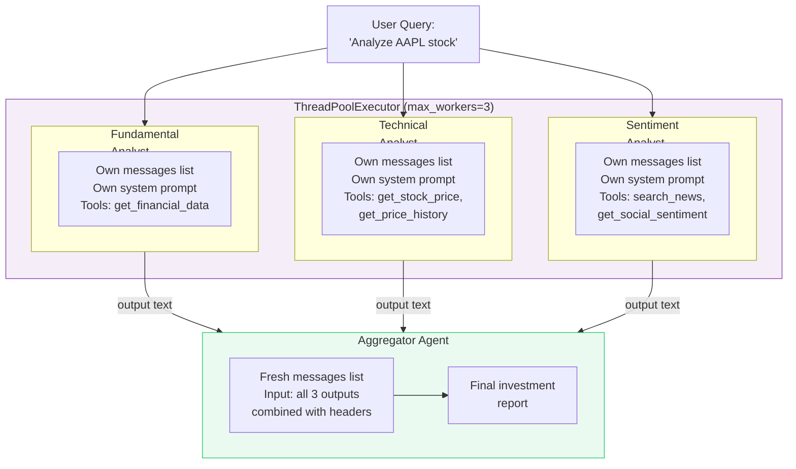
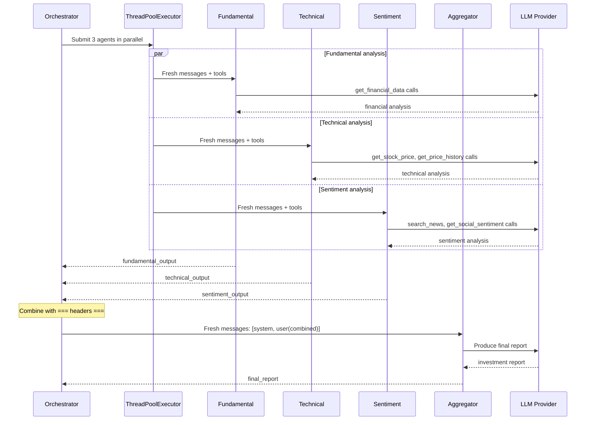

# Exercise 05: Concurrent Pattern

## Objective

Implement fan-out/fan-in execution where multiple agents work in parallel, then results are aggregated.

## Concepts Covered

- Parallel agent execution with `concurrent.futures`
- Independent context per agent (no shared state between parallel agents)
- Result aggregation by a synthesizer agent
- Fan-out/fan-in architecture

## How It Works

Four agents participate, but only three run concurrently. The Fundamental, Technical, and Sentiment analysts each analyze the same stock independently. Their results are then combined and given to an Aggregator agent that produces a final investment report.



The execution timeline:



**Context sharing:** **Completely isolated.** Each analyst gets its own `messages` list, its own system prompt, and its own tools. No agent can see another agent's reasoning or tool calls. The Aggregator receives only the final text outputs, formatted with `=== Analyst Name ===` headers. Thread safety is guaranteed because there is zero shared mutable state between the concurrent agents.

**Structured output:** Not used. Plain text strings are passed between agents.

!!! tip "When to use this pattern"
    The concurrent pattern works best when sub-tasks are **independent** — no agent needs another agent's output to do its work. If agents have dependencies, use the sequential pattern instead. You can also combine both: parallel fan-out followed by sequential refinement.

## Files

1. **`01_stock_analysis.py`** — Three parallel analyst agents + an aggregator for stock analysis

## How to Run

```bash
python exercises/05_concurrent/01_stock_analysis.py
```

## Expected Output

Logging showing parallel agent launches, individual completions, and the final aggregated analysis.

## Next

→ [Exercise 06: Group Chat Pattern](06_group_chat.md)
