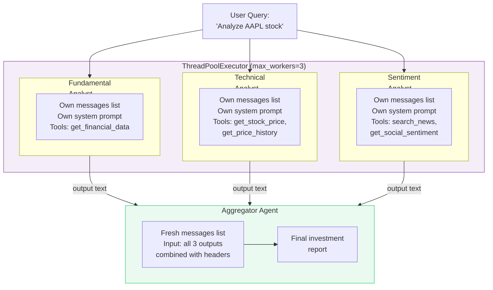
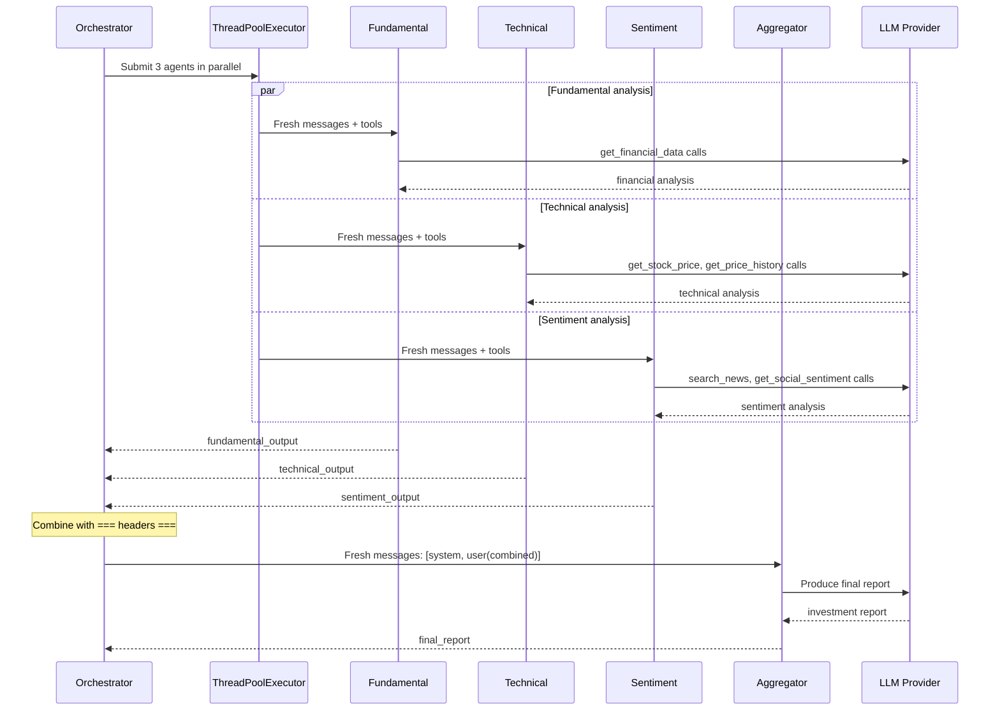

# Exercise 05: Concurrent Pattern

## Objective

Implement fan-out/fan-in execution where multiple agents work in parallel, then results are aggregated.

## Concepts Covered

- Parallel agent execution with `concurrent.futures`
- Independent context per agent (no shared state between parallel agents)
- Result aggregation by a synthesizer agent
- Fan-out/fan-in architecture

## How It Works

Four agents participate, but only three run concurrently. The Fundamental, Technical, and Sentiment analysts each analyze the same stock independently. Their results are then combined and given to an Aggregator agent that produces a final investment report.



The execution timeline:



**Context sharing:** **Completely isolated.** Each analyst gets its own `messages` list, its own system prompt, and its own tools. No agent can see another agent's reasoning or tool calls. The Aggregator receives only the final text outputs, formatted with `=== Analyst Name ===` headers. Thread safety is guaranteed because there is zero shared mutable state between the concurrent agents.

**Structured output:** Not used. Plain text strings are passed between agents.

!!! tip "When to use this pattern"
    The concurrent pattern works best when sub-tasks are **independent** — no agent needs another agent's output to do its work. If agents have dependencies, use the sequential pattern instead. You can also combine both: parallel fan-out followed by sequential refinement.

<div class="message-flow-interactive" markdown="block" data-title="Stock Analysis: Parallel Fan-Out + Aggregation" data-context-type="isolated" data-context-label="Each analyst gets its own isolated messages list — no shared state between parallel agents">

<div class="mf-step" data-description="Fan-out: The same query is sent to three analysts in parallel, each with its own messages list and specialized system prompt">
<div class="mf-msg" data-role="system" data-list="fundamental" data-agent="Fundamental" data-payload='{"role": "system", "content": "You are a fundamental analyst. Evaluate financial health, revenue growth, earnings, market position, and business model sustainability."}'>You are a fundamental analyst. Evaluate financial health, revenue growth, earnings, market position, and business model sustainability.</div>
<div class="mf-msg" data-role="user" data-list="fundamental" data-payload='{"role": "user", "content": "Analyze NVDA stock"}'>Analyze NVDA stock</div>
<div class="mf-msg" data-role="system" data-list="technical" data-agent="Technical" data-payload='{"role": "system", "content": "You are a technical analyst. Evaluate price trends, support/resistance levels, moving averages, RSI, and chart patterns."}'>You are a technical analyst. Evaluate price trends, support/resistance levels, moving averages, RSI, and chart patterns.</div>
<div class="mf-msg" data-role="user" data-list="technical" data-payload='{"role": "user", "content": "Analyze NVDA stock"}'>Analyze NVDA stock</div>
<div class="mf-msg" data-role="system" data-list="sentiment" data-agent="Sentiment" data-payload='{"role": "system", "content": "You are a sentiment analyst. Evaluate news coverage, social media buzz, analyst ratings, and overall market mood."}'>You are a sentiment analyst. Evaluate news coverage, social media buzz, analyst ratings, and overall market mood.</div>
<div class="mf-msg" data-role="user" data-list="sentiment" data-payload='{"role": "user", "content": "Analyze NVDA stock"}'>Analyze NVDA stock</div>
</div>

<div class="mf-step" data-description="All three analysts respond independently and in parallel — they cannot see each other's output or reasoning">
<div class="mf-msg" data-role="assistant" data-list="fundamental" data-agent="Fundamental" data-payload='{"role": "assistant", "content": "NVDA shows exceptional fundamentals: revenue grew 122% YoY driven by data center demand. P/E ratio is high but justified by growth trajectory. Strong competitive moat in GPU and AI accelerator markets. Risk: geopolitical export restrictions to China."}'>NVDA shows exceptional fundamentals: revenue grew 122% YoY driven by data center demand. P/E ratio is high but justified by growth trajectory. Strong competitive moat in GPU and AI accelerator markets. Risk: geopolitical export restrictions to China.</div>
<div class="mf-msg" data-role="assistant" data-list="technical" data-agent="Technical" data-payload='{"role": "assistant", "content": "NVDA is in a strong uptrend. Breakout above $400 and $500 resistance levels confirmed. Golden cross (50-day MA above 200-day MA). RSI at 60-70, moderately overbought. Support at $450-460. MACD bullish but flattening — momentum may slow."}'>NVDA is in a strong uptrend. Breakout above $400 and $500 resistance levels confirmed. Golden cross (50-day MA above 200-day MA). RSI at 60-70, moderately overbought. Support at $450-460. MACD bullish but flattening — momentum may slow.</div>
<div class="mf-msg" data-role="assistant" data-list="sentiment" data-agent="Sentiment" data-payload='{"role": "assistant", "content": "Market sentiment overwhelmingly positive. AI hype cycle driving strong retail and institutional interest. Analyst upgrades frequent. Limited insider selling signals confidence. Risk: sentiment-driven rallies could amplify volatility if enthusiasm wanes."}'>Market sentiment overwhelmingly positive. AI hype cycle driving strong retail and institutional interest. Analyst upgrades frequent. Limited insider selling signals confidence. Risk: sentiment-driven rallies could amplify volatility if enthusiasm wanes.</div>
</div>

<div class="mf-step" data-description="Fan-in: All three outputs are combined into a single text block with === headers and sent to the aggregator in a fresh messages list">
<div class="mf-msg" data-role="system" data-list="aggregator" data-agent="Aggregator" data-payload='{"role": "system", "content": "You are a senior investment strategist. Synthesize multiple analyst reports into a unified investment recommendation with clear reasoning."}'>You are a senior investment strategist. Synthesize multiple analyst reports into a unified investment recommendation with clear reasoning.</div>
<div class="mf-msg" data-role="user" data-list="aggregator" data-payload='{"role": "user", "content": "Synthesize these analyses: === Fundamental === Revenue grew 122% YoY, strong moat in AI... === Technical === Strong uptrend, RSI 60-70, support at $450... === Sentiment === Overwhelmingly positive, AI hype driving interest..."}'>Synthesize these analyses: === Fundamental === Revenue grew 122% YoY, strong moat in AI... === Technical === Strong uptrend, RSI 60-70, support at $450... === Sentiment === Overwhelmingly positive, AI hype driving interest...</div>
</div>

<div class="mf-step" data-description="The aggregator produces a unified report drawing from all three perspectives — the only agent that sees all analyst outputs">
<div class="mf-msg" data-role="assistant" data-list="aggregator" data-agent="Aggregator" data-payload='{"role": "assistant", "content": "NVDA Investment Summary: BUY with caution. Strong fundamentals and technical momentum support continued growth. However, elevated sentiment and high RSI suggest waiting for a pullback to the $450 support level before adding positions. Key risks: geopolitical export restrictions and momentum slowdown."}'>NVDA Investment Summary: BUY with caution. Strong fundamentals and technical momentum support continued growth. However, elevated sentiment and high RSI suggest waiting for a pullback to the $450 support level before adding positions. Key risks: geopolitical export restrictions and momentum slowdown.</div>
</div>

</div>

## Message Flow: A Practical Example

This example shows exactly what each agent's `messages` list looks like at runtime. Notice that **every agent gets its own isolated list** — there is no shared state.

### Step 1 — Fan-Out: Each analyst gets an independent messages list

All three analysts receive the same user query, but in completely separate `messages` lists. They run in parallel threads and cannot see each other.

```python
# Fundamental Analyst's messages (isolated)
fundamental_messages = [
    {"role": "user", "content": "Analyze NVIDIA Corp. (NVDA) stock."}
]

# Technical Analyst's messages (isolated — separate list)
technical_messages = [
    {"role": "user", "content": "Analyze NVIDIA Corp. (NVDA) stock."}
]

# Sentiment Analyst's messages (isolated — separate list)
sentiment_messages = [
    {"role": "user", "content": "Analyze NVIDIA Corp. (NVDA) stock."}
]
```

Each analyst also has its own system prompt (set via the `Agent` abstraction), so the actual API call for the Fundamental Analyst looks like:

```python
# What the LLM actually receives for the Fundamental Analyst:
[
    {"role": "system", "content": "You are a fundamental analyst. Analyze the given stock..."},
    {"role": "user",   "content": "Analyze NVIDIA Corp. (NVDA) stock."}
]
```

The other two analysts receive the same structure but with their own system prompts (technical analysis, sentiment analysis). **No agent sees any other agent's prompt or output.**

### Step 2 — Each analyst produces its output independently

After the LLM responds, each analyst's `messages` list grows — but only its own:

```python
# Fundamental Analyst — after LLM responds
fundamental_messages = [
    {"role": "user",      "content": "Analyze NVIDIA Corp. (NVDA) stock."},
    {"role": "assistant", "content": "NVIDIA shows strong revenue growth driven by AI/datacenter..."}
]

# Technical Analyst — after LLM responds (separate list, separate output)
technical_messages = [
    {"role": "user",      "content": "Analyze NVIDIA Corp. (NVDA) stock."},
    {"role": "assistant", "content": "NVDA is trading above its 50-day moving average..."}
]

# Sentiment Analyst — after LLM responds (separate list, separate output)
sentiment_messages = [
    {"role": "user",      "content": "Analyze NVIDIA Corp. (NVDA) stock."},
    {"role": "assistant", "content": "Market sentiment for NVIDIA is overwhelmingly positive..."}
]
```

The orchestrator collects just the final text output from each analyst — the `messages` lists themselves are discarded.

### Step 3 — Fan-In: Aggregator receives all outputs in a fresh list

The Aggregator gets a **brand new `messages` list** containing all three outputs combined with `=== headers ===`:

```python
# Aggregator's messages — completely fresh, no analyst history
aggregator_messages = [
    {
        "role": "user",
        "content": (
            "Synthesize these independent analyses of NVIDIA Corp. (NVDA):\n\n"
            "=== Fundamental Analyst ===\n"
            "NVIDIA shows strong revenue growth driven by AI/datacenter...\n\n"
            "=== Technical Analyst ===\n"
            "NVDA is trading above its 50-day moving average...\n\n"
            "=== Sentiment Analyst ===\n"
            "Market sentiment for NVIDIA is overwhelmingly positive..."
        ),
    }
]
```

The Aggregator has **no knowledge** of how the analysts worked, what tools they used, or what their system prompts were. It sees only the combined text outputs.

### Summary: Four agents, four independent message lists

| Agent | Messages list | Sees other agents? | Shared state? |
|---|---|---|---|
| Fundamental Analyst | Own isolated list | No | None |
| Technical Analyst | Own isolated list | No | None |
| Sentiment Analyst | Own isolated list | No | None |
| Aggregator | Own fresh list (with combined outputs) | Only their text outputs | None |

## Files

1. **`01_stock_analysis.py`** — Three parallel analyst agents + an aggregator for stock analysis

## How to Run

```bash
python exercises/05_concurrent/01_stock_analysis.py
```

## Expected Output

Logging showing parallel agent launches, individual completions, and the final aggregated analysis.

## Next

→ Next: [Exercise 06: Group Chat](../06_group_chat/)
