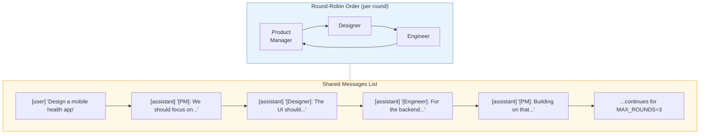
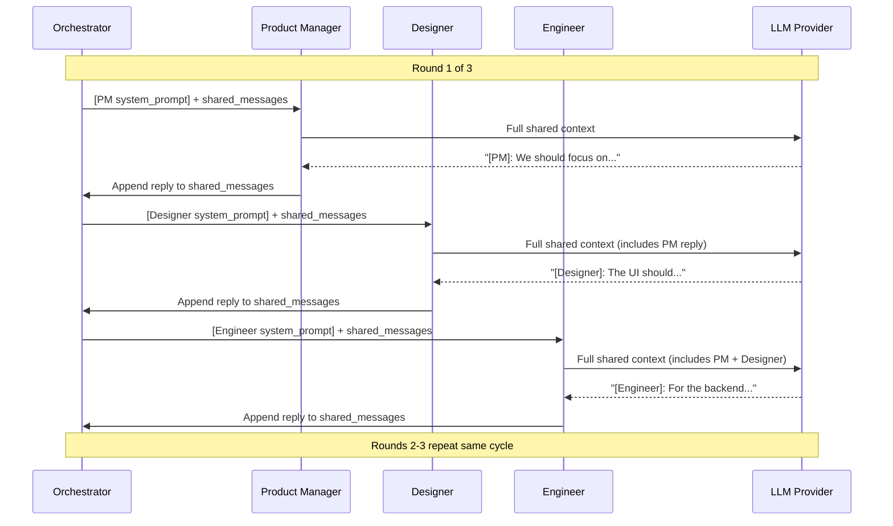
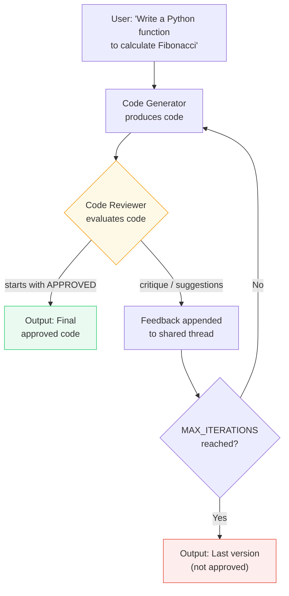
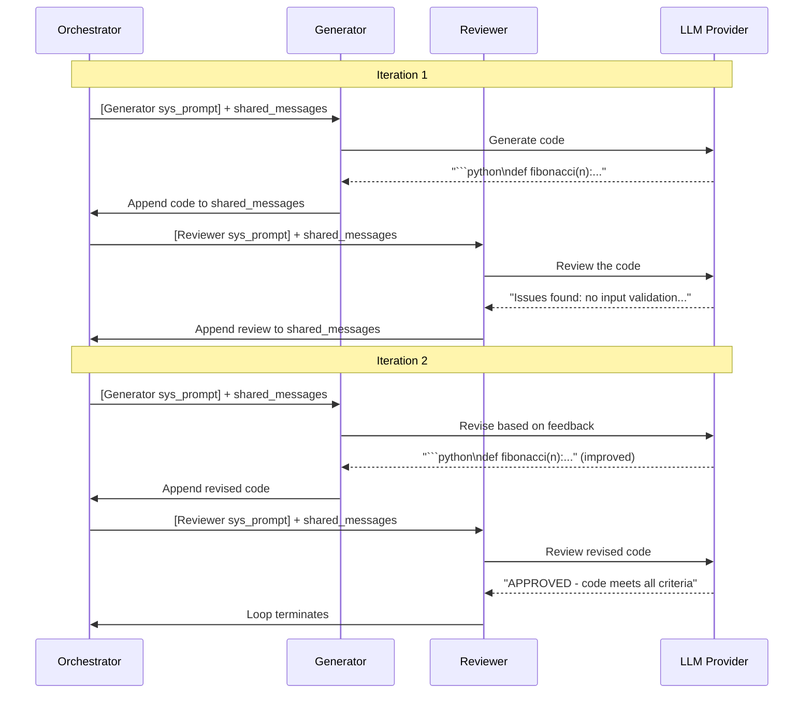

# Exercise 06: Group Chat Pattern

## Objective

Implement multi-agent group conversations with shared context, including the maker-checker (reflection) variant.

## Concepts Covered

- Shared conversation thread across agents
- Chat manager for speaking order and termination
- Maker-checker / evaluator-optimizer loop
- Context window management in multi-agent conversations

## How It Works

This exercise contains two variants of the group chat pattern, each with different communication structures.

### Exercise 1: Brainstorm (Round-Robin)

Three agents — Product Manager, Designer, and Engineer — share a single `shared_messages` list and take turns in a fixed round-robin order. Each agent sees the entire conversation history, prepends its own system prompt, and adds its reply back to the shared list.





**Context sharing:** **Fully shared.** All agents read and write to the same `shared_messages` list. Each agent sees every previous turn from every other agent. The system prompt is swapped per agent by prepending it to the shared messages before each call.

### Exercise 2: Maker-Checker (Reflection Loop)

Two agents — a Code Generator and a Code Reviewer — alternate on a shared conversation thread. The Generator produces code, the Reviewer critiques it, and the loop continues until the Reviewer responds with `APPROVED` or `MAX_ITERATIONS` (4) is reached.





**Context sharing:** **Fully shared.** Both agents operate on the same thread. The Reviewer sees the Generator's code and all prior iterations. The Generator sees the Reviewer's feedback and improves accordingly. This accumulating shared context is what enables iterative refinement.

**Structured output:** Not used in either variant. Agent replies are plain text strings. Termination is detected by checking if the review `strip().upper().startswith("APPROVED")`.

!!! warning "Context window growth"
    In both variants, the shared messages list grows with every turn. With 3 rounds × 3 agents = 9 turns in brainstorm, or up to 8 turns in maker-checker, the context can become substantial. For production systems, consider summarizing or truncating older messages.

## Files (in order)

1. **`01_brainstorm.py`** — Three agents debate a product idea in a shared thread
2. **`02_maker_checker.py`** — Code generator + reviewer in a reflection loop

## How to Run

```bash
python exercises/06_group_chat/01_brainstorm.py
python exercises/06_group_chat/02_maker_checker.py
```

## Expected Output

Turn-by-turn logging showing which agent speaks, the shared conversation growing, and (for maker-checker) the iterative refinement loop.

## Next

→ [Exercise 07: Handoff Pattern](07_handoff.md)
