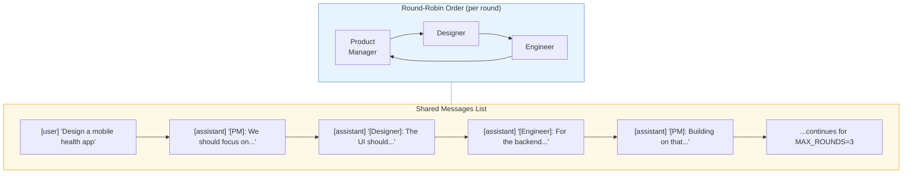
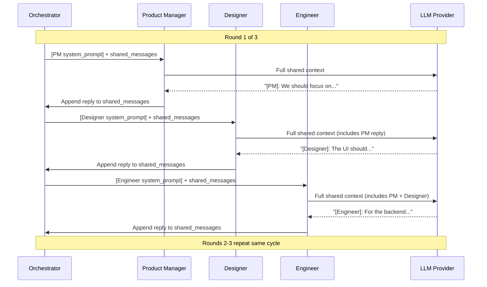
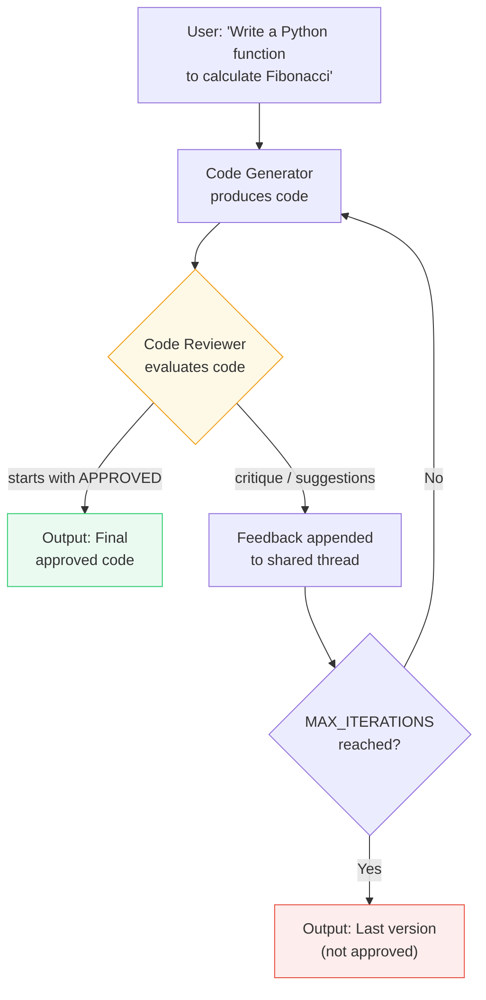
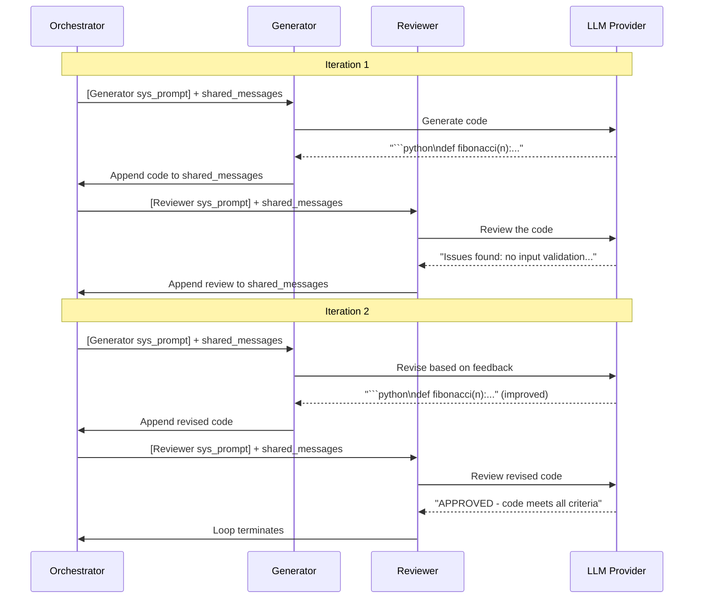

# Exercise 06: Group Chat Pattern

## Objective

Implement multi-agent group conversations with shared context, including the maker-checker (reflection) variant.

## Concepts Covered

- **Round-robin orchestration** — agents take turns in a fixed, repeating cycle
- Shared conversation thread across agents
- Chat manager for speaking order and termination
- Maker-checker / evaluator-optimizer loop (reflection pattern)
- Context window management in multi-agent conversations

## How It Works

This exercise contains two variants of the group chat pattern, each with different communication structures.

### Exercise 1: Brainstorm (Round-Robin)

**Round-robin** is the simplest orchestration strategy for multi-agent group chats: agents speak in a **fixed, repeating order**. Each agent gets exactly one turn per round, and the cycle repeats for a configured number of rounds. No agent can interrupt, skip, or speak out of turn.

Three agents — Product Manager, Designer, and Engineer — share a single `shared_messages` list. The orchestrator cycles through them in a predetermined order (`SPEAKING_ORDER`), prepends each agent's own system prompt before calling the API, and appends the reply back to the shared list.

```python
# The round-robin orchestration loop
SPEAKING_ORDER = ["Product Manager", "Designer", "Engineer"]
MAX_ROUNDS = 3  # → 3 rounds × 3 agents = 9 total turns

for round_num in range(1, MAX_ROUNDS + 1):
    for agent_name in SPEAKING_ORDER:        # fixed order each round
        # Prepend this agent's system prompt to shared context
        messages = [
            {"role": "system", "content": AGENTS[agent_name]},
            *shared_messages,
        ]
        # Call the LLM with this agent's persona + full history
        response = client.chat.completions.create(model=model, messages=messages)
        reply = response.choices[0].message.content
        # Append reply to the SHARED list — all agents see it next turn
        shared_messages.append({
            "role": "assistant",
            "content": f"[{agent_name}]: {reply}",
        })
```

This creates **predictable, democratic** conversations where every perspective is heard equally. The trade-off is rigidity — agents cannot interrupt, respond out of order, or dynamically decide who speaks next. For more flexible conversations, you would need a manager-driven or priority-based speaking strategy.

!!! question "What happens after the rounds finish?"
    In this exercise, **nothing** — the loop simply ends after `MAX_ROUNDS` and the raw conversation is the result. There is no final LLM call to extract consensus or synthesize a summary. In production systems you would typically add a **synthesis step**: one final API call with a prompt like *"Summarize the key decisions and action items from this brainstorm"* to distill the multi-agent discussion into actionable output. We omit this here to keep the focus on the round-robin orchestration pattern itself.





**Context sharing:** **Fully shared.** All agents read and write to the same `shared_messages` list. Each agent sees every previous turn from every other agent. The system prompt is swapped per agent by prepending it to the shared messages before each call.

### Exercise 2: Maker-Checker (Reflection Loop)

Two agents — a Code Generator and a Code Reviewer — alternate on a shared conversation thread. The Generator produces code, the Reviewer critiques it, and the loop continues until the Reviewer responds with `APPROVED` or `MAX_ITERATIONS` (4) is reached.





**Context sharing:** **Fully shared.** Both agents operate on the same thread. The Reviewer sees the Generator's code and all prior iterations. The Generator sees the Reviewer's feedback and improves accordingly. This accumulating shared context is what enables iterative refinement.

**Structured output:** Not used in either variant. Agent replies are plain text strings. Termination is detected by checking if the review `strip().upper().startswith("APPROVED")`.

!!! warning "Context window growth"
    In both variants, the shared messages list grows with every turn. With 3 rounds × 3 agents = 9 turns in brainstorm, or up to 8 turns in maker-checker, the context can become substantial. For production systems, consider summarizing or truncating older messages.

<div class="message-flow-interactive" markdown="block" data-title="Brainstorm: Shared Conversation Thread" data-context-type="shared" data-context-label="All agents read and write to ONE shared messages list — context grows with every turn">

<div class="mf-step" data-description="Three agents are created, each with a specialized system prompt. These are prepended per-agent before each API call — they are NOT stored in shared_messages.">
<div class="mf-msg" data-role="system" data-list="agent_system_prompts" data-agent="Product Manager" data-payload='{"role": "system", "content": "You are an experienced Product Manager in a brainstorm session. Focus on market fit, user needs, business viability, and competitive landscape. Challenge ideas constructively. Build on others&#39; points. Keep contributions to 2-3 sentences."}'>You are an experienced Product Manager in a brainstorm session. Focus on market fit, user needs, business viability, and competitive landscape. Challenge ideas constructively. Build on others' points. Keep contributions to 2-3 sentences.</div>
<div class="mf-msg" data-role="system" data-list="agent_system_prompts" data-agent="Designer" data-payload='{"role": "system", "content": "You are a creative UX Designer in a brainstorm session. Focus on user experience, interface design, accessibility, and user delight. Propose concrete design ideas. React to and build on what others say. Keep contributions to 2-3 sentences."}'>You are a creative UX Designer in a brainstorm session. Focus on user experience, interface design, accessibility, and user delight. Propose concrete design ideas. React to and build on what others say. Keep contributions to 2-3 sentences.</div>
<div class="mf-msg" data-role="system" data-list="agent_system_prompts" data-agent="Engineer" data-payload='{"role": "system", "content": "You are a pragmatic Senior Engineer in a brainstorm session. Focus on technical feasibility, architecture, scalability, and implementation complexity. Be honest about trade-offs. Build on others&#39; points. Keep contributions to 2-3 sentences."}'>You are a pragmatic Senior Engineer in a brainstorm session. Focus on technical feasibility, architecture, scalability, and implementation complexity. Be honest about trade-offs. Build on others' points. Keep contributions to 2-3 sentences.</div>
</div>

<div class="mf-step" data-description="The shared messages list starts with the user prompt. All agents will see this and build on it.">
<div class="mf-msg" data-role="user" data-list="shared_messages" data-payload='{"role": "user", "content": "Brainstorm a mobile app that helps people reduce food waste at home."}'>Brainstorm a mobile app that helps people reduce food waste at home.</div>
</div>

<div class="mf-step" data-description="Round 1, Turn 1: Product Manager speaks first. Sees only the initial prompt.">
<div class="mf-msg" data-role="assistant" data-list="shared_messages" data-agent="Product Manager" data-payload='{"role": "assistant", "content": "The app should fit seamlessly into daily routines. Core features: meal planning based on expiry dates, recipes that use leftovers, and personalization to differentiate from basic tracking apps."}'>The app should fit seamlessly into daily routines. Core features: meal planning based on expiry dates, recipes that use leftovers, and personalization to differentiate from basic tracking apps.</div>
</div>

<div class="mf-step" data-description="Round 1, Turn 2: Designer speaks. Sees the prompt + PM's contribution and builds on it.">
<div class="mf-msg" data-role="assistant" data-list="shared_messages" data-agent="Designer" data-payload='{"role": "assistant", "content": "Building on that — add barcode scanning or photo recognition for quick food logging. Gamify with badges for reducing waste. Visual freshness indicators (green/yellow/red) for the pantry view. This adds efficiency and delight!"}'>Building on that — add barcode scanning or photo recognition for quick food logging. Gamify with badges for reducing waste. Visual freshness indicators (green/yellow/red) for the pantry view. This adds efficiency and delight!</div>
</div>

<div class="mf-step" data-description="Round 1, Turn 3: Engineer speaks last. Sees ALL prior contributions and grounds them in technical reality.">
<div class="mf-msg" data-role="assistant" data-list="shared_messages" data-agent="Engineer" data-payload='{"role": "assistant", "content": "Barcode scanning requires third-party APIs or custom ML models — increases complexity. Prioritize low-latency architecture for real-time expiry tracking. Gamification can use server-side logic to manage progress efficiently without heavy client processing."}'>Barcode scanning requires third-party APIs or custom ML models — increases complexity. Prioritize low-latency architecture for real-time expiry tracking. Gamification can use server-side logic to manage progress efficiently without heavy client processing.</div>
</div>

<div class="mf-step" data-description="Round 2 begins: Each agent now sees ALL prior contributions. Context grows rapidly — this is the core tradeoff of the shared pattern.">
<div class="mf-msg" data-role="assistant" data-list="shared_messages" data-agent="Product Manager" data-payload='{"role": "assistant", "content": "To balance complexity and viability, start simple: manual item input + recipe suggestions. Scale to scanning later. Partner with grocery brands for discounts to users reducing waste — creating a win-win retention model."}'>To balance complexity and viability, start simple: manual item input + recipe suggestions. Scale to scanning later. Partner with grocery brands for discounts to users reducing waste — creating a win-win retention model.</div>
</div>

</div>

<div class="message-flow-interactive" markdown="block" data-title="Maker-Checker: Iterative Code Review" data-context-type="shared" data-context-label="Generator and Reviewer alternate on the same shared messages list until APPROVED">

<div class="mf-step" data-description="Two agents are created: a Generator and a Reviewer, each with a specialized system prompt. These are prepended per-agent before each API call.">
<div class="mf-msg" data-role="system" data-list="agent_system_prompts" data-agent="Generator" data-payload='{"role": "system", "content": "You are an expert Python developer. Write clean, well-documented Python code that follows best practices. When you receive feedback from a reviewer, carefully address each point and provide an improved version. Output ONLY the Python code (in a code block) — no extra commentary."}'>You are an expert Python developer. Write clean, well-documented Python code that follows best practices. When you receive feedback from a reviewer, carefully address each point and provide an improved version. Output ONLY the Python code (in a code block) — no extra commentary.</div>
<div class="mf-msg" data-role="system" data-list="agent_system_prompts" data-agent="Reviewer" data-payload='{"role": "system", "content": "You are a meticulous code reviewer. Review the provided Python code for:\n1. Correctness — does it handle edge cases?\n2. Readability — clear naming, good structure?\n3. Best practices — type hints, docstrings, error handling?\n4. Performance — any obvious inefficiencies?\n\nIf the code is good enough, respond with exactly &#39;APPROVED&#39; as the first word.\nIf it needs improvement, provide specific, actionable feedback points.\nBe constructive but rigorous."}'>You are a meticulous code reviewer. Review the provided Python code for: 1. Correctness — does it handle edge cases? 2. Readability — clear naming, good structure? 3. Best practices — type hints, docstrings, error handling? 4. Performance — any obvious inefficiencies? If the code is good enough, respond with exactly 'APPROVED' as the first word. If it needs improvement, provide specific, actionable feedback points. Be constructive but rigorous.</div>
</div>

<div class="mf-step" data-description="The coding task is placed in the shared messages list. Both Generator and Reviewer will see this.">
<div class="mf-msg" data-role="user" data-list="shared_messages" data-payload='{"role": "user", "content": "Write a Python function merge_sorted_lists(list1, list2) that merges two sorted lists into one sorted list. Do NOT use sorted() — implement the merge algorithm manually."}'>Write a Python function merge_sorted_lists(list1, list2) that merges two sorted lists into one sorted list. Do NOT use sorted() — implement the merge algorithm manually.</div>
</div>

<div class="mf-step" data-description="Iteration 1 — Generator produces initial code. It sees only the task description.">
<div class="mf-msg" data-role="assistant" data-list="shared_messages" data-agent="Generator" data-payload='{"role": "assistant", "content": "def merge_sorted_lists(list1, list2): Two-pointer merge — initialize result=[], i=j=0. Compare elements, append smaller, advance pointer. After loop, extend with remaining elements. Includes docstring and edge case handling for empty lists."}'>def merge_sorted_lists(list1, list2): Two-pointer merge — initialize result=[], i=j=0. Compare elements, append smaller, advance pointer. After loop, extend with remaining elements. Includes docstring and edge case handling for empty lists.</div>
</div>

<div class="mf-step" data-description="Iteration 1 — Reviewer evaluates. In the actual run, the code was clean enough to pass on first try.">
<div class="mf-msg" data-role="assistant" data-list="shared_messages" data-agent="Reviewer" data-payload='{"role": "assistant", "content": "APPROVED. The implementation correctly uses two-pointer merge with O(n) time complexity. Edge cases (empty lists, remaining elements) are handled properly. Type hints and docstring included. Code is clean and efficient."}'>APPROVED. The implementation correctly uses two-pointer merge with O(n) time complexity. Edge cases (empty lists, remaining elements) are handled properly. Type hints and docstring included. Code is clean and efficient.</div>
</div>

</div>

## Message Flow: Practical Examples

These examples show exactly how the **shared `messages` list** grows turn by turn. Unlike the concurrent pattern (where each agent has its own list), here **all agents read and write to the same list**.

### Brainstorm: Shared messages growing round by round

**Start — the shared list has only the user prompt:**

```python
# Turn 0 — initial state
shared_messages = [
    {
        "role": "user",
        "content": "Brainstorm session topic: A mobile app that helps people reduce food waste at home..."
    }
]
```

**Turn 1 — Product Manager speaks.** The orchestrator prepends PM's system prompt before calling the LLM:

```python
# What the LLM receives for the Product Manager:
api_call_messages = [
    {"role": "system",    "content": "You are an experienced Product Manager..."},
    {"role": "user",      "content": "Brainstorm session topic: A mobile app..."}  # from shared_messages
]

# After PM responds → reply is appended to the SHARED list:
shared_messages = [
    {"role": "user",      "content": "Brainstorm session topic: A mobile app..."},
    {"role": "assistant", "content": "[Product Manager]: The market for food waste apps is growing..."}
]
```

**Turn 2 — Designer speaks.** The Designer sees PM's contribution because it's in the shared list:

```python
# What the LLM receives for the Designer:
api_call_messages = [
    {"role": "system",    "content": "You are a creative UX Designer..."},
    {"role": "user",      "content": "Brainstorm session topic: A mobile app..."},       # shared
    {"role": "assistant", "content": "[Product Manager]: The market for food waste..."}   # shared
]

# After Designer responds → appended to shared list:
shared_messages = [
    {"role": "user",      "content": "Brainstorm session topic: A mobile app..."},
    {"role": "assistant", "content": "[Product Manager]: The market for food waste..."},
    {"role": "assistant", "content": "[Designer]: We should focus on a camera-based UI..."}
]
```

**Turn 3 — Engineer speaks.** The Engineer sees both PM and Designer contributions:

```python
# What the LLM receives for the Engineer:
api_call_messages = [
    {"role": "system",    "content": "You are a pragmatic Senior Engineer..."},
    {"role": "user",      "content": "Brainstorm session topic: A mobile app..."},       # shared
    {"role": "assistant", "content": "[Product Manager]: The market for food waste..."},  # shared
    {"role": "assistant", "content": "[Designer]: We should focus on a camera-based..."} # shared
]

# After Engineer responds → appended to shared list:
shared_messages = [
    {"role": "user",      "content": "Brainstorm session topic: A mobile app..."},
    {"role": "assistant", "content": "[Product Manager]: The market for food waste..."},
    {"role": "assistant", "content": "[Designer]: We should focus on a camera-based..."},
    {"role": "assistant", "content": "[Engineer]: Image recognition for food is feasible with..."}
]
```

**Rounds 2-3 continue the same way.** By the end of 3 rounds × 3 agents = 9 turns, `shared_messages` has **10 entries** (1 user + 9 assistant). Every agent in later turns sees the full accumulated history.

| After turn | `shared_messages` length | Agents visible in history |
|---|---|---|
| Start | 1 (user only) | — |
| Turn 1 (PM) | 2 | PM |
| Turn 2 (Designer) | 3 | PM, Designer |
| Turn 3 (Engineer) | 4 | PM, Designer, Engineer |
| Turn 4 (PM, round 2) | 5 | All — PM sees Designer + Engineer's ideas |
| ... | ... | ... |
| Turn 9 (Engineer, round 3) | 10 | Complete group conversation |

### Maker-Checker: Shared messages with a termination condition

**Start — the coding task:**

```python
# Initial state
shared_messages = [
    {"role": "user", "content": "Write a Python function `merge_sorted_lists`..."}
]
```

**Generator produces initial code → appended to shared list:**

```python
shared_messages = [
    {"role": "user",      "content": "Write a Python function `merge_sorted_lists`..."},
    {"role": "assistant", "content": "[Generator]: ```python\ndef merge_sorted_lists(...):\n    ...```"}
]
```

**Reviewer evaluates:** The Reviewer sees the shared list plus an extra instruction. If the code has issues:

```python
# Reviewer adds its critique to the shared list:
shared_messages = [
    {"role": "user",      "content": "Write a Python function `merge_sorted_lists`..."},
    {"role": "assistant", "content": "[Generator]: ```python\ndef merge_sorted_lists(...):\n    ...```"},
    {"role": "assistant", "content": "[Reviewer]: Missing type hints and no edge case handling for empty lists..."}
]
```

**Generator revises** — it sees the original task, its first attempt, AND the feedback:

```python
shared_messages = [
    {"role": "user",      "content": "Write a Python function `merge_sorted_lists`..."},
    {"role": "assistant", "content": "[Generator]: ```python\ndef merge_sorted_lists(...):\n    ...```"},
    {"role": "assistant", "content": "[Reviewer]: Missing type hints and no edge case handling..."},
    {"role": "assistant", "content": "[Generator]: ```python\ndef merge_sorted_lists(list1: list[int], ...):\n    ...```"}
]
```

**Reviewer approves** — the loop terminates:

```python
shared_messages = [
    {"role": "user",      "content": "Write a Python function `merge_sorted_lists`..."},
    {"role": "assistant", "content": "[Generator]: ```python\ndef merge_sorted_lists(...):\n    ...```"},
    {"role": "assistant", "content": "[Reviewer]: Missing type hints and no edge case handling..."},
    {"role": "assistant", "content": "[Generator]: ```python\ndef merge_sorted_lists(list1: list[int], ...):\n    ...```"},
    {"role": "assistant", "content": "[Reviewer]: APPROVED - code meets all criteria"}
]
# ↑ Loop ends because review.strip().upper().startswith("APPROVED")
```

**Termination:** The loop checks `review.strip().upper().startswith("APPROVED")`. If not approved after `MAX_ITERATIONS=4`, the loop ends with the last generated code (not approved).

## Files (in order)

1. **`01_brainstorm.py`** — Three agents debate a product idea in a shared thread
2. **`02_maker_checker.py`** — Code generator + reviewer in a reflection loop

## How to Run

```bash
python exercises/06_group_chat/01_brainstorm.py
python exercises/06_group_chat/02_maker_checker.py
```

## Expected Output

Turn-by-turn logging showing which agent speaks, the shared conversation growing, and (for maker-checker) the iterative refinement loop.

## References

- **Andrew Ng — Agentic Design Patterns (2024):** Ng identifies *Multi-Agent Collaboration* and *Reflection* as two of four foundational agentic AI patterns. The brainstorm exercise implements multi-agent collaboration; maker-checker implements reflection (an agent critiques and iterates on another's output). See [Agentic Design Patterns Part 2: Reflection](https://www.deeplearning.ai/the-batch/agentic-design-patterns-part-2-reflection/) and the full [Agentic AI course by DeepLearning.AI](https://www.deeplearning.ai/courses/).
- **Microsoft Agent Framework SDK — `RoundRobinGroupChat`:** The production-grade implementation of this pattern. Agents take turns via `select_speaker()` cycling through `participant_names` with modular termination conditions. See [Agent Framework documentation](https://learn.microsoft.com/en-us/agent-framework/) and the [`RoundRobinGroupChat` source](https://github.com/microsoft/autogen/blob/main/python/packages/autogen-agentchat/src/autogen_agentchat/teams/_group_chat/_round_robin_group_chat.py).
- **Microsoft Agent Framework — Group Chat Orchestration:** Describes round-robin, selector-based, and swarm group chat strategies with shared message threads and configurable termination. See [Group Chat Orchestration on Microsoft Learn](https://learn.microsoft.com/en-us/agent-framework/workflows/orchestrations/group-chat).
- **LangGraph — Multi-Agent Group Chat:** Graph-based orchestration where agents are nodes and edges define speaking order. Round-robin is modeled as a cyclic graph. See [LangGraph documentation](https://www.langchain.com/langgraph).

## Next

→ Next: [Exercise 07: Handoff Pattern](../07_handoff/)
