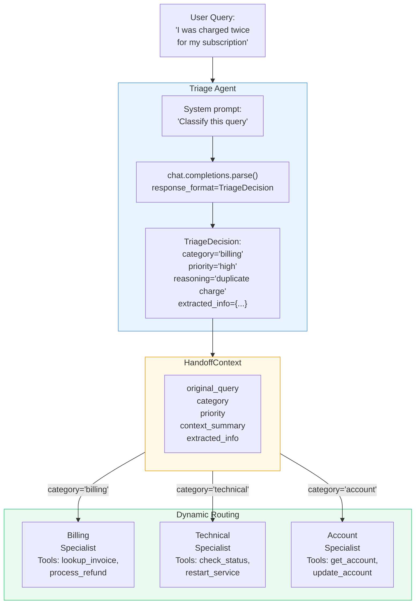
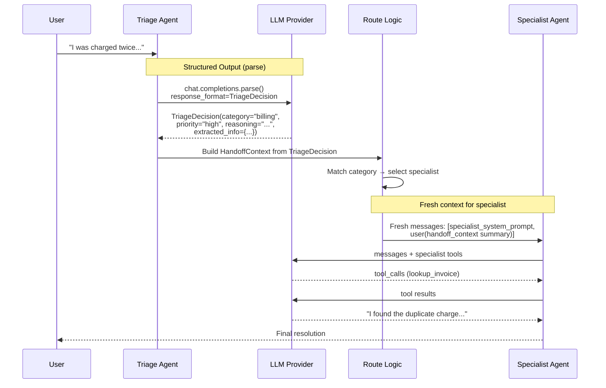

# Exercise 07: Handoff Pattern

## Objective

Implement dynamic routing where a triage agent analyzes queries and hands off to specialist agents.

## Concepts Covered

- Triage / routing agent with classification
- Structured handoff context (dataclass with query, category, relevant info)
- Specialist agents with focused capabilities
- Context passing strategies (full history vs. summary vs. structured object)

## How It Works

This is the first exercise that uses **structured output for inter-agent communication**. A Triage Agent classifies the incoming query using `client.chat.completions.parse()` with a Pydantic model, producing a structured `TriageDecision`. This decision is packaged into a `HandoffContext` dataclass and routed to the appropriate specialist.



The full message flow:



**Context sharing:** **Structured handoff.** The triage agent's internal reasoning and raw messages are NOT passed to the specialist. Instead, only a structured `HandoffContext` object crosses the boundary, containing the original query, category, priority, and extracted information. The specialist receives a **fresh messages list** with this structured context as its input. This is a deliberate design choice — the specialist doesn't need to know how the triage agent reasoned, only what it concluded.

**Structured output:** **Yes — this is the key feature of this exercise.** `client.chat.completions.parse()` with `response_format=TriageDecision` ensures the LLM returns a valid, typed Pydantic object. This enables reliable routing (no string parsing for category) and structured extraction of relevant details for the specialist.

!!! info "Why structured handoff matters"
    Compared to passing raw conversation history, a structured handoff object provides: (1) **Reliable routing** — category is a typed field, not a substring match. (2) **Context compaction** — the specialist gets only relevant info, not the full triage conversation. (3) **Auditability** — the reasoning field documents why the triage decision was made.

## Files

1. **`01_support_triage.py`** — Triage agent routes to billing, technical, or account specialists

## How to Run

```bash
python exercises/07_handoff/01_support_triage.py
```

## Expected Output

Logging showing the triage classification, handoff decision with reasoning, structured context passed to the specialist, and the specialist's resolution.

## Next

→ [Exercise 08: Magentic Pattern](08_magentic.md)
