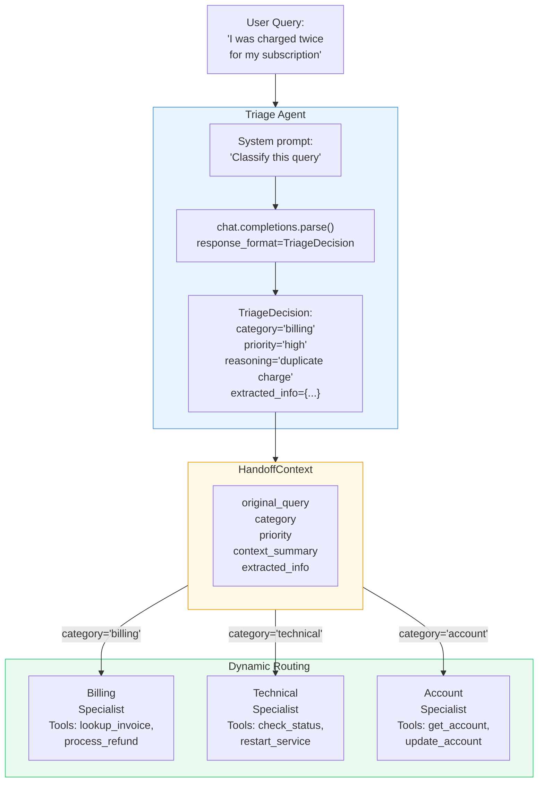
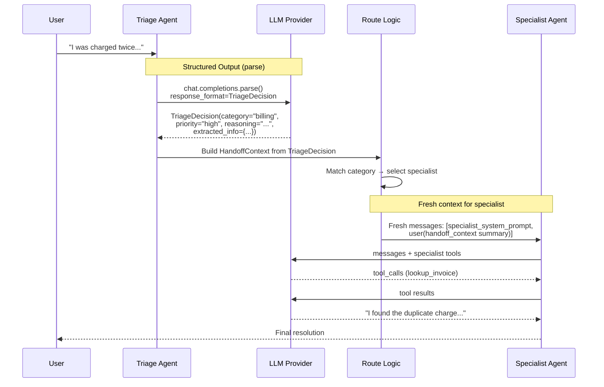

# Exercise 07: Handoff Pattern

## Objective

Implement dynamic routing where a triage agent analyzes queries and hands off to specialist agents.

## Concepts Covered

- Triage / routing agent with classification
- Structured handoff context (dataclass with query, category, relevant info)
- Specialist agents with focused capabilities
- Context passing strategies (full history vs. summary vs. structured object)

## How It Works

This is the first exercise that uses **structured output for inter-agent communication**. A Triage Agent classifies the incoming query using `client.chat.completions.parse()` with a Pydantic model, producing a structured `TriageDecision`. This decision is packaged into a `HandoffContext` dataclass and routed to the appropriate specialist.



The full message flow:



**Context sharing:** **Structured handoff.** The triage agent's internal reasoning and raw messages are NOT passed to the specialist. Instead, only a structured `HandoffContext` object crosses the boundary, containing the original query, category, priority, and extracted information. The specialist receives a **fresh messages list** with this structured context as its input. This is a deliberate design choice — the specialist doesn't need to know how the triage agent reasoned, only what it concluded.

**Structured output:** **Yes — this is the key feature of this exercise.** `client.chat.completions.parse()` with `response_format=TriageDecision` ensures the LLM returns a valid, typed Pydantic object. This enables reliable routing (no string parsing for category) and structured extraction of relevant details for the specialist.

!!! info "Why structured handoff matters"
    Compared to passing raw conversation history, a structured handoff object provides: (1) **Reliable routing** — category is a typed field, not a substring match. (2) **Context compaction** — the specialist gets only relevant info, not the full triage conversation. (3) **Auditability** — the reasoning field documents why the triage decision was made.

<div class="message-flow-interactive" markdown="block" data-title="Support Triage: Structured Handoff" data-context-type="structured" data-context-label="Triage and specialist never share a messages list — a structured HandoffContext bridges them">

<div class="mf-step" data-description="Triage agent receives the raw customer query in its own fresh messages list">
<div class="mf-msg" data-role="system" data-list="triage" data-agent="Triage Agent" data-payload='{"role": "system", "content": "You are a support triage agent. Classify the customer query by category (billing, account, technical) and priority (high, medium, low). Extract relevant details for the specialist."}'>You are a support triage agent. Classify the customer query by category (billing, account, technical) and priority (high, medium, low). Extract relevant details for the specialist.</div>
<div class="mf-msg" data-role="user" data-list="triage" data-payload='{"role": "user", "content": "I was charged twice for order ORD-1001. I need a refund for the duplicate charge."}'>I was charged twice for order ORD-1001. I need a refund for the duplicate charge.</div>
</div>

<div class="mf-step" data-description="Triage agent returns a structured TriageDecision via chat.completions.parse() — not free text. This enables reliable routing.">
<div class="mf-msg" data-role="structured" data-list="triage" data-agent="TriageDecision" data-payload='{"role": "assistant", "content": "{\"category\": \"billing\", \"priority\": \"high\", \"reasoning\": \"Duplicate charge for a specific order requires immediate financial correction\", \"extracted_info\": [{\"key\": \"order_id\", \"value\": \"ORD-1001\"}, {\"key\": \"issue\", \"value\": \"duplicate charge\"}]}", "parsed": {"category": "billing", "priority": "high", "reasoning": "Duplicate charge for a specific order requires immediate financial correction", "extracted_info": [{"key": "order_id", "value": "ORD-1001"}, {"key": "issue", "value": "duplicate charge"}]}}'>category: billing | priority: high | reasoning: Duplicate charge for a specific order requires immediate financial correction | extracted_info: order_id=ORD-1001, issue=duplicate charge</div>
</div>

<div class="mf-step" data-description="A HandoffContext dataclass is built from the TriageDecision — compacting the information for the specialist. This is the structured boundary.">
<div class="mf-msg" data-role="handoff" data-list="triage" data-agent="HandoffContext" data-payload='{"customer_query": "I was charged twice for order ORD-1001. I need a refund for the duplicate charge.", "category": "billing", "priority": "high", "extracted_info": {"order_id": "ORD-1001", "issue": "duplicate charge"}}'>customer_query: I was charged twice for order ORD-1001... | category: billing | priority: high | extracted_info: {order_id: ORD-1001, issue: duplicate charge}</div>
</div>

<div class="mf-step" data-description="Billing specialist gets a NEW messages list with the handoff context as user input — it never sees the triage conversation or system prompt">
<div class="mf-msg" data-role="system" data-list="specialist" data-agent="Billing Specialist" data-payload='{"role": "system", "content": "You are a billing specialist. Resolve billing issues using your tools: lookup_order, process_refund."}'>You are a billing specialist. Resolve billing issues using your tools: lookup_order, process_refund.</div>
<div class="mf-msg" data-role="user" data-list="specialist" data-payload='{"role": "user", "content": "Customer reports duplicate charge for order ORD-1001 and requests a refund. Priority: high. Please investigate and resolve."}'>Customer reports duplicate charge for order ORD-1001 and requests a refund. Priority: high. Please investigate and resolve.</div>
</div>

<div class="mf-step" data-description="Billing specialist uses tools to look up the order, verify the issue, and process the refund. The triage agent is no longer involved.">
<div class="mf-msg" data-role="tool_calls" data-list="specialist" data-agent="Billing Specialist" data-payload='{"role": "assistant", "content": null, "tool_calls": [{"id": "call_lo02", "type": "function", "function": {"name": "lookup_order", "arguments": "{\"order_id\":\"ORD-1001\"}"}}, {"id": "call_pr02", "type": "function", "function": {"name": "process_refund", "arguments": "{\"order_id\":\"ORD-1001\",\"reason\":\"Duplicate charge\"}"}}]}'>lookup_order(order_id='ORD-1001') then process_refund(order_id='ORD-1001', reason='Duplicate charge')</div>
<div class="mf-msg" data-role="tool" data-list="specialist" data-agent="process_refund" data-payload='{"role": "tool", "tool_call_id": "call_pr02", "content": "{\"refund_status\": \"approved\", \"refund_amount\": 114.98, \"estimated_days\": 6, \"reference\": \"REF-32879\"}"}'>{"refund_status": "approved", "refund_amount": 114.98, "estimated_days": 6, "reference": "REF-32879"}</div>
<div class="mf-msg" data-role="assistant" data-list="specialist" data-agent="Billing Specialist" data-payload='{"role": "assistant", "content": "The duplicate charge for order ORD-1001 has been refunded. Refund amount: $114.98. Reference: REF-32879. You should see it in your account within 6 business days."}'>The duplicate charge for order ORD-1001 has been refunded. Refund amount: $114.98. Reference: REF-32879. You should see it in your account within 6 business days.</div>
</div>

</div>

## Message Flow: A Practical Example

This example follows a single customer query through the full handoff lifecycle. Unlike group chat (shared list) or concurrent (isolated lists), the handoff pattern creates a **structured boundary** between the triage agent and the specialist — they never share a messages list.

### Step 1: Triage agent receives the query

The triage agent gets a fresh messages list with its system prompt and the customer's raw query:

```python
# Triage agent's messages (completely self-contained)
triage_messages = [
    {
        "role": "system",
        "content": "You are a customer support triage agent. Analyze the query and route to billing, technical, or account..."
    },
    {
        "role": "user",
        "content": "I was charged twice for my subscription last month and I want a refund"
    }
]
```

### Step 2: Triage agent returns structured output

Instead of a free-text reply, the triage agent returns a **Pydantic-validated structured object** via `client.chat.completions.parse(response_format=TriageDecision)`:

```python
# TriageDecision — the LLM's structured output (not a chat message!)
TriageDecision(
    category="billing",
    priority="high",
    reasoning="Customer reports duplicate charge, requesting refund — route to billing specialist",
    extracted_info={
        "issue_type": "duplicate_charge",
        "timeframe": "last month",
        "desired_resolution": "refund"
    }
)
```

### Step 3: Structured context is packaged for handoff

The orchestrator converts the triage decision into a `HandoffContext` dataclass — a clean boundary between agents:

```python
# HandoffContext — the only data that crosses the agent boundary
HandoffContext(
    customer_query="I was charged twice for my subscription last month and I want a refund",
    category="billing",
    priority="high",
    extracted_info={
        "issue_type": "duplicate_charge",
        "timeframe": "last month",
        "desired_resolution": "refund"
    }
)
```

### Step 4: Specialist gets a fresh messages list

The specialist does NOT inherit any messages from the triage agent. Instead, it receives a brand-new list built from the handoff context:

```python
# Billing specialist's messages — completely fresh, no triage history
specialist_messages = [
    {
        "role": "user",
        "content": (
            "Customer query: I was charged twice for my subscription last month and I want a refund\n"
            "Priority: high\n"
            "Extracted details: {\"issue_type\": \"duplicate_charge\", "
            "\"timeframe\": \"last month\", \"desired_resolution\": \"refund\"}\n\n"
            "Please resolve this customer's issue."
        )
    }
]
```

The specialist then runs its own tool loop (e.g., calling `lookup_invoice`) with this context until it reaches a resolution.

### What crosses the boundary

| Data | Passed to specialist? | How? |
|---|---|---|
| Customer's original query | Yes | Via `HandoffContext.customer_query` |
| Triage category + priority | Yes | Via `HandoffContext.category` / `.priority` |
| Extracted details (issue type, timeframe, etc.) | Yes | Via `HandoffContext.extracted_info` dict |
| Triage agent's system prompt | **No** | Specialist has its own |
| Triage agent's internal reasoning | **No** | Stays in `TriageDecision.reasoning` for logging only |
| Triage agent's raw messages list | **No** | Specialist starts fresh |

## Files

1. **`01_support_triage.py`** — Triage agent routes to billing, technical, or account specialists

## How to Run

```bash
python exercises/07_handoff/01_support_triage.py
```

## Expected Output

Logging showing the triage classification, handoff decision with reasoning, structured context passed to the specialist, and the specialist's resolution.

## Next

→ [Exercise 08: Magentic Pattern](08_magentic.md)
