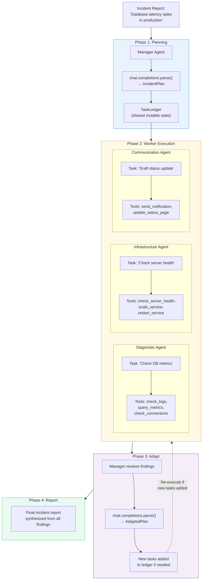
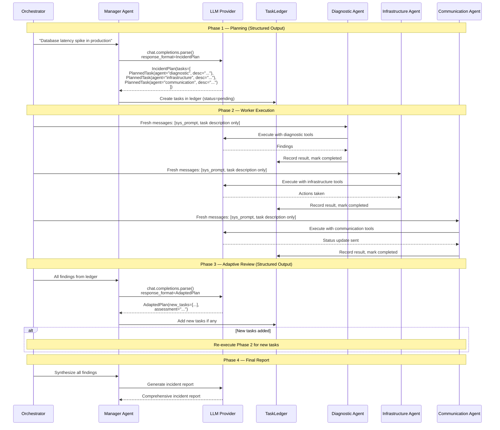

# Exercise 08: Magentic Pattern

## Objective

Implement adaptive planning where a manager agent builds and executes a dynamic task ledger, delegating to specialist workers.

## Concepts Covered

- Task ledger as shared mutable state
- Manager agent that creates, assigns, and tracks tasks
- Worker agents receiving task-specific context only
- Dynamic plan adjustment based on findings
- Synthesis of worker results

## How It Works

This is the most sophisticated pattern in the workshop. A Manager Agent creates a structured plan, delegates tasks to specialist Worker Agents, reviews their findings, and adaptively adjusts the plan — all coordinated through a shared `TaskLedger` data structure and multiple uses of structured output.



The detailed execution flow:



**Context sharing:** **Task-specific isolation with shared ledger.** The `TaskLedger` dataclass is the single source of truth — it holds all tasks, their status, assigned agents, and results. However, each worker agent receives only its specific task description in a **fresh messages list**, not the full ledger or other workers' findings. Only the Manager sees everything. This gives the Manager full visibility while keeping workers focused.

**Structured output:** **Heavily used — three structured output models:**

- `IncidentPlan` — Manager's initial plan: a list of `PlannedTask` objects with agent assignment and description
- `AdaptedPlan` — Manager's revised plan after reviewing findings: new tasks + assessment
- `PlannedTask` — Individual task definition with agent, description, and status fields

All produced via `client.chat.completions.parse()` with Pydantic models, ensuring reliable plan structure.

!!! warning "Complexity tradeoff"
    The Magentic pattern is the most powerful but also the most complex. It involves multiple LLM calls (planning + N workers + adaptation + reporting), structured outputs for plan management, and mutable shared state. Use it when simpler patterns like sequential or concurrent don't provide enough flexibility — for example, when the plan itself needs to change based on intermediate results.

## Files

1. **`01_incident_response.py`** — Manager handles an incident by coordinating diagnostic, infrastructure, and communication agents

## How to Run

```bash
python exercises/08_magentic/01_incident_response.py
```

## Expected Output

Logging showing the task ledger being built, tasks assigned to workers, worker results flowing back, plan adjustments, and the final incident report.

## Next

→ Return to the [documentation site](../production-considerations/index.md) to review implementation considerations.
