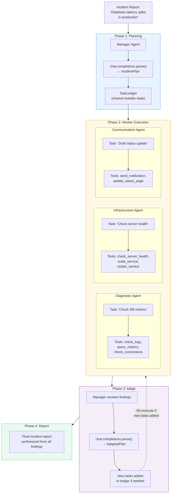
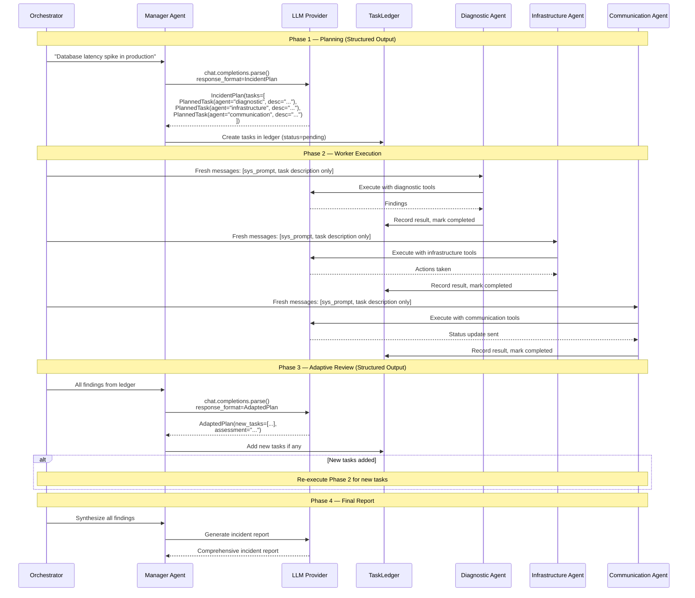

# Exercise 08: Magentic Pattern

## Objective

Implement adaptive planning where a manager agent builds and executes a dynamic task ledger, delegating to specialist workers.

## Concepts Covered

- Task ledger as shared mutable state
- Manager agent that creates, assigns, and tracks tasks
- Worker agents receiving task-specific context only
- Dynamic plan adjustment based on findings
- Synthesis of worker results

## How It Works

This is the most sophisticated pattern in the workshop. A Manager Agent creates a structured plan, delegates tasks to specialist Worker Agents, reviews their findings, and adaptively adjusts the plan — all coordinated through a shared `TaskLedger` data structure and multiple uses of structured output.



The detailed execution flow:



**Context sharing:** **Task-specific isolation with shared ledger.** The `TaskLedger` dataclass is the single source of truth — it holds all tasks, their status, assigned agents, and results. However, each worker agent receives only its specific task description in a **fresh messages list**, not the full ledger or other workers' findings. Only the Manager sees everything. This gives the Manager full visibility while keeping workers focused.

**Structured output:** **Heavily used — three structured output models:**

- `IncidentPlan` — Manager's initial plan: a list of `PlannedTask` objects with agent assignment and description
- `AdaptedPlan` — Manager's revised plan after reviewing findings: new tasks + assessment
- `PlannedTask` — Individual task definition with agent, description, and status fields

All produced via `client.chat.completions.parse()` with Pydantic models, ensuring reliable plan structure.

!!! warning "Complexity tradeoff"
    The Magentic pattern is the most powerful but also the most complex. It involves multiple LLM calls (planning + N workers + adaptation + reporting), structured outputs for plan management, and mutable shared state. Use it when simpler patterns like sequential or concurrent don't provide enough flexibility — for example, when the plan itself needs to change based on intermediate results.

<div class="message-flow-interactive" markdown="block" data-title="Incident Response: Manager-Worker with Task Ledger" data-context-type="task-ledger" data-context-label="Manager structures work via plans. Workers get task-specific context only. TaskLedger tracks state.">

<div class="mf-step" data-description="An incident report arrives. The manager will analyze it and create a structured plan with task assignments.">
<div class="mf-msg" data-role="system" data-list="manager" data-agent="Manager" data-payload='{"role": "system", "content": "You are an incident response manager. Analyze incidents and create structured plans assigning tasks to diagnostic, infrastructure, and communication specialists."}'>You are an incident response manager. Analyze incidents and create structured plans assigning tasks to diagnostic, infrastructure, and communication specialists.</div>
<div class="mf-msg" data-role="user" data-list="manager" data-payload='{"role": "user", "content": "CRITICAL: Checkout service returning 500 errors for 30% of payment requests. Started at 14:30 UTC. Error rate spiked after 14:00 deployment of v2.3.1. Database connection pool metrics show elevated wait times."}'>CRITICAL: Checkout service returning 500 errors for 30% of payment requests. Started at 14:30 UTC. Error rate spiked after 14:00 deployment of v2.3.1. Database connection pool metrics show elevated wait times.</div>
</div>

<div class="mf-step" data-description="Manager produces a structured IncidentPlan via parse(). Tasks are added to the TaskLedger for tracking.">
<div class="mf-msg" data-role="structured" data-list="manager" data-agent="IncidentPlan" data-payload='{"role": "assistant", "content": null, "parsed": {"assessment": "Critical payment service outage linked to database connection issues after v2.3.1 deployment", "tasks": [{"description": "Analyze error logs for specific exceptions causing 500 errors", "assigned_to": "Diagnostic Agent"}, {"description": "Investigate database connection health and capacity", "assigned_to": "Infrastructure Agent"}, {"description": "Publish customer acknowledgment on status page", "assigned_to": "Communication Agent"}, {"description": "Check effects of v2.3.1 deployment", "assigned_to": "Infrastructure Agent"}]}}'>assessment: Critical payment service outage linked to database connection issues after v2.3.1 deployment | tasks: [1. Diagnostic: Analyze error logs for specific exceptions causing 500 errors, 2. Infrastructure: Investigate database connection health and capacity, 3. Communication: Publish customer acknowledgment on status page, 4. Infrastructure: Check effects of v2.3.1 deployment]</div>
</div>

<div class="mf-step" data-description="Phase 1: Workers execute tasks. Each gets ONLY the incident description + their specific task — not the full ledger or other workers' tasks.">
<div class="mf-msg" data-role="system" data-list="diagnostic" data-agent="Diagnostic" data-payload='{"role": "system", "content": "You are a diagnostic specialist. Analyze application logs and errors to identify root causes."}'>You are a diagnostic specialist. Analyze application logs and errors to identify root causes.</div>
<div class="mf-msg" data-role="user" data-list="diagnostic" data-payload='{"role": "user", "content": "INCIDENT: Checkout service 500 errors at 30% rate since 14:30 UTC. YOUR TASK: Analyze error logs to identify specific exceptions causing the 500 errors."}'>INCIDENT: Checkout service 500 errors at 30% rate since 14:30 UTC. YOUR TASK: Analyze error logs to identify specific exceptions causing the 500 errors.</div>
<div class="mf-msg" data-role="system" data-list="infrastructure" data-agent="Infrastructure" data-payload='{"role": "system", "content": "You are an infrastructure specialist. Check system health, capacity, deployments, and network status."}'>You are an infrastructure specialist. Check system health, capacity, deployments, and network status.</div>
<div class="mf-msg" data-role="user" data-list="infrastructure" data-payload='{"role": "user", "content": "INCIDENT: Checkout service 500 errors at 30% rate since 14:30 UTC. YOUR TASK: Investigate database connection health and capacity."}'>INCIDENT: Checkout service 500 errors at 30% rate since 14:30 UTC. YOUR TASK: Investigate database connection health and capacity.</div>
<div class="mf-msg" data-role="system" data-list="communication" data-agent="Communication" data-payload='{"role": "system", "content": "You are a communications specialist. Draft clear, empathetic customer-facing notifications."}'>You are a communications specialist. Draft clear, empathetic customer-facing notifications.</div>
<div class="mf-msg" data-role="user" data-list="communication" data-payload='{"role": "user", "content": "INCIDENT: Checkout service 500 errors at 30% rate since 14:30 UTC. YOUR TASK: Publish immediate customer acknowledgment on status page."}'>INCIDENT: Checkout service 500 errors at 30% rate since 14:30 UTC. YOUR TASK: Publish immediate customer acknowledgment on status page.</div>
</div>

<div class="mf-step" data-description="Workers complete Phase 1 tasks. Results are recorded in the TaskLedger as findings.">
<div class="mf-msg" data-role="assistant" data-list="diagnostic" data-agent="Diagnostic" data-payload='{"role": "assistant", "content": "Found repeated java.sql.SQLException: Connection pool exhausted and TimeoutException: Unable to acquire database connection. Errors correlate with elevated connection pool wait times starting after 14:00 deployment."}'>Found repeated java.sql.SQLException: Connection pool exhausted and TimeoutException: Unable to acquire database connection. Errors correlate with elevated connection pool wait times starting after 14:00 deployment.</div>
<div class="mf-msg" data-role="assistant" data-list="infrastructure" data-agent="Infrastructure" data-payload='{"role": "assistant", "content": "Database connection pool at 95% utilization (threshold: 80%). Wait times averaging 3 seconds. No hardware exhaustion. v2.3.1 deployment introduced changes to database query handling — increased execution times and deadlock occurrences."}'>Database connection pool at 95% utilization (threshold: 80%). Wait times averaging 3 seconds. No hardware exhaustion. v2.3.1 deployment introduced changes to database query handling — increased execution times and deadlock occurrences.</div>
<div class="mf-msg" data-role="assistant" data-list="communication" data-agent="Communication" data-payload='{"role": "assistant", "content": "Status Update published: We are experiencing intermittent payment processing delays. Our team has identified the issue and is implementing a fix. No payment data has been compromised."}'>Status Update published: We are experiencing intermittent payment processing delays. Our team has identified the issue and is implementing a fix. No payment data has been compromised.</div>
</div>

<div class="mf-step" data-description="Manager reviews all findings and adapts the plan. AdaptedPlan adds new tasks based on what was learned.">
<div class="mf-msg" data-role="user" data-list="manager" data-payload='{"role": "user", "content": "Findings: Diagnostic found connection pool exhaustion from v2.3.1 query changes. Infrastructure confirms pool at 95%, elevated wait times, deadlocks. Communication published acknowledgment."}'>Findings: Diagnostic found connection pool exhaustion from v2.3.1 query changes. Infrastructure confirms pool at 95%, elevated wait times, deadlocks. Communication published acknowledgment.</div>
<div class="mf-msg" data-role="structured" data-list="manager" data-agent="AdaptedPlan" data-payload='{"role": "assistant", "content": null, "parsed": {"analysis": "Root cause confirmed — v2.3.1 introduced inefficient query handling causing connection pool exhaustion", "new_tasks": [{"description": "Roll back to v2.3.0", "assigned_to": "Infrastructure Agent"}, {"description": "Expand connection pool size temporarily", "assigned_to": "Infrastructure Agent"}, {"description": "Verify error rate returns to normal after rollback", "assigned_to": "Diagnostic Agent"}], "ready_for_report": false}}'>analysis: Root cause confirmed — v2.3.1 introduced inefficient query handling causing connection pool exhaustion | new_tasks: [5. Infrastructure: Roll back to v2.3.0, 6. Infrastructure: Expand connection pool size temporarily, 7. Diagnostic: Verify error rate returns to normal after rollback]</div>
</div>

<div class="mf-step" data-description="Phase 2: New tasks from the adapted plan are executed. Workers get updated task-specific context.">
<div class="mf-msg" data-role="user" data-list="infrastructure" data-payload='{"role": "user", "content": "YOUR TASK: Roll back checkout service to v2.3.0 and expand connection pool size temporarily."}'>YOUR TASK: Roll back checkout service to v2.3.0 and expand connection pool size temporarily.</div>
<div class="mf-msg" data-role="assistant" data-list="infrastructure" data-agent="Infrastructure" data-payload='{"role": "assistant", "content": "Rollback to v2.3.0 complete. Connection pool expanded by 50%. Pool utilization dropping from 95% to normal levels. Error rate decreasing."}'>Rollback to v2.3.0 complete. Connection pool expanded by 50%. Pool utilization dropping from 95% to normal levels. Error rate decreasing.</div>
<div class="mf-msg" data-role="user" data-list="diagnostic" data-payload='{"role": "user", "content": "YOUR TASK: Verify error rate returns to normal after rollback."}'>YOUR TASK: Verify error rate returns to normal after rollback.</div>
<div class="mf-msg" data-role="assistant" data-list="diagnostic" data-agent="Diagnostic" data-payload='{"role": "assistant", "content": "Error rate now at 0.2% (normal baseline). All transaction queues draining. Payment processing fully restored as of 15:05 UTC."}'>Error rate now at 0.2% (normal baseline). All transaction queues draining. Payment processing fully restored as of 15:05 UTC.</div>
</div>

<div class="mf-step" data-description="Manager produces the final incident report synthesizing all findings, actions taken, and prevention recommendations.">
<div class="mf-msg" data-role="user" data-list="manager" data-payload='{"role": "user", "content": "All tasks complete. Produce final incident report."}'>All tasks complete. Produce final incident report.</div>
<div class="mf-msg" data-role="assistant" data-list="manager" data-agent="Manager" data-payload='{"role": "assistant", "content": "INCIDENT REPORT: Payment Service Outage. Duration: 14:30-15:05 UTC (35 min). Root cause: Connection pool exhaustion from inefficient query handling in v2.3.1. Resolution: Rolled back to v2.3.0, expanded pool temporarily. Impact: 30% transaction failure rate. Prevention: Fix query handling before re-deploying, add connection pool monitoring alerts, implement phased rollouts."}'>INCIDENT REPORT: Payment Service Outage. Duration: 14:30-15:05 UTC (35 min). Root cause: Connection pool exhaustion from inefficient query handling in v2.3.1. Resolution: Rolled back to v2.3.0, expanded pool temporarily. Impact: 30% transaction failure rate. Prevention: Fix query handling before re-deploying, add connection pool monitoring alerts, implement phased rollouts.</div>
</div>

</div>

## Files

1. **`01_incident_response.py`** — Manager handles an incident by coordinating diagnostic, infrastructure, and communication agents

## How to Run

```bash
python exercises/08_magentic/01_incident_response.py
```

## Expected Output

Logging showing the task ledger being built, tasks assigned to workers, worker results flowing back, plan adjustments, and the final incident report.

## Next

→ Workshop complete! Run `mkdocs serve` to browse the full documentation site.
